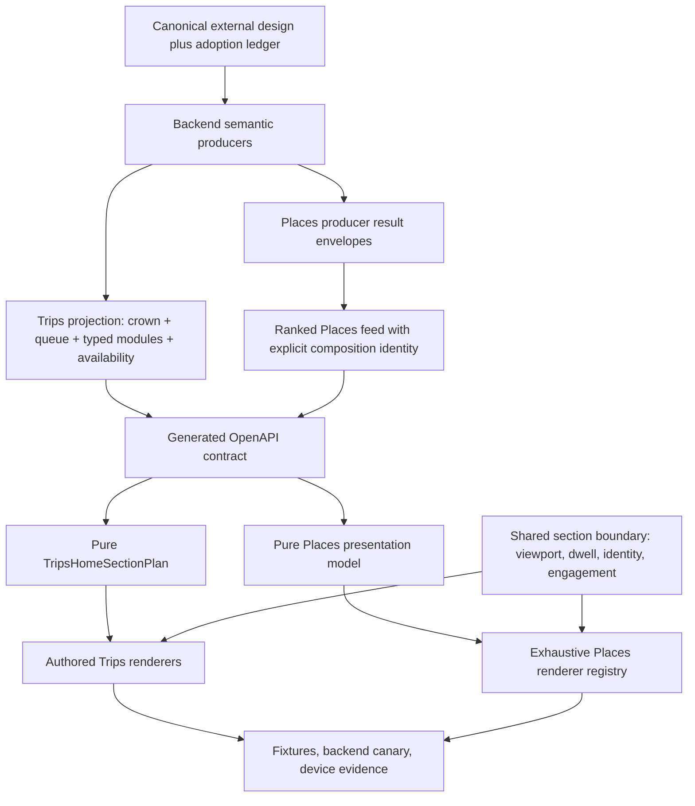
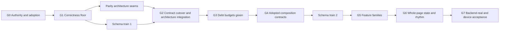

# Places and Trips Home Surfaces — Engineering Roadmap

**Date:** 2026-08-09  
**Status:** Execution in progress; static/mock integration is landed, backend-real and device gates remain
**Primary audit:** [`home-surfaces-audit-2026-08-09.md`](./home-surfaces-audit-2026-08-09.md)  
**Canonical design:** External bundle at `/Users/feihuyan/Downloads/vesper-home-surfaces`  
**Delivery model:** One integration coordinator plus at most three parallel coding agents

## 1. Outcome

Build the adopted Places and Trips home-surface directions without turning either page into a larger monolith, inventing data that the product does not possess, or mistaking component existence for a complete feature.

The program is successful when:

1. Trips has one typed, pure section plan that owns membership, order, spacing relationships, and telemetry identity.
2. Places remains server-produced but has an explicit presentation model, typed composition identity, and an exhaustive renderer registry split by stable family.
3. Dedicated Trips modules are not mined from a capped generic queue.
4. Places producers fail independently, run concurrently where safe, and distinguish empty evidence from unavailable evidence.
5. Both surfaces use generated transport contracts and preserve typed destinations end to end.
6. Adopted cards have honest evidence, reachable data, a real destination or canonical mutation path, deterministic fixtures, backend-real proof, and device evidence.
7. The existing size, containment, spacing, typography, and design-evidence debt is reduced rather than re-baselined upward.

This is not a commitment to implement every frame in the Page boards. The boards contain proposals and variants. Adoption decisions precede feature-family implementation.

## 2. Non-negotiable boundaries

### 2.1 Design authority

- The external `vesper-home-surfaces` bundle is the canonical design source for this program.
- Do not copy its HTML, screenshots, or exported design references into the workspace, frontend, or backend repositories.
- Check in only a lightweight authority record: bundle name, decision date, source hashes, superseded authorities, and adopted/exploratory/rejected status.
- Runtime code must cite semantic contracts, not a personal Downloads path.
- Local visual QA may receive the external path explicitly and must verify its hashes before comparison.
- CI may validate the authority record, fixtures, and app captures, but must not require a developer's Downloads directory.

This intentionally supersedes the current repo instruction that strict visual intent must always use a repo-tracked design export. `HS-G01` updates the workflow so it agrees with the product owner's explicit authority decision.

### 2.2 Product and architecture

- Trips stays authored. Places stays produced. Do not create one generic server-driven page engine.
- Shared code is limited to tokens, materials, section telemetry, action adapters, fixture conventions, and validation tooling.
- The server may specify semantic identity and eligible composition; it must not send React component names, arbitrary layout trees, style bags, or copy-sized metadata blobs.
- New transport fields are additive and typed. Do not add a generic `metadata` object.
- Do not create handwritten copies of generated API unions.
- Layout allocation happens after section existence is resolved. A child returning `null` must not leave a wrapper gap.
- Page rhythm belongs to the section plan/feed frame, not to ad hoc margins inside cards.

### 2.3 Truth, privacy, and mutation safety

- No plausible stub may look live. Missing evidence produces an absent, unavailable, or explicitly limited state.
- Group-visible copy must use the canonical redaction/composition path. No private member fact may enter a shared card, notification, proposal, or itinerary receipt by interpolation at the surface.
- A mutation must have one canonical writer, a durable receipt, coherent reads afterward, and a retry/reversal story appropriate to the action.
- Places and Trips home surfaces route to canonical domain writers; they do not directly mutate projection state.
- Preference learning remains private. UI copy must reflect the actual `recorded` receipt.

### 2.4 Completion language

Every work package reports the highest evidence layer actually achieved:

| Layer | Allowed status language |
|---|---|
| Static trace | Implemented in source; tests not sufficient for runtime claims |
| Mock walk | Mock-verified |
| Backend canary | Backend-real canary verified |
| Live device/dogfood | Device-observed or dogfood-verified |
| Founder/design acceptance | Accepted for the named platform, width, state, and design hash |

No agent may call a user-visible family complete, shipped, certified, or done without the required live-device evidence. Green backend, Jest, typecheck, or screenshot generation alone is not device proof.

## 3. Target architecture



### 3.1 Trips plan contract

`TripsHomeSectionPlan` should be a pure value built from generated projection types plus explicitly named side inputs. Its entries should carry at least:

```ts
type TripsHomeSectionEntry = {
  id: string;
  family: TripsHomeSectionFamily;
  renderState: "ready" | "empty" | "unavailable" | "dark";
  containment: ContainmentStep;
  grounding: GroundingSummary;
  action: TripsHomeAction | null;
  exposureKey: string;
  rhythmRole: RhythmRole;
  data: TripsHomeSectionData;
};
```

The exact names may change during implementation. The invariants may not:

- one membership decision;
- one authored order;
- one source for layout existence and telemetry;
- no React nodes or callbacks in the pure plan;
- no search through a capped generic queue for dedicated modules;
- exhaustive handling of generated destinations.

### 3.2 Places contract and renderer

Places keeps the current semantic `reason` and payload `kind`, but adds explicit orthogonal identity only as adopted compositions require it:

```text
reason × kind × treatment × arrangement/register
```

Do not predeclare all 34 proposals. Add the smallest typed union needed by the first adopted vertical slices, with explicit evidence payloads for semantic registers.

The frontend target is:

```text
PlacesWorkspace controller
  → pure PlacesPresentationModel
  → FeedFrame
  → exhaustive renderer registry
  → candidate / editorial / experience / memory / social / notice-prompt families
```

Responsive degradation remains deterministic client policy. Semantic register, eligible arrangement, server order, and grounded evidence remain backend contract.

## 4. Program gates and dependency graph



The graph shows integration gates, not a ban on parallel work. For example, design-governance work, Trips backend projection work, Places producer hardening, and shared telemetry infrastructure can begin in parallel. A package may merge only when its own dependencies and repository gate are satisfied.

| Gate | Exit condition |
|---|---|
| G0 | Authority record exists; adoption ledger exists; each unresolved decision has explicit downstream blockers. |
| G1 | Known correctness defects have regression tests; destination and Dreams honesty fixes are landed; backend correction packages are ready for their schema/integration gates. |
| Schema train 1 | Backend projection changes are merged; workspace snapshots and frontend generated types are regenerated once; contract check and typecheck pass. |
| Parity architecture seams | Trips current output is represented by a pure plan; Places has a pure controller model; shared viewport infrastructure exists. These can develop while the additive backend projection is in its schema train. |
| G2 | Trips consumes typed modules through the plan; Places dispatcher has stable seams; shared viewport boundary is integrated without duplicated membership logic. |
| G3 | Size, containment, spacing, typography, and design-evidence checks pass without increasing baselines. New family work may begin. |
| G4 | Only adopted compositions have typed evidence and arrangement contracts; privacy and mutation routes are reviewed. |
| Schema train 2 | The adopted Places/Trips contract batch is generated and landed by the single schema owner. |
| G5 | Each selected family reaches its declared D/C/P/R/A/F/B/V layer without stubs. |
| G6 | State fixtures and adjacency-based rhythm cover the full pages; no family owns page-level margins. |
| G7 | Named iOS and Android scenarios have backend-real/device receipts and an explicit acceptance verdict. |

## 5. Execution model for coding agents

### 5.1 Coordinator duties

The primary coding agent is the integration coordinator. It must:

1. Record the intended base SHA for the workspace and both child repositories.
2. Check `git branch -a` and `git status` before every dispatch and merge.
3. Create isolated worktrees/branches for every package; never reuse a dirty shared checkout.
4. Assign one owner to every hot file and generated artifact.
5. Run schema trains itself or assign one explicit schema owner.
6. Review package evidence and prohibited-file compliance before landing.
7. Land backend contracts before regenerated schemas, then land frontend consumers.
8. Re-run the integration gate after each parallel batch.
9. Update the composition inventory and decision ledger as part of the same merge that changes status.
10. Report exact evidence layers and unresolved risks.

Current shared checkouts contain unrelated concurrent changes, including generated frontend schema and backend narration/conversation work. The implementation program must start from clean dedicated worktrees and must not stage or absorb those changes.

### 5.2 Branch and worktree convention

- Integration branches: `codex/home-surfaces-trips`, `codex/home-surfaces-places`, and `codex/home-surfaces-workspace`.
- Package branches: `codex/hs-<task-id>-<short-slug>`.
- One package branch belongs to one agent.
- Agents commit only explicitly named files. Never use `git add .` or `git add -A`.
- Agents do not merge other package branches.
- The coordinator lands reviewed packages in dependency order and resolves integration conflicts.
- Cross-repo packages use two commits, backend first and frontend second, unless the coordinator deliberately keeps the whole pair in one isolated cross-repo lane.

### 5.3 Work-package contract

Every dispatch prompt must include:

| Field | Required content |
|---|---|
| Task ID and objective | One independently reviewable outcome |
| Risk class | `safe-frontend`, `contract-sensitive`, `founder-only`, and/or canonical-journey impact |
| Base SHAs | Workspace, frontend, backend as relevant |
| Dependencies | Merged task IDs, not assumptions about another agent's unmerged worktree |
| Owned files | Exact files or directories the agent may edit |
| Forbidden hot files | Files reserved for coordinator or another package |
| Contract inputs | Generated types and API snapshot revision |
| Acceptance tests | Exact commands plus new regression cases |
| Evidence target | Static, mock, backend canary, or device |
| Handoff | Commit SHA, changed files, tests, evidence, remaining risks, and migration notes |

If an agent discovers that it must touch a forbidden file or change a shared contract, it stops that portion and sends a dependency proposal to the coordinator. It does not widen its own scope.

### 5.4 Hot-file locks

These files are single-writer until the named extraction makes them small:

| Repository | Hot file or artifact | Lock rule |
|---|---|---|
| Frontend | `app/(tabs)/trips/index.tsx` | Only the active Trips root/plan integrator |
| Frontend | `components/places/PlacesWorkspace.tsx` | Only the active Places controller integrator |
| Frontend | `components/places/PlacesSectionFeed.tsx` | Only the active Places strangler integrator |
| Frontend | `utils/tripsHomeStackModel.ts` | One Trips contract adapter owner per batch |
| Frontend | `scripts/polish-qa/surfaces.mjs` | Design-governance owner only |
| Frontend | `constants/textVariants.ts`, `constants/typography.ts` | Design-system owner only |
| Frontend | `utils/api/schema.gen.ts` | Schema-train owner; generated, never hand-edited |
| Backend | `backend/home/trips_stack.py` | Trips projection owner only |
| Backend | `backend/places/sections.py` | Places production owner only |
| Backend | `backend/places/ranking.py` | Places ranking owner only |
| Backend | `backend/core/models/places_sections.py` | Places contract owner only |
| Workspace | `docs/openapi.json`, `docs/openapi.app.json` | Schema-train owner only |

After `PlacesSectionFeed` is split, individual family modules and family-specific test files may be assigned in parallel. Agents must not all add cases to one giant renderer test.

### 5.5 Schema-train protocol

Schema work is deliberately serialized:

1. Backend package lands Pydantic/route changes and backend tests.
2. Coordinator runs `./scripts/sync-types.sh` from the workspace root.
3. Coordinator reviews `docs/openapi.json` and `docs/openapi.app.json`.
4. Coordinator reviews generated `travel-app/utils/api/schema.gen.ts`.
5. Coordinator runs `make contract-check` and `make typecheck`.
6. Frontend consumer packages rebase onto that generated contract.

No frontend agent edits generated types to unblock itself. Batch compatible contract changes into a schema train so parallel backend packages do not repeatedly churn the same snapshots.

## 6. Milestone 0 — authority, adoption, and baseline

These packages can begin immediately. `HS-D01` requires product/design decisions; the other packages do not wait for all decisions to close.

| ID | Package | Primary owner/files | Dependencies | Evidence and exit |
|---|---|---|---|---|
| HS-G01 | Replace stale design-authority pointers with an external-canonical authority record and hash-aware local QA input. Do not add design files. | Workspace docs; frontend Makefile, surface contracts, QA registry/tooling, stale code comments | None | QA tooling tests pass; a local check detects the exact external hashes; CI path works without Downloads; docs state the exception clearly. |
| HS-I01 | Create the machine-readable composition inventory using D/C/P/R/A/F/B/V and adoption state. Seed it from the audit, not from frame count. | Workspace `docs/status/` plus validator/test | Audit | Inventory validation passes; every adopted item names evidence, producer, contract, renderer, action, telemetry, and blockers. |
| HS-D01 | Close the ten immediate product decisions from the audit and record owner/date/rationale. | Workspace decision record | None | Each decision is `adopted`, `exploratory`, `rejected`, or `deferred`; affected task IDs are listed. |
| HS-B01 | Capture executable baseline and add regression tests for known false positives: real two-row Trips projection, People destination, null-wrapper gaps, empty crown posture, saved-count duplication, and current rank cap semantics. | New focused test files where possible | None | Tests fail for the intended defects before fixes; existing unrelated failures are recorded without increasing ratchets. |
| HS-B02 | Restore design-system evidence and budget health without relaxing baselines. | Design-system scripts/tokens; extracted styles as later tasks permit | HS-G01; may finish after architecture extraction | `size-budgets`, `containment-budget`, `spacing-budget`, typography checks, and design-evidence checks pass with equal or lower baselines. |

### Decision-to-task blockers

Until a decision closes, agents use the conservative default below. This prevents an unresolved proposal from becoming product behavior through implementation momentum.

| Decision | Blocks | Safe default while unresolved |
|---|---|---|
| Adopted versus exploratory frames | Every `TR-F*` and `PL-F*` visual family | Proposed frames remain exploratory; preserve current UI. |
| Places versus Trips ownership of gap/expiry/group waiting/harvest | `PL-C03`, Trips urgency/spine slices | Preserve current ownership; do not duplicate or relocate. |
| Places page-length semantics | `PL-C01` ranking behavior and whole-page fixtures | Preserve the current 4–8 behavior and document it as a cap, not “no ceiling.” |
| Places root map adoption | `PL-F04` | Selector remains dark and is not counted as a feature. |
| Root experience imagery direction | Places experience arrangement slice | Preserve current imagery behavior; no new illustration/photo claim. |
| Lens naming | `PL-F03` | Do not add a new public lens discriminant. |
| “The Rest” adoption | `PL-F06` and Places whole-page rhythm | Keep it absent. |
| Trip Feel persistence/resumption | `TR-F02` | Preserve session-local behavior and do not claim resumed/reduced states. |
| Today Mapped release posture | `TR-F06` | Keep release-dark. |
| Return-story and comparison destinations | `TR-F05` and dedicated comparison resolution | Keep dedicated compositions absent; retain only honest existing destinations. |

## 7. Milestone 1 — correctness and honesty floor

### 7.1 Trips correctness

| ID | Package | Owned area | Dependencies | Required tests/evidence |
|---|---|---|---|---|
| TR-C01 | Preserve generated `details_section` exhaustively and route invite-seat to People. Remove the handwritten destination narrowing. | `tripsHomeStackModel.ts`, `tripsHomeDestination.ts`, focused tests; no root edits | HS-B01 | Generated-union exhaustiveness; People and Bookings routing tests; typecheck. Static/mock evidence. |
| TR-C02 | Add a discriminated Trips projection with `projection_state`, `crown`, typed dedicated `modules`, stable module/content identity, explicit availability, and an intentionally capped generic queue. Select modules before queue capping. Keep the current capped `rows` representation as a deployed-client compatibility field until cleanup. | `backend/home/trips_stack.py`, its models/tests | HS-B01 | Backend contract tests prove all eligible D2 modules can coexist while the generic queue remains capped; ranked state requires a crown; crown reuse is deterministic; no duplicate fact production. |
| TR-C03 | Cut the frontend over to typed modules through the section plan, resolve section existence before layout, and enforce a nonblank hero invariant. Retain a temporary old-server adapter. | Trips adapter/plan/root under one hot-file owner; focused screen/plan tests | TR-C01, TR-A01, Schema train 1 from TR-C02 | Backend-shaped fixture with two generic rows and four modules; no phantom gaps; crownless valid state has an explicit fallback; old and new payload compatibility; typecheck and focused Jest. |
| TR-C04 | Make Dreams learning copy conditional on the actual private-learning receipt while keeping navigation nonblocking. Treat persistence of dismissal/resumption as a later product decision. | Trips table and data facade | HS-B01 | `recorded=true/false/error` tests; private storage assertion; no learned/saved claim before success; mock plus backend canary. |

### 7.2 Places correctness

| ID | Package | Owned area | Dependencies | Required tests/evidence |
|---|---|---|---|---|
| PL-C01 | Make page-length semantics truthful in code, tests, and contract. Implement the adopted floor/cap policy rather than retaining “no ceiling” language with a cap. | `ranking.py`, ranking tests, Places contract docs | HS-D01 page-length decision | Boundary tests for each posture and qualified count; docs and code use the same vocabulary. |
| PL-C02 | Remove the redundant saved-count read; execute independent producers concurrently under explicit budgets; isolate failures. Preserve deterministic candidate order rather than appending completion order; re-raise cancellation and programmer/schema errors. | `backend/places/sections.py`, optional new orchestration helper, producer tests, observability | HS-B01 | One optional producer failure does not fail the feed; empty and unavailable are distinguishable internally; deterministic ordering is preserved; duration/state metrics exist; one saved-items/total read. |
| PL-C03 | Apply the adopted cross-surface ownership rule without duplicate urgency pressure. | Places assembly and relevant Trips producer/projection tests | HS-D01 surface-ownership decision | A fact appears on the intended surface once; deferral is tested; no contradictory call to action. |

### 7.3 Shared correctness

| ID | Package | Owned area | Dependencies | Required tests/evidence |
|---|---|---|---|---|
| SH-C01 | Build a reusable viewport-aware section boundary with content identity, dwell, engagement, and reset semantics. No surface integration yet. | New shared component/hook and focused tests | HS-B01 | Offscreen mounted children do not log; content changes under one reason get a new identity; user/surface reset works; fake timers deterministic. |
| SH-C02 | Correct typography role misuse: Places memory no longer uses the itinerary-only 13px italic role; Trips fallback respects the Roman-serif floor; reconcile mono weight intentionally. | Design tokens plus already-extracted call sites when possible | HS-G01 | Typography guards pass; 320/360/393 fixtures at normal and ~1.35 font scale; no new one-off role. |

## 8. Milestone 2 — architecture seams

These are strangler refactors. They should preserve current output unless a Milestone 1 fix is explicitly included. New Page-board visuals do not land here.

| ID | Package | Objective | Dependencies | Debt gate |
|---|---|---|---|---|
| TR-A01 | Introduce a parity-first pure `TripsHomeSectionPlan`; move membership, order, render state, grounding, action identity, exposure key, and rhythm role out of the root before consuming the new module contract. Represent every currently shipping root row, including rows omitted from the new Page boards. | HS-B01, TR-C01 | Root renders current behavior from the plan; exposure list duplication is deleted; plan matrix covers resource/posture/capability axes; no intended visual delta. |
| TR-A02 | Split Trips root orchestration from rendering and move styles/components into named modules without behavior drift. | TR-A01, TR-C03 | Main function falls below budget; net deletion from root; no new raw containment/spacing debt. |
| PL-A01 | Extract pure `PlacesPresentationModel` from request/search/connectivity/posture state. Keep transport, content posture, local mode, and availability orthogonal while preserving the current length policy. | HS-B01, PL-C02 | Workspace controller becomes orchestration only; matrix tests cover initial, fresh, refresh-cached, offline-cached, error-empty, browse, and search. |
| PL-A02 | Create a small exhaustive Places renderer registry and family contracts. | PL-A01 | Registry is exhaustive over generated card kinds; no free-form component lookup; unsupported combinations fail in development/tests. |
| PL-A03 | Strangle `PlacesSectionFeed.tsx` family by family into social, memory, editorial-reading, experience, notice-prompt, and candidate modules, in that low-risk-to-high-coupling order. | PL-A02 | Each move transfers component, style, and focused tests and deletes dead source in the same commit. Feed file and giant test shrink materially. |
| SH-A01 | Integrate the shared viewport boundary into Trips using the section plan. | SH-C01, TR-A01 | Telemetry reads the plan; every rendered section has one identity; engagement is wired; no duplicated membership list. |
| SH-A02 | Integrate the shared viewport boundary into Places using the registry/feed model. | SH-C01, PL-A02 | Friend, notice, prompt, and all family actions report consistently; below-fold mount is not impression. |
| DS-A01 | Encode containment and emphasis as separate semantic axes where the new families need them; provide adjacency rhythm tokens without choosing whole-page rhythm yet. | HS-G01 | No numeric baseline increase; crown remains unique; marginal rules stay outside the containment ladder. |
| QA-A01 | Create deterministic in-app fixture galleries and backend-real-shaped payload fixtures for both surfaces. Attach source hash and evidence metadata; do not store canonical design exports. | HS-G01, HS-I01 | 320/360/393 widths, normal/~1.35 font scale, resource/posture/availability states, and old/new additive payloads are representable without root edits. |

### 8.1 Strangler rule for Places

Do not dispatch multiple agents to extract families directly from the 2,253-line file. `PL-A02` first establishes the registry and family interfaces. The coordinator then assigns one family at a time from the monolith. Once a family lives entirely in its own module with its own test file, separate family enhancements may run in parallel.

### 8.2 Architecture gate

No new visual family starts until:

- the active surface has its plan/model seam;
- the relevant renderer is outside the monolith or has one designated owner;
- shared budget checks are green;
- a deterministic fixture exists for the intended state;
- the feature's product decision is closed.

## 9. Milestone 3 — adopted data contracts

This milestone defines only the first adopted vertical slices. It does not encode the entire design board speculatively.

| ID | Package | Objective | Dependencies | Exit |
|---|---|---|---|---|
| PL-D01 | Write the Places composition RFC: semantic reason versus register/arrangement, evidence requirements, responsive degradation, and compatibility migration. | HS-D01, PL-A02 | Founder/architecture review; explicit rejected alternatives; no code yet. |
| PL-D02 | Add stable section/content identity plus the minimal typed register/arrangement discriminants for adopted one-place and several-place slices. Preserve old clients during migration. | PL-D01 | Backend validation and OpenAPI tests; invalid payload/register pairs rejected; content revision drives keys/exposure/dismissal; no generic metadata bag. |
| PL-D03 | Project only adopted evidence fields, including reading lens if selected. Keep citations attributable and change/caveat/log claims typed. | PL-D01, lens decision | Contract tests prove provenance/freshness/claim boundaries; private fields absent from shared payloads. |
| TR-D01 | Add canonical itinerary-day receipt data required for countdown pips, or formally adopt a simpler countdown that does not imply unavailable days. | HS-D01 adopted countdown, TR-C02 | Contract fixture is grounded in itinerary truth; no invented duration. |
| TR-D02 | Consolidate D2 side-channel inputs into coherent typed module view models with explicit unavailable states. | TR-C02, TR-A01 | A module cannot combine stale row facts with independently newer side data silently. |

The coordinator batches `PL-D02`, `PL-D03`, `TR-D01`, and `TR-D02` into Schema train 2 when their decisions are ready. Packages not ready remain out of the train; they do not block unrelated adopted work.

## 10. Milestone 4 — feature-family vertical slices

Every slice includes producer, projection, generated contract, renderer, action, state lifecycle, telemetry, fixtures, backend canary, and device plan. A backend-only or component-only change is not a feature slice.

### 10.1 Trips families

| ID | Family | Dependencies | First honest scope | Do not build yet |
|---|---|---|---|---|
| TR-F01 | D2 time/conditions/group | TR-D01, TR-D02, SH-A01 | Faithful Now, countdown, conditions, and group modules from typed data; component modules may be assigned separately after props freeze. | Temporal claims or day pips without canonical facts. |
| TR-F02 | Trip Feel | TR-A01, SH-A01, persistence decision | Full pair with contrast seam, resumed state, and reduced asked-not-shown state driven by real exposure/conversation data. | Local-only fake resumption or unconditional “learning” copy. |
| TR-F03 | Pre-trip approach | TR-A01 and adopted frames | Existing-substrate This Week/Weekend/Saved Unplaced compositions with real destinations. | Hosting until a real entity exists. |
| TR-F04 | People and evidence/decision | TR-A01, adopted frames | Dedicated invite-seat/room and grounded work/compare/open-loop compositions where canonical destinations exist. | A second decision writer or shared copy containing private constraints. |
| TR-F05 | Return | Real story/comparison destination decision | Since-last-looked or return section linked to a real read destination. | A story card that routes generically to Plan. |
| TR-F06 | Maps | Release-posture decision and map data contract | Today Mapped in an intentional dogfood/production profile with loading, permission, unavailable, and open states. | Other map concepts or `reachable_cluster` until selectors and truth exist. |

### 10.2 Places families

| ID | Family | Dependencies | First honest scope | Do not build yet |
|---|---|---|---|---|
| PL-F01 | One-place registers | PL-D02, PL-D03, PL-A03 | One server-side composer owns register selection and precedence. Begin with adopted legally supportable change, caveat, log, and evidence-backed verdict registers, each with typed claims. Freeze composer precedence before delegating register leaf components. | Recommendation/conviction without a trustworthy producer; independent producers racing to choose visual register. |
| PL-F02 | Several-place arrangements | PL-D02, PL-A03 | Adopted lead+siblings, pair/comparison, door, stack, or stub arrangements using existing set data and deterministic responsive degradation. | Treating the existing `lead` flag as implemented without visual behavior. |
| PL-F03 | Reading | PL-D03, lens decision, PL-A03 | Adopted reading spine and lens states with real projected lens identity and reader destinations. | A second ambiguous lens concept or decorative quote without source. |
| PL-F04 | Root map | Root-map adoption decision | Adopted area story/map with a production caller, explicit geographic truth, and empty/unavailable states. | Wiring the dormant selector merely because it exists. |
| PL-F05 | Memory and people | PL-A03 plus adopted frames/evidence | Return/postcard and social marks that respect privacy and real trip/love facts. | Co-sign or “Again?” without the necessary cross-person evidence. |
| PL-F06 | Personal record | “The Rest” and page-length decisions plus real aggregate signals | Adopted tally/record composition with honest aggregation. | Belonging/rhythm ladders derived from synthetic counts. |

### 10.3 Safe family parallelism

After Milestone 2, use this pattern:

- Worker A: one Trips family module and its focused tests.
- Worker B: one Places family module and its focused tests.
- Worker C: fixture/backend-canary/evidence support for those two families.
- Coordinator: owns registries, section plans, generated schema, root composition, and merge order.

Two workers may work on separate families in the same frontend repository only when they own disjoint module and test files and neither touches a registry, plan, token, generated type, or root. The coordinator performs the small registration commits after landing both.

## 11. Milestone 5 — whole-page state and rhythm

State modeling begins in Milestone 2; visual rhythm is intentionally deferred until the adopted inventory is stable enough to compose as a page.

| ID | Package | Scope | Required scenarios |
|---|---|---|---|
| TR-P01 | Trips whole-page plan matrix | Verify membership/order for resource state, all eight postures, familiarity, and capability. | loading, error-empty, stale, starter, between, quiet, planning, ready, urgent, live, returned; feature dark/dogfood/production. |
| PL-P01 | Places whole-page model matrix | Verify request state, browse/search mode, posture, producer availability, and adopted page-length rule. | initial, fresh, refresh-cached, offline-cached, error-empty, partial feed, search empty/results, starter/quiet/full. |
| TR-R01 | Trips adjacency rhythm | Replace repeated section-owned `spacing.xxxl` with plan-selected relationships based on continuity, interruption, density, containment, and posture. | 320/360/393 widths; normal and ~1.35 font scale; short and maximal page. |
| PL-R01 | Places feed rhythm | Reduce mechanical label/hairline/row repetition while protecting open page rhythm and crown uniqueness. | Same width/type matrix; minimal, medium, and max adopted feed. |
| SH-R01 | Cross-surface visual review | Judge tokens/materials consistently without forcing identical page grammar. | iOS and Android; system-sans differences; mono legibility; empty and degraded states. |

Rhythm acceptance is page-level. A card may look correct in isolation and still fail because it creates a card tunnel, repeats an eyebrow mechanically, or weakens the crown.

## 12. Milestone 6 — validation and release

### 12.1 Per-package automated gate

Use the narrowest relevant commands during development, then the full surface gate before landing:

```bash
# Workspace contract path
make contract-check
make typecheck

# Frontend, from travel-app
npm run typecheck
npm run size-budgets
npm run containment-budget
npm run spacing-budget
npm run typography-budget
npm run typography-role-usage
npm run typography-override-budget
npm run typography-roman-only
npm run design:evidence:check
npm run qa:polish:test
npm test -- --runInBand <focused tests>

# Backend, from travel-agent
PYTHONPATH=. pytest <focused tests> -v
ruff check <touched backend and test files>
ruff format --check <touched backend and test files>
```

The exact full-repository test command may be adjusted to the package's risk class and runtime cost, but focused tests do not replace the integration gate.

### 12.2 Visual/device gate

For each adopted composition:

1. Verify the external design bundle hash before review.
2. Render deterministic app fixtures at 320, 360, and 393 points.
3. Exercise normal and approximately 1.35 font scale.
4. Run mock capture for state completeness.
5. Run a real-backend canary for producer, projection, destination, and mutation truth.
6. Capture on iOS and Android using the registered surface QA path adapted by `HS-G01`.
7. Inspect screenshots and comparison output; do not infer fidelity from a command exit code.
8. Validate a structured verdict with design hash, data context, known noise, and remaining gaps.
9. For group/mutation paths, run the applicable journey and privacy/mutation checks from `mvp-invariants`.

### 12.3 Release labels

Feature availability remains explicit:

- `dark`: code or selector exists but no declared build exposes it;
- `dogfood`: intentionally enabled for internal/device proof;
- `production`: enabled for users with backend-real evidence and rollback/observability;
- `unavailable`: producer attempted but evidence/service was unavailable;
- `empty`: producer succeeded and found nothing eligible.

Dark code is not counted as shipped. Dogfood is not counted as production. Empty and unavailable must not collapse into the same claim in telemetry or status inventory.

### 12.4 Journey checks for affected behavior

At minimum, map the integrated work to the existing journey evidence system:

| Journey | Home-surface proof |
|---|---|
| J01 | Starter/crownless/idea states remain honest and actionable. |
| J02 | Invite-seat routes to People and membership stays coherent without exposing private constraints. |
| J07 | A Places-to-Trip action reaches the canonical itinerary mutation and receipt path. |
| J08 | Now, Countdown, Conditions, and Group are reachable from backend-real live-trip data. |
| J12 | Returned state links to a real story/read destination rather than a plausible shell. |
| J13 | Offline, error, empty, partial, and unavailable states remain distinguishable and useful. |

Seeded replay, green route tests, or generated screenshots do not certify these journeys on a device.

## 13. Recommended dispatch batches

This is the default dispatch order for one coordinator plus three workers. The coordinator may hold back a package whose product decision or base branch is not ready.

### Batch 0 — planning and governance

- Worker A: `HS-G01` design authority and QA governance.
- Worker B: `HS-I01` composition inventory and validator.
- Worker C: `HS-B01` focused regression specifications.
- Coordinator: drive `HS-D01`, record base SHAs, create clean worktrees, and lock hot files.

### Batch 1 — immediate correctness

- Worker A: `TR-C01` destination preservation plus the small, disjoint `TR-C04` Dreams honesty correction.
- Worker B: `TR-C02` Trips backend projection modules.
- Worker C: `PL-C02` Places producer concurrency/failure isolation.
- Coordinator: review/land backend packages and prepare Schema train 1; keep generated artifacts single-owner.

### Batch 2 — parity seams while the contract train lands

- Worker A: `TR-A01` parity-first Trips section plan.
- Worker B: `PL-A01` Places presentation model.
- Worker C: `SH-C01` shared viewport boundary.
- Coordinator: run Schema train 1 after `TR-C02`; keep Trips root and Places Workspace locks separate.

### Batch 3 — contract cutover and renderer seam

- Worker A: `TR-C03` typed module cutover through the section plan.
- Worker B: `PL-A02` Places renderer registry.
- Worker C: `SH-C02` typography corrections and fixture coverage in files not locked by A/B.
- Coordinator: land sequentially; the typography worker leaves locked root/feed call-site edits to the surface owners.

### Batch 4 — modular extraction and budget recovery

- Worker A: `TR-A02` Trips root/style modular extraction.
- Worker B: `PL-A03` Places family-by-family extraction under one Places owner.
- Worker C: `QA-A01` deterministic fixture/evidence harness work in new files only.
- Coordinator: finish `HS-B02`; no new visual family begins until debt gates are green.

### Batch 5 — telemetry and contract design

- Worker A: `SH-A01` Trips telemetry integration.
- Worker B: `SH-A02` Places telemetry integration after the relevant family seam.
- Worker C: `PL-D01` composition RFC and contract tests/specification.
- Coordinator: review decisions, batch adopted schema packages, and run Schema train 2.

### Batch 6 and later — vertical slices

- Worker A: one unblocked Trips family.
- Worker B: one unblocked Places family.
- Worker C: fixtures, backend canaries, and device-scenario support for those families.
- Coordinator: owns registration, plan/feed integration, status ledger, schema, and page-level review.

### Final batches — page composition and acceptance

- Worker A: Trips state/rhythm matrix.
- Worker B: Places state/rhythm matrix.
- Worker C: cross-platform capture and evidence assembly.
- Coordinator: inspect evidence, run privacy/mutation gates, record acceptance without overclaiming unsupported states.

## 14. Merge policy

Each batch uses this merge sequence:

1. Reconfirm the package base and dirty-tree status.
2. Review tests before implementation changes where a regression was expected.
3. Land pure/new-file infrastructure before integrations.
4. Land backend producers/models before schema generation.
5. Run the single schema train.
6. Land frontend adapters before root/render integrations.
7. Land family modules before coordinator-owned registry/plan updates.
8. Run focused tests, repository gates, and cross-repo contract checks.
9. Update the composition inventory in the same integration batch.
10. Record evidence layer, not a binary done flag.

Avoid a single long-lived “all home surfaces” branch accumulating every family. Keep the two child-repo integration branches continuously releasable behind explicit capability flags where a family is not production-ready.

## 15. Dispatch prompt template

```text
Task: <ID — objective>
Risk class: <safe-frontend | contract-sensitive | founder-only | journey-sensitive>
Base: workspace <sha>, frontend <sha>, backend <sha>
Dependencies already merged: <IDs>

Read first:
- workspace, child-repo AGENTS.md/CLAUDE.md
- docs/home-surfaces-audit-2026-08-09.md
- docs/home-surfaces-engineering-roadmap-2026-08-09.md
- relevant surface contract and feature docs
- mvp-invariants when group-visible content, mutations, journeys, or completion claims are involved

Owned files:
- <exact paths>

Forbidden files:
- <hot files owned by coordinator/other agent>

Requirements:
- <bounded behavior and architectural constraints>
- add failing regression tests first for known defects
- do not edit generated schema
- do not copy the external canonical design into the repo
- preserve unrelated working-tree changes

Validation:
- <exact focused commands>
- <contract/typecheck/budget commands>
- evidence target: <static | mock | backend canary | device>

Handoff:
- commit SHA
- exact files changed
- test commands/results
- evidence achieved and not achieved
- remaining risks or follow-up dependencies
```

## 16. Program risks and controls

| Risk | Control |
|---|---|
| Design frames become one ticket each | Adoption ledger maps frames to stable semantic families before dispatch. |
| Parallel agents collide in monoliths | Hot-file locks and strangler seams precede family parallelism. |
| Backend and frontend contracts drift | Serialized schema train and generated unions only. |
| Refactor changes visual output invisibly | Architecture packages use deterministic before/after fixtures and no-intentional-delta review. |
| New UI outruns domain truth | Every family declares evidence requirements and prohibited stubs. |
| Empty and unavailable collapse | Producer envelopes and explicit render state. |
| Telemetry drives false familiarity | Viewport-aware identity/dwell precedes Trip Feel and reduced-state logic. |
| Existing quality ratchets are raised | `HS-B02` requires green checks without baseline increases. |
| Group-private facts leak into visible copy | Canonical redaction/composition tests and journey checks. |
| Home surface becomes a second writer | Typed destinations route to canonical mutation owners; no projection mutation. |
| “Implemented” is mistaken for accepted | D/C/P/R/A/F/B/V inventory and evidence-layer completion language. |
| Canonical source is silently replaced | Hash verification and explicit source-authority record; no in-repo design copies. |

## 17. First release recommendation

The first post-pivot release should be intentionally narrow:

1. Correct Trips destination and projection reachability.
2. Correct Places producer behavior and page-length semantics.
3. Establish the Trips plan, Places presentation/registry seams, and viewport telemetry.
4. Return all debt budgets to green.
5. Ship one representative, fully evidenced family on each surface:
   - Trips: Trip Feel or the adopted D2 set, depending on the persistence decision and contract readiness.
   - Places: typed one-place change/caveat/log registers or the adopted reading spine, depending on the evidence decision.
6. Compose and device-review the full page around those families before starting the next pair.

That release proves the architecture, data contract, evidence ladder, and visual QA loop. Subsequent families then become smaller vertical slices instead of repeated surgery on the roots.

## 18. What may begin before product decisions close

Engineering does not need to wait on every aesthetic choice. The following can start safely:

- design-authority governance and status inventory;
- regression tests for known defects;
- People destination preservation;
- Trips dedicated-module projection;
- Places saved-count/concurrency/failure isolation;
- viewport-aware telemetry infrastructure;
- pure presentation/section planning seams;
- renderer strangler extraction;
- quality-budget recovery;
- fixture and canary infrastructure.

Do not begin visual implementation of proposed families, relocate cross-surface pressure, change Places length policy, enable maps, persist Trip Feel lifecycle, or invent return/comparison destinations until their corresponding decision is recorded.

## 19. Compatibility cleanup after adoption

Compatibility code is temporary product code and must have an explicit deletion gate.

| ID | Cleanup | May start when | Exit |
|---|---|---|---|
| HS-CL01 | Remove Trips D2 mining from legacy `rows`, the old-server module adapter, obsolete shadow types, dead selectors, and associated compatibility tests. | Additive backend is deployed to every app environment; minimum supported mobile version consumes modules; device regression is accepted. | No supported client needs the fields; contract, backend-real canary, and device journey repeat pass. |
| HS-CL02 | Remove Places legacy composition inference for producers migrated to typed arrangements/registers. | All reachable producers for that family emit the adopted typed contract; older payload fallback is no longer required. | Registry remains exhaustive; no dual selection policy; fixtures and backend canary prove the typed path. |
| HS-CL03 | Tighten size/containment/spacing/typography ratchets to the new lower measured baseline. | Architecture and first-family work is accepted. | Ratchets decrease; no exception list grows to preserve deleted code. |

The coordinator opens cleanup tickets when compatibility paths are introduced. “Remove later” without an owner, deployment condition, and test is not an acceptable migration plan.

## 20. Execution ledger (2026-08-09)

The roadmap is being executed in separate parent, backend, and frontend integration lanes. The entries below are commits and evidence, not release acceptance:

| Batch | Landed work | Commit/evidence | Layer and remaining gate |
|---|---|---|---|
| 0 | Design authority, composition inventory, external-canon QA wiring | `d9b29bf`, `b841d8c2`, `7b296d3`; governance checks pass | Governance/static; no device claim |
| 0 | Places and Trips characterization suites | `0ce6374a`, `57b1592c`, `51991c40`, `2500e18f`, `44b30c40`; expected-red defects recorded | Static/mock characterization; defects drove Batch 1 |
| 1 | Trips destination/receipt honesty and People route reachability | `225225ba`, `1145e8b0`; Trips/Details focused suites green | Static/mock; backend canary and device route proof remain |
| 1 | Trips dedicated modules and queue projection | `ced9643f`; 80 focused backend tests, ruff/format/pyright pass | Backend static/offline; schema/client cutover follows |
| 1 | Places bounded producer orchestration | `1560b15d`; 57 focused, 394 offline Places tests pass; one unrelated stale-DB failure | Backend static/offline; DB migration/device gates remain |
| 1 | Places producer type boundary cleanup | `421d1ff3`; full `tests/home` suite 605 passed, 1 skipped; pyright 0 warnings on touched modules | Backend static/offline; repository-wide ratchets still have unrelated baseline failures |
| 1 | Shared viewport-aware exposure boundary | `1de051c8`; 4 focused tests pass | UI infrastructure; roots still need real viewport integration |
| 1 | Additive module contract and generated app types | `7b57094` (workspace), `6f80b043` (app); snapshots are additive | Contract/static; app integration and device validation remain |
| 2 | Pure Trips section plan and Places presentation model | `9a2ac692`, `10d4972c`; Trips plan 4/4 and Places model 8/8 focused tests pass | Pure adapter/static; root renderers and rhythm/state gates remain |
| 2 | Trips renderer cutover, empty-wrapper rhythm, and measured section exposure | `5a9f1f39`, `ce90e3d2`, `9f18bd0d`; combined Trips/Details/registry suites pass, including ranked-state fallback | Static/mock; no simulator/device viewport proof |
| 2 | Places renderer cutover, engagement ownership, and measured section exposure | `3b9bf942`, `5ba0b960`; 30 Places-focused tests pass and the combined home lane is 12 suites / 85 tests | Static/mock; no simulator/device viewport proof |
| 2 | Cross-surface integration evidence | `9f18bd0d` app lane; API-boundary, surface-index, external-canon, and characterization checks pass; canonical design remains `/Users/feihuyan/Downloads/vesper-home-surfaces` | Static/mock; backend-real canary, simulator/device, and page-rhythm acceptance remain |

The current integration branches are intentionally not called shipped. A feature becomes eligible for acceptance only after the roadmap's contract, backend-real, and device gates produce evidence for the exact state and journey being claimed.
