# Canonical demo convergence closure plan

## 1. Executive decision

The recent convergence work is directionally correct, but the flagship journey
is not source-complete as one user experience. The disruption half is strong;
the micro-journey half is still a prompt doorway whose intended proposal is
unreachable from the private conversation it opens.

The next round should close one end-to-end Lisbon loop:

> Feihu and Maya have a verified open interval before dinner. They tap **Take
> us somewhere**. Vesper selects one feasible nearby anchor, prepares one
> group-safe canonical add proposal, and the accepted change appears in the
> shared Plan and Map. Rain then makes that anchor a poor choice; Vesper
> prepares one grounded replacement through the existing weather-rescue path.
> Both observers converge, each privately confirms or corrects the outcome,
> and only applicable evidence may influence a later occasion.

This is a convergence round, not a new architecture wave. It makes four product
and engineering decisions:

1. **No new durable micro-journey aggregate.** Before commitment, the opening is
   a server-owned current-window read projection. The canonical proposal is the
   review boundary. After acceptance, the Plan block is durable truth.
2. **No new chat-card family.** Reuse the existing proposal/vote, change receipt,
   proposal detail, Plan, and Map surfaces. Extend their destinations only where
   the accepted route needs a direct door.
3. **Private judgment may produce a group-safe proposal.** A trip-linked private
   turn may use private context, but only the existing privacy-validated,
   membership-checked, canonical proposal path may cross into shared state.
4. **The demo proves one anchor plus its connective route.** It does not need a
   multi-stop generated itinerary. One placed anchor between two commitments is
   enough to demonstrate time, place, route, AI judgment, multiplayer agency,
   weather repair, and outcome closure.

## 2. Verified baseline

The runtime source investigated for this plan is:

| Repository | Revision | Relevant state |
| --- | --- | --- |
| workspace | `f7427f770b8eb09b468436ee7e948b6fd4047632` | Current Home roadmap rebaseline included. |
| backend | `1bde69535841f849ccdc55550a1d1c6c71fec59d` | Clean runtime source at inspection. |
| mobile | `ce110b54a47f3d601d7c0d4ef7ccfe48429fab3f` | Concurrent Home truth/polish and internal profile-gallery/QA commits are included; the audited doorway, seed, proposal, Map-route, and Now-Mode files are unchanged from the doorway round. |

Focused verification on this baseline:

- mobile: 5 suites / 22 tests passed for the doorway, Now Mode, Map route card,
  and build-profile controls;
- mobile TypeScript: passed;
- backend: 107 of 108 focused open-window, tool-selection, Lisbon contract,
  weather-rescue, proposal, and replay tests passed;
- backend failure: the Postgres Lisbon replay is time-of-day dependent and
  failed with `shape_block_dates_mismatch` after fixture blocks crossed the
  Lisbon schedule-local date.

These are source, deterministic, and backend-real checks only. They do not
establish controlled-device or physical-device acceptance.

## 3. Current system assessment

| System | What is implemented | How it connects today | Closure status |
| --- | --- | --- | --- |
| Doorway | Internal build-profile flag, Plan CTA builder, review-first private composer, conversation seed. | Available only while a block is active; absent in the canonical between-commitments moment. | Partial |
| Time / availability | Canonical Plan instants, transition-aware Now Mode, conservative `ItineraryOpenWindow`, gap suggestions, destination timezone. | Places can use bounded gaps; the CTA and seed do not consume that authority. | Adjacent |
| Place judgment | Canonical entities, gap ranking, duration and geometry gates, operational facts, World Foundry evidence, relationship markers. | Places has the strictest gap projection; concierge calls the lower-level search path directly. | Policy drift |
| Location | Permissioned recent GPS, location context, symbolic `current_location`, origin resolver, private spatial situation. | The doorway says “from here,” which is not a location-loading cue; its review handoff also drops `spatialContext`. | Unreliable |
| AI serving | One-time serving-scope resolution, relationship/experience scope, Situation dependencies, typed tools, causal IDs, private shadow controls. | The CTA supplies prose, not a bounded intent contract or dedicated micro-journey skill/eval. | Partial |
| Proposal / multiplayer | Exact add/replace/remove/reschedule proposals, privacy validation, membership and consent checks, voting, accept/reject/expiry/revert, invite redemption. | `propose_change` is removed from every personal turn even though its handler implements private-shielded authorship. | Unreachable seam |
| Map / Mapbox | Canonical Plan/Map projection profiles, shared route context, route-fact freshness, transport hubs, Mapbox-backed distance resolution, map route card. | Strong after a Plan mutation; no pre-accept route object, and the card requires at least two placed committed stops. | Post-commit only |
| Weather repair | Narrow current-weather matcher, verified indoor alternative, canonical replace proposal, exact cohort flag, group-safe composition. | Strong once an outdoor block already exists. It does not prove creation of the initial micro-journey. | Strong half-loop |
| Outcomes | Private occurrence confirmation, exact-roster companion scope, correction, causal outcome receipts, shared applicability resolver. | Roster checks are strong; several live callers still omit current place, destination, or occasion context. | Partial reuse |
| Evidence | Fixed contract, controlled Trip, deploy identities, simulator doorway support, backend-real rescue lifecycle. | Current runbook and source-complete language overstate the doorway half; no two-device physical receipt exists. | Not promoted |

## 4. Confirmed seams

### F1 — the CTA disappears in the moment the demo requires

`usePlanNowMode` returns the next upcoming block as `nowBlock` when nothing is
active. `buildNowModeHeader` correctly converts that state to `mode='between'`,
but `NowModeStrip` returns the quiet “Next up” card before rendering the CTA.
The parent also gates the callback on the misleadingly named `nowBlock`.

Result: the app can show **Take us somewhere** during an active stop, but not
while the group has ninety minutes free before dinner.

### F2 — the doorway is prompt-shaped, not opportunity-shaped

`buildTakeSomewhereHandoff` references one `trip_block` and asks the model to
consult the Plan. In the between state that reference would name the upcoming
dinner, while the source subtitle would incorrectly read “From dinner.” The
backend has no authoritative current-window seed resolver.

The generic review-first composer rebuilds seeds with entity and client context
but omits `spatialContext`, despite the typed seed and backend resolver both
supporting it.

### F3 — the requested group proposal cannot be created from the opened chat

The CTA opens a `privateTrip` conversation. The prompt says not to mutate the
shared Plan directly and to prepare a reviewable group proposal. Tool selection
then subtracts `propose_change` from every personal turn.

The lower handler already contains the intended security topology:

- private requests use `human_private_shielded` authorship;
- private corpora are checked before group copy persists;
- trip membership is rechecked;
- delegation can downgrade direct action to a proposal;
- the canonical operation proposal is the only shared writer.

The safe capability exists, but this entry point cannot reach it.

### F4 — the strictest gap-candidate policy is not shared with Concierge

Places uses the conservative open-window model, duration/type/geometry gates,
relationship markers, and cached operational truth. The concierge
`itinerary_day_gap_suggestions` handler calls `get_gap_suggestions` directly
and serializes rows without the same readiness policy. A model can therefore
see a candidate that the product feed would refuse to call actionable.

### F5 — Map is truthful after commitment but not yet the route-start surface

The existing `map_route` card deliberately reads committed `TripMapState` and
refuses fewer than two placed stops. That is the right truth contract. It means
the unaccepted idea should not masquerade as a saved route.

The missing UX is smaller than a new map system: after acceptance, provide a
direct **See updated route / Start route** door to the existing Map focused on
the newly added block. Map remains a Plan projection, not another writer.

### F6 — the backend-real replay skips the first half of the flagship story

The current replay begins with Miradouro da Graça already committed and tests
its replacement with Museu Nacional do Azulejo. It proves the rescue half, not:

- current open-window detection;
- **Take us somewhere** grounding;
- one-anchor selection;
- creation and acceptance of the initial add proposal;
- a route from the previous stop through the new anchor to dinner.

Its dinner is also an unplaced custom block, so the replay proves common
projection revision and changed stop coordinates, not a complete three-anchor
route. Its use of `datetime.now(UTC) + N hours` with `now.date()` makes the
fixture fail when those instants cross Lisbon's local date.

### F7 — “source-complete” documentation is too broad

The convergence outcome accurately says the simulator support flow proves only
the doorway. Elsewhere, the execution outcome says the bounded doorway and
Group Trip source implementation are complete and places remaining work
outside source. The runtime findings above show remaining source seams. The
device runbook also says the CTA appears only with a current block, which
contradicts the ninety-minute-open-window scenario.

## 5. Target product contract

### 5.1 Fixed Lisbon state

- two actual Trip members: one rich organizer and one thin participant;
- a current schedule-local day in Lisbon;
- one placed preceding block that has ended;
- one placed birthday-dinner block with a hard start;
- a server-resolved current open window with at least ninety remaining minutes;
- one outdoor candidate that fits location, visit duration, route, hours, and
  the protected dinner boundary;
- one verified indoor replacement for the deterministic rain branch;
- all route anchors use canonical venue/site identity and coordinates.

### 5.2 User-visible sequence

1. Plan shows the open interval and **Take us somewhere**.
2. The organizer opens a private, review-first Vesper composer.
3. Vesper returns one judgment, not a list, and prepares one exact add proposal.
4. The same group-safe proposal is inspectable from the private thread, group
   room, Review stack, and proposal detail.
5. The required humans approve; the canonical add commits once.
6. Plan and Map show the same new block and projection truth for both viewers.
7. **See updated route** opens Map on the new stop; directions remain an
   explicit user action.
8. Synthetic rain makes the outdoor stop materially worse.
9. Existing weather rescue creates one canonical replacement proposal.
10. Accept, reject, expiry, and diff-safe revert preserve truthful projections.
11. Each member privately confirms or corrects the outcome.
12. Changed-roster or changed-occasion reuse is withheld or weakened.

### 5.3 Authority flow

```mermaid
flowchart LR
  A["Canonical Plan + clock"] --> B["Current open-window projection"]
  B --> C["Private Take us somewhere turn"]
  C --> D["Shared grounded gap-candidate policy"]
  D --> E["One AI judgment + exact add proposal"]
  E --> F["Group review / consent"]
  F --> G["Canonical Plan mutation"]
  G --> H["Plan + Map + Now projections"]
  H --> I["Weather rescue replacement proposal"]
  I --> J["Projection convergence"]
  J --> K["Private occurrence + outcome"]
  K --> L["Applicability-gated later occasion"]
```

No edge authorizes a second Plan writer. Private prose does not cross the
proposal/privacy boundary.

## 6. Detailed execution plan

### R0 — restore truth before feature work

#### R0.1 Make the Lisbon replay clock deterministic

- Inject or freeze one schedule-local reference instant instead of deriving
  itinerary days from the wall clock at test execution.
- Build every fixture instant from an explicit `Europe/Lisbon` local date/time
  and convert to UTC.
- Give the protected dinner a canonical placed venue.
- Remove the duplicated in-memory outcome append in the replay.
- Assert at least three placed Map anchors after the initial add, then assert
  replacement preserves route cardinality and protected dinner identity.

Primary files:

- `travel-agent/tests/scenarios/test_lisbon_group_disruption_replay.py`;
- `travel-agent/tests/fixtures/lisbon_group_disruption.json`;
- optionally `travel-agent/backend/concierge/proactive.py` if a narrow `now`
  injection is required for deterministic producer evaluation.

Suggested commit: `test(trips): make Lisbon convergence replay schedule-local`

#### R0.2 Correct planning and runbook claims

- Mark the current doorway as active-block-only and prompt-only.
- State that the replay begins after the initial route exists.
- Remove “remaining work is outside source” for the doorway half.
- Keep controlled, backend-real, and physical evidence labels distinct.

Suggested commit: `docs: correct Lisbon doorway and replay boundary`

**R0 exit:** the focused replay passes at every time of day and documentation no
longer claims the unimplemented half.

### R1 — make current availability a canonical read projection

#### R1.1 Add a current opportunity window to Plan state

- Extend the existing open-window authority with boundary block IDs and titles.
- Add a pure resolver that clips the static gap to the current server instant
  and computes remaining minutes.
- Fail closed for untimed, overlapping, cross-day, stale, dispatched, or
  insufficient windows.
- Project one optional `current_open_window` under the Plan status rail with:
  trip/day identity, previous and next block IDs, evaluated-at, ends-at,
  remaining minutes, and minimum-policy identity.
- Bind Plan-state validity to the next boundary so a cached CTA cannot outlive
  the opportunity.

Primary files:

- `travel-agent/backend/core/itinerary_open_windows.py`;
- `travel-agent/backend/core/models/plan_state.py`;
- `travel-agent/backend/core/db/plan_state.py`;
- focused core and Plan-state tests.

Suggested commit: `feat(plan): project the current bounded open window`

#### R1.2 Render the correct between-state doorway

- Drive the CTA from `status_rail.current_open_window`, not from a client guess
  about `nowBlock`.
- Render it in `NowModeStrip`'s between state beneath the next-commitment cue.
- Omit it when the projection is absent or expired.
- Keep active-block support only if product explicitly wants “leave this stop
  now”; do not let that branch define the flagship contract.

Primary files:

- `travel-app/components/trip-plan/NowModeStrip.tsx`;
- `travel-app/utils/planPresentation.ts`;
- `travel-app/app/(tabs)/trips/[tripId]/plan.tsx`;
- `travel-app/hooks/usePlanNowMode.ts` only if naming/derivation cleanup is
  required.

Suggested commit: `feat(trips): open Take us somewhere in a bounded gap`

#### R1.3 Resolve a thin trip-window conversation seed

- Add a thin `trip_open_window` seed reference containing trip/day/boundary IDs,
  not copied times or recommendation claims.
- Re-resolve membership, adjacency, current clock, and window eligibility on
  the backend.
- Render authoritative remaining time and next commitment into entry context.
- If the window expired between tap and send, tell the model it is unavailable;
  never silently reuse the old gap.
- Preserve `spatialContext` through the review-first create-to-chat handoff.

Suggested commits:

- `feat(concierge): resolve trip open-window entry context`;
- `fix(chat): preserve spatial context through review handoff`.

**R1 exit:** the CTA appears exactly in the ninety-minute fixture, disappears
after expiry, and the backend—not route-param prose—states the usable interval.

### R2 — make one grounded judgment executable

#### R2.1 Share one gap-candidate readiness policy

- Extract the actionable candidate policy so Places and Concierge use the same
  duration, type, geometry, trip-membership, relationship, and operational
  truth.
- For an immediate journey, reject known permanently closed candidates and
  fresh `open_now=false` candidates.
- Treat unknown hours as unknown: allow only a qualified suggestion or abstain;
  never label it start-ready.
- Return route-relevant entity IDs and provenance/freshness fields without
  copying presentation prose into the core service.

Suggested commit: `refactor(places): share actionable gap candidate policy`

#### R2.2 Add a bounded Take-somewhere AI contract

- Recognize the typed entry intent independently of the exact English prompt.
- Load the current private location for this explicit private intent when
  permission and freshness allow; otherwise use the previous placed Plan stop
  as an explicitly stated fallback.
- Ensure the turn receives only the required tools: current itinerary/day,
  shared gap candidates, venue status/details, two single-leg distance checks,
  and the canonical proposal tool.
- Instruct the model to choose one anchor, preserve the next boundary, state one
  decisive rationale, and abstain when route/hours/window truth is inadequate.
- Do not run the heavyweight full-day planner for this one-anchor request.

Required deterministic/provider evaluation cases:

- exact ninety-minute fit;
- candidate too long;
- stale or missing GPS with placed-stop fallback;
- stale route fact;
- known closed candidate;
- unknown hours;
- hard private constraint shaping but not appearing in group copy;
- changed roster;
- no viable candidate, producing honest silence/abstention;
- repeated send/idempotent proposal behavior.

Suggested commit: `feat(concierge): add bounded micro-journey decision contract`

#### R2.3 Restore private-to-group proposal reachability

- Keep reaction cards, generic group composition, and group-state readers
  group-only.
- Allow `propose_change` only for a trip-linked personal turn with a current
  itinerary and authenticated membership.
- Preserve the handler's private-shielded attribution and strict privacy check.
- Post the same group-safe proposal projection to the initiating private
  conversation when it differs from the canonical group room, so the organizer
  has an immediate review door.
- Deduplicate both projections by proposal/tool-call identity.
- Verify votes and resolution remain one canonical proposal, not duplicated
  proposal state.

Suggested commit: `feat(multiplayer): bridge private judgment to group proposal`

**R2 exit:** one private CTA turn can select one grounded candidate and create
one group-safe canonical add proposal without direct mutation or private-copy
leakage.

### R3 — close Plan and Map after acceptance

#### R3.1 Use one exact add operation

- Build the initial stop through `create_add_operation_proposal` with the
  authoritative day ID, exact local start/end, canonical entity, full current
  roster, and current day revision precondition.
- Keep one anchor only. The connective path belongs to route projection; it is
  not an itinerary block.
- Revalidate that the proposed duration and travel slack still fit before
  commit; stale proposals fail visibly.

Suggested commit: `feat(trips): commit bounded journey through canonical add`

#### R3.2 Add the route door without a new card family

- After successful acceptance, offer **See updated route** from proposal detail
  or the existing applied-change receipt.
- Deep-link to the existing Trip Map focused on the added block.
- Let Map assemble previous stop -> added anchor -> protected next commitment
  from canonical TripMapState and current route facts.
- Label degraded or approximate geometry honestly.
- Keep external directions as an explicit tap from the focused Map stop.

Suggested commit: `feat(map): open accepted journey on the canonical route`

#### R3.3 Verify warm convergence

- Ensure proposal acceptance invalidates/refetches Plan, Map, Now, proposal
  lists/detail, group-room attachment state, and both viewer caches through the
  existing mutation-impact envelope.
- Assert both viewers agree on block identity, entity, time, protected dinner,
  and shared revision even when capability envelopes are viewer-specific.

Suggested commit: `fix(sync): converge accepted micro-journey projections`

**R3 exit:** acceptance creates one Plan stop; both users see the same route and
can open it without a manual refresh.

### R4 — join the existing weather-rescue half

- Use the newly accepted outdoor anchor as the weather-sensitive subject.
- Inject explicitly synthetic rain in deterministic/backend-real layers.
- Reuse the existing verified indoor alternative and canonical replace
  proposal.
- Prove independent accepted, rejected, expired, and accepted-then-reverted
  forks.
- Assert the replacement changes only the intended subject lineage; the
  previous stop, protected dinner, roster, and route cardinality remain.
- Preserve the decision -> proposal -> operation -> projection causal chain.

Suggested commit: `test(trips): join micro-journey creation to rain rescue`

**R4 exit:** one replay covers the doorway's canonical add and the repair's
canonical replace instead of beginning halfway through the story.

### R5 — outcome and later-occasion closure

- Keep occurrence confirmation and relationship outcome private per member.
- Preserve the exact roster and accepted subject lineage after replacement.
- Pass current place, destination, occasion kind, correction/retraction state,
  and recency into every live applicability caller that can influence planning.
- Add a later New York evaluation with exact-roster apply and changed-roster /
  changed-occasion withhold or weak-precedent branches.
- Do not enable proactive delivery in this round.

Suggested commits:

- `fix(outcomes): supply current occasion to applicability policy`;
- `eval: prove second-occasion micro-journey reuse`.

**R5 exit:** the outcome can improve a later bounded decision only when its
subject, roster, place, and occasion remain applicable.

### R6 — polish and evidence promotion

#### Source and deterministic gates

- app unit/component tests for between/free/expired/active states;
- seed round-trip tests including spatial context;
- backend current-window and membership/expiry tests;
- tool-surface tests for trip-linked private proposal capability;
- privacy negative oracles and duplicate-proposal tests;
- exact add/replace/reject/expiry/revert tests;
- route freshness/degradation and projection invalidation tests;
- TypeScript, OpenAPI/type sync, async checks, and source budgets.

#### Backend-real gate

- one Postgres replay from open window through initial add, rain replacement,
  two viewers, causal receipts, occurrence, outcome, correction, and changed
  applicability;
- repeat at multiple host times or with a frozen schedule-local clock;
- assert no duplicate proposal, operation, receipt, or outcome rows.

#### Controlled-device gate

- exact app and backend identities;
- organizer doorway, private review, group proposal, participant vote,
  acceptance, Map door, repair, correction, and revert;
- separate controlled/simulator receipt; never label it physical.

#### Physical-device gate

- two physical devices and identities;
- fresh artifacts for both viewers before and after each mutation;
- explicit private-string negative oracle;
- Plan/Map/Now/proposal convergence without manual recovery;
- exact build/deploy/migration/seed/oracle hashes in the receipt.

**R6 exit:** only then may the Group Trip proof be described as physical-device
validated. External-alpha readiness still requires an unrehearsed-user pass.

## 7. Commit order and dependencies

| Order | Commit | Depends on |
| ---: | --- | --- |
| 1 | `test(trips): make Lisbon convergence replay schedule-local` | none |
| 2 | `docs: correct Lisbon doorway and replay boundary` | 1 |
| 3 | `feat(plan): project the current bounded open window` | 1 |
| 4 | `feat(concierge): resolve trip open-window entry context` | 3 |
| 5 | `feat(trips): open Take us somewhere in a bounded gap` | 3–4 + generated types |
| 6 | `fix(chat): preserve spatial context through review handoff` | none; may land before 5 |
| 7 | `refactor(places): share actionable gap candidate policy` | none |
| 8 | `feat(concierge): add bounded micro-journey decision contract` | 4, 7 |
| 9 | `feat(multiplayer): bridge private judgment to group proposal` | 8 |
| 10 | `feat(trips): commit bounded journey through canonical add` | 8–9 |
| 11 | `feat(map): open accepted journey on the canonical route` | 10 |
| 12 | `fix(sync): converge accepted micro-journey projections` | 10–11 |
| 13 | `test(trips): join micro-journey creation to rain rescue` | 10–12 |
| 14 | `fix(outcomes): supply current occasion to applicability policy` | 13 |
| 15 | `eval: prove second-occasion micro-journey reuse` | 14 |
| 16 | evidence/runbook/status commits | exact integrated candidate |

OpenAPI and generated mobile types should be regenerated once after the backend
contract stabilizes, not independently in several commits.

## 8. Product and design acceptance

The first thirty seconds should communicate:

1. **pain:** “We have ninety minutes and do not want to research”;
2. **judgment:** one situated path, not search results;
3. **multiplayer:** it fits these people but reveals no private source;
4. **action:** one governed proposal changes one shared Plan;
5. **reality:** Map and timing make the consequence inspectable;
6. **adaptation:** rain produces one coherent repair;
7. **learning:** the outcome can matter later, under explicit scope.

Design should polish only the surfaces in that sequence. The current Home
redesign is not a blocker: the flagship demo begins inside the live Trip Plan.
A Trips Home doorway can follow after the loop is proven; it should not delay
the canonical Plan entry or force another Home composition family now.

## 9. Negative oracles

The round stops on any of the following:

- the CTA appears without a current server-resolved window;
- the client supplies authoritative remaining time;
- private GPS or a private constraint appears in group copy or metadata;
- a personal turn can create a proposal outside an authenticated Trip;
- the initial journey mutates the Plan before required review;
- a candidate known closed is presented as start-ready;
- stale/estimated route facts are described as precise;
- Map shows an unaccepted idea as committed truth;
- add and replace create unrelated subject lineage;
- reject or expiry changes Plan state;
- revert overwrites a later independent change;
- one observer remains stale until manual refresh;
- changed-roster evidence improves a later group decision;
- a simulator, dry run, skipped assertion, or authored receipt is reported as
  physical evidence.

## 10. Explicit non-goals

- no broad proactive push enablement;
- no general multi-stop micro-journey planner;
- no new universal context model;
- no new Map writer or freeform route object;
- no new group agent;
- no public profile dependency;
- no full Riviera-to-Lisbon corpus expansion before one proof-quality Lisbon
  packet works;
- no broad Home-surface redesign inside this closure round;
- no claim that one synthetic Lisbon story proves real provider quality or
  external-user retention.

## 11. Immediate next action

Start with R0.1. The flaky replay currently prevents the principal backend-real
proof from being a stable gate. Once its schedule-local fixture is deterministic,
implement R1's current-window projection. Do not begin visual polish or device
evidence before the private-to-group proposal seam in R2.3 is closed.
