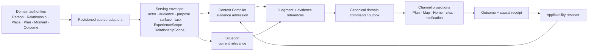
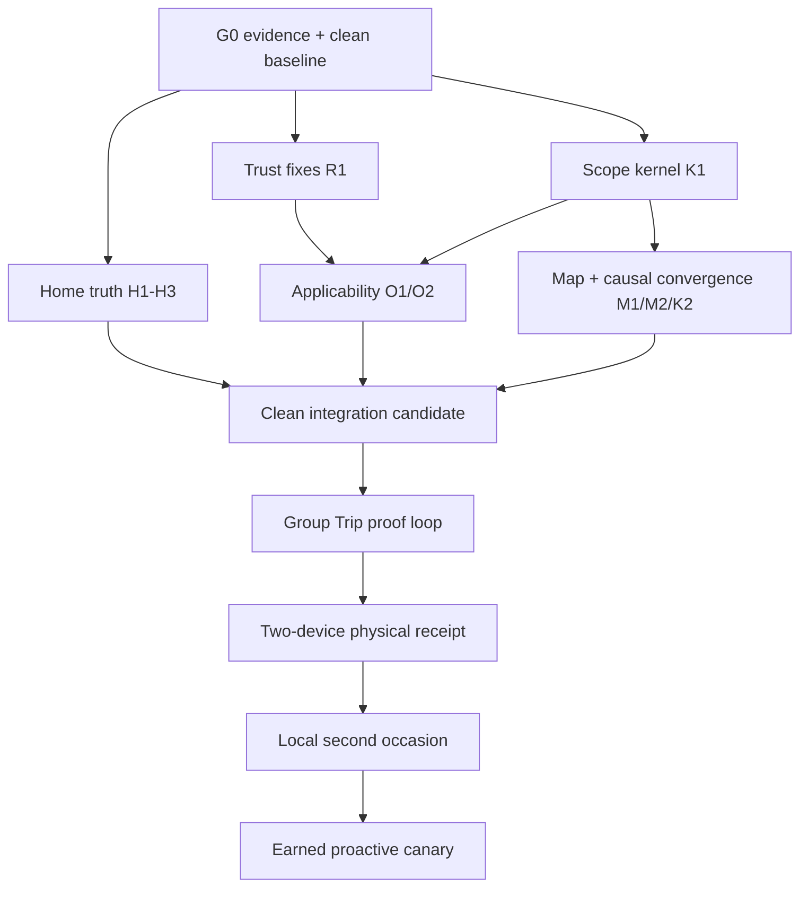

# Intentional convergence engineering plan

## 1. Executive decision

The product does not need another broad architecture wave. The recent pivot is
strategically coherent and its substrate is substantial. The next engineering
round should convert that substrate into two experienced, revision-bound proof
loops:

1. **Group Trip judgment:** people + place + route + time + weather → one
   governed proposal → group decision → coherent Plan/Map/Now projections →
   correctable per-person outcome.
2. **Local second occasion:** saved interest + relationship + current moment →
   bounded local Plan → occurrence → governed outcome → a materially better
   next occasion.

The next round should not attempt both loops at once. It should first establish
the truth, trust, scope, projection, and evidence joints that both loops need.
Then it should close the group Trip loop on devices. The local second-occasion
loop follows on the same kernel.

This program makes four immediate decisions:

1. **Truth and trust defects are P0.** A backend failure must not become an
   authoritative empty state; wrong-roster relationship evidence must not
   remain visible or influence judgment; private and missing public profiles
   must be indistinguishable; and device scripts must not report success when
   no device assertion ran.
2. **Converge through bounded contracts, not a universal model.** Context
   Compiler owns evidence admission, Situation owns current relevance, domain
   authorities own facts and mutations, and a content-free serving/causal
   envelope joins the decision.
3. **Profile is a projection doctrine and prototype, not a production build
   authorization.** The pair-level Together view is the right first profile
   prototype, but no production endpoint or Home integration should precede
   roster revocation, applicability, and viewer-safe projection guarantees.
4. **Keep the external V1 contract stable until product explicitly changes
   it.** P01–P04 are treated as internal pivot-proof gates for now. They must
   not be blended with “V1 release-ready” language. Changing the external
   release milestone requires a separate explicit update to the release
   contract and its generated gates.

## 2. Inputs and evidence boundary

This plan reconciles four August 9 documents:

- [Thesis-to-experience convergence audit](thesis-to-experience-convergence-audit-2026-08-09.md);
- [Home surfaces post-consolidation engineering plan](home-surfaces-post-consolidation-engineering-plan-2026-08-09.md);
- [Profile system and relationship views](../../travel-agent/docs/working/profile-system-and-relationship-views-2026-08-09.md);
- [Cross-slice engineering coherence audit](cross-slice-engineering-coherence-audit-2026-08-09.md).

It also incorporates three independent read-only verification lanes run on
August 10:

- backend context, relationship, outcome, profile, and canonical-write paths;
- Trips/Places Home state, cache, gates, actions, and evidence;
- journey evidence, release governance, flags, World Foundry, and status drift.

The stable investigation anchors were:

| Repository | Verified clean lineage |
| --- | --- |
| workspace | `6fb04af3848641b3be0a057d131bcf4cf7396870` |
| backend `main` | `95074b3eea7e1c5905d912822bbb3a6eaf5d9fb3` |
| mobile `main` | `f7549bd757f82bf4688bd599cfc78a96923ef25d` |

The shared backend worktree was on a moving Riviera/Map/Search branch during
verification. Workspace governance/status files also changed concurrently.
Those moving worktrees are **not** an integration baseline. Every implementation
lane below starts in a dedicated worktree from recorded clean heads.

### Execution ledger — 2026-08-10

Rounds 0 and 1 are complete on the main-derived candidate. The candidate is now:

| Repository | Candidate revision |
| --- | --- |
| workspace | `e09ba42bb5de8968d58625545f22cda674328730` |
| backend | `98490418fbba2fd07b714d9c9efba5f2b0f88227` |
| mobile | `9ea3f44eb11f193b15959a50e25f9271108b005b` |

The exact backend/mobile SHAs above are the revisions used for the Round 1
focused checks; the workspace SHA remains the coordinator revision. Landed
work is intentionally split into small commits:

- G0 evidence integrity and status/flag governance: `d504d2f`, `0a2575a`,
  `e936fae`, `aa2b8b0`, `e8df013`, `594b4d8`, `2d0d7b9`;
- G0 metadata and documentation truth: `5b32842b`, `b5b871820`, `59de99e`,
  `bc97fa1`;
- baseline fixture correction: `84930858f` (binds a readiness assertion to
  the explicit dark-by-default Duffel live-booking flag);
- H1 degraded Concierge Home truth: `0ddffd2be`;
- H2/H3 mobile Home and Places truth: `84b47e68`, `07c7618b`, `a61b9eb0`,
  `a0074f39`, `9ea3f44e`;
- R1 roster-drift revocation and unavailable-profile indistinguishability:
  `c7e9d7133`, `92ce61d2e`;
- K1 live experience/Trip-roster serving identity: `a533ebcb2`.
- O1 exact-roster outcome applicability across private planner and compiler
  paths: `98490418f`.

Verification so far: `make certify-fast` is green (including 17,112 offline
backend tests, 33 mobile journey suites/171 tests, and 316 Maestro flows), and
the post-O1 full offline backend run is 17,121 passed/14 skipped/1 xpassed.
The Round 1 focused backend set is 148 passed/9 skipped plus 92
outcome/compiler tests, the five Home truth mobile suites are 52/52, TypeScript
compiles, and contract/docs gates are green.
This is deterministic/static and backend-real evidence only. The committed
attestation index is still empty; no device-mock, physical, staging, or AI-eval
receipt has been promoted for this candidate.

### Post-lane hardening candidate — 2026-08-10

The four parallel lanes are on `main`. The subsequent targeted hardening work
is currently committed locally as this clean triple-SHA candidate:

| Repository | Candidate revision | Added scope |
| --- | --- | --- |
| workspace | `377582bf0ffe63a686396d9b9783db91d7320050` | Physical-receipt cardinality and device-proof attribution integrity. |
| backend | `5491ca97231fc2d7c2efe730daad8f35d3b00f5d` | One shared outcome-applicability policy and durable receipt-upload identity migration. |
| mobile | `aba00ae32946d279411836a0337f2df0d41c2cde` | Unchanged; the required local-Plan, RSVP, and outcome UI surfaces were already present. |

The targeted source/mock checks for these additions are green: 22 workspace
evidence tests, 9 outcome/compiler safety tests, and 122 expense/API tests.
The migration has one Alembic head and backend async/size checks pass in the
configured project environment. These are S/M-layer facts only; they do not
create a D/V receipt or promote a proof.

The next unavailable boundary is intentionally external: G3–G5 needs a
deployed backend revision, a build of the exact app SHA, two distinct physical
devices and identities, plus the real second-participant interaction. No local
script, simulated account, or manually authored receipt may substitute for
that evidence.

Evidence terms are strict:

- **S:** source/static or type evidence;
- **M:** deterministic fixture or mock-walk evidence;
- **B:** backend-real behavior on a pinned revision and database state;
- **D:** controlled simulator/device-mock evidence;
- **V:** physical-device evidence bound to app build and backend deploy;
- **A:** observed AI evaluation evidence.

Passing a lower layer never implies a higher layer. “Complete,” “certified,”
“accepted,” and “release-ready” must name the exact layer and receipt.

## 3. Reconciled assessment

### 3.1 What is already a sound foundation

- Canonical itinerary operations, proposal gateways, receipts, and mutation
  impact envelopes form a credible shared Plan authority.
- Strict group chat suppresses raw model streaming and routes group-visible
  text through the privacy-aware group composition boundary.
- Weather rescue already uses the canonical replace-proposal builder and a
  strict private-corpus validator.
- Trips preserves server attention order; Places preserves server section
  order and filters only for renderability.
- Places-originated itinerary changes preview and commit through the canonical
  Trips operation path rather than mutating an itinerary directly.
- Route facts carry provenance, freshness, resolved transport mode, geometry,
  and degradation semantics.
- Context Compiler is a real, gated planner consumer with parity and cutover;
  it is no longer observer-only.
- Outcome capture stores the exact confirmed occurrence roster and supports
  correction.
- Public profile is opt-in and server-projected. Follows, co-travel, circles,
  Plan membership, and location grants remain distinct authorities.
- The current Home architectures—authored Trips page plan and server-produced
  Places feed—are appropriate. They need state honesty and ownership headroom,
  not replacement.

### 3.2 Verified P0 defects

These are sprint-authorized correctness work, not product exploration.

| ID | Defect | Consequence |
| --- | --- | --- |
| T-01 | Concierge Home assembly failure reaches Trips Stack as ordinary empty | Outage can appear as “nothing needs attention.” |
| T-02 | Trips query identity omits precipitation and wind | Weather-sensitive ranking can remain stale under the same key. |
| T-03 | Offline Trips conflates committed-trip cache, ranked cache, and placeholder projection | Cached trips can remain in initial loading; old Near You content can look current. |
| T-04 | Day Map uses the local-Plan gate and queries while dark; Ambient also queries while dark | Release controls do not govern reachability or spend. |
| T-05 | Zero-renderable partial Places feed renders an empty feed with a partial notice | Unavailable truth appears as a blank but usable surface. |
| T-06 | Circle leave/removal retracts only claims authored by the departing member | A remaining member's shared companion-fit claim can survive after its source roster is no longer valid. |
| T-07 | Missing and non-public profile responses use different error details | The proposed unavailable-profile indistinguishability rule is not met. |
| T-08 | Founder-device commands cannot record a first-class physical receipt and may succeed after skipping assertions | Release language can outrun evidence. |

### 3.3 Verified convergence gaps

| ID | Gap | Current state |
| --- | --- | --- |
| C-01 | Live scope identity | `AIRunContext` can carry RelationshipScope, but production root chat runs omit it; no production resolver constructs it. ExperienceScope is resolved later in turn loading and is absent from the run envelope. |
| C-02 | Context policy duplication | Context Compiler, TripWorldModel, Situation, turn loading, and spatial context apply overlapping selection/relevance policy. |
| C-03 | Outcome applicability | Capture keeps `companion_scope`; recent summaries and both planner paths drop it and can emit generic “those companions” prose without current-roster comparison. |
| C-04 | Map assembly parity | Interactive Map has richer canonical inputs than AI spatial context, AI route cards, and public map share. |
| C-05 | Spatial handoff grounding | “Ask Vesper about this area” does not send viewport, bounds, zoom, or area identity. |
| C-06 | Projection convergence | Save/unsave omits the canonical Places feed; terminal proposal subtraction omits the current Trips queue. |
| C-07 | Durable trust-loop idempotency | Receipt upload idempotency is process-local; concurrent workers or deploy retries can create duplicate rows/jobs. |
| C-08 | Flag governance | Three consequential mobile flags are absent from the registry; the checker scans backend conventions only. |
| C-09 | Evidence convergence | Seeded replay is freshly 28/28, but committed J08 status is stale; P01–P04 receipts are stale/unrun; `certify-fast` stops on 26 Maestro metadata diffs. |
| C-10 | World Foundry operator path | A transactional persistence library exists, but the main reviewed promotion workflow lacks supported operator apply, editorial promotion, index parity, and runtime capability certification. |

### 3.4 Stale or over-broad claims to retire

- “J08 currently fails” is stale at seeded-replay level. A fresh diagnostic run
  was 28/28. It remains unproven on a clean integration revision and on device.
- “Context Compiler has no planner consumer” and “live compilation is
  observer-only” are stale. The planner is the first gated consumer; parity,
  cutover, coverage, and rollback remain incomplete.
- “World Foundry has no writer” is too broad. A persistence library and a
  narrow catalog-bootstrap apply path exist. The missing claim is the supported
  fact/editorial operator workflow with rechecks, index parity, and runtime
  certification.
- The Home design bundle's suggestion that local Plan production is absent is
  stale. A gated path exists; it is not broadly promoted or device-certified.

### 3.5 Authority classification

| Input | How this plan uses it |
| --- | --- |
| Product thesis and Product Model | Durable direction and object boundaries. |
| Release scope, journeys, system charters | Current external promise and certification authority. |
| Thesis convergence audit | Architectural diagnosis and target proof loops. |
| Home engineering plan | Authorized correctness and hardening backlog. |
| Profile/relationship document | Product hypothesis and fixture-prototype brief only. |
| Cross-slice audit | Revision-anchored seam findings, reverified before dispatch. |

### 3.6 Round 1 implementation status

The following P0 defects are now implemented with regression coverage:

- **T-01:** degraded Concierge Home is marked internally and the Trips Stack
  returns a retryable authorization-safe unavailable response instead of an
  authoritative empty projection; committed-trip fallback remains client-owned.
- **T-02–T-04:** Trips ranking identity includes rounded precipitation/wind;
  committed, ranked, placeholder, offline, and re-keyed ambient states are
  distinct; Day Map and Ambient work are flag-gated.
- **T-05:** Places treats zero-renderable producer failure as unavailable and
  applies one deterministic notice-precedence rule.
- **T-06–T-07:** roster-drift invalidates shared companion-fit claims regardless
  of author, and missing/private profiles share one generic unavailable detail.
- **T-08:** physical evidence remains fail-closed through the G0 runner package;
  no physical receipt exists yet.

**K1 is additive, not a universal-model migration.** `AIRunContext` now carries
both `ExperienceScope` and a revisioned Trip-roster `RelationshipScope` at live
chat entry; child runs inherit them. Circle scope construction remains an
explicit authorized caller responsibility, and a Trip never guesses a circle.

**O1 is complete for the current kernel.** Recent outcome summaries retain
`companion_scope`; private formatter/planner paths and Context Compiler source
admission withhold malformed, stale, or changed-roster companion-fit evidence.
The pure policy exposes `apply | weak_precedent | withhold`; only exact-roster
evidence currently applies. The remaining Round 2 work is map/projection
convergence and durable causal propagation, not a profile production build.

## 4. Target architecture

### 4.1 Bounded serving and decision lifecycle



Rules:

1. The serving envelope is content-free identity and purpose. It does not hold
   private prose, raw memories, or a universal user blob.
2. Context Compiler decides which evidence is admissible for the job. It does
   not own every database read or current-state computation.
3. Situation represents now: time, location, Plan state, route, weather,
   availability, and current social/operational posture. It is not durable
   memory.
4. TripWorldModel remains a revisioned source/cache adapter during migration.
5. Domain commands—not AI runs, screens, or profile projections—own mutations.
6. Group-visible text continues through `group_compose.py` or an explicitly
   equivalent typed group projection. Private rationale never crosses into the
   group payload and is never “hidden” client-side.
7. Outcomes remain domain-specific. A pure applicability policy decides
   `apply`, `weak_precedent`, or `withhold` for the current roster, place,
   occasion, recency, correction, and consent state.
8. Every consequential decision joins source revisions, run/workflow identity,
   command/receipt identity, projection revision, and outcome where applicable.

### 4.2 Map projection profiles

One map assembly service should expose named profiles:

- `interactive_viewer`;
- `ai_context`;
- `editorial_cache_only`;
- `public_share`.

Every profile shares canonical block IDs, day order, resolved schedule
timezone, ordered destinations, crossings, and route-fact status. Viewer-private
layers are explicit profile additions. Privacy is not implemented by omitting
canonical public-safe truth from lower-context consumers.

### 4.3 Viewer-scoped profile projections

Profile remains a projection router, not a seventh durable object or a generic
profile table:

```text
self                 -> private interpretation + evidence/correction doors
unknown/follower     -> explicit public authored lens only
common Trip only     -> bounded shared-history projection
confirmed pair/circle -> Together projection
active Plan context  -> Plan-member projection
```

Every projection has a server-owned audience contract and cache identity that
includes subject, viewer, audience, relationship/Plan/privacy revisions, and
purpose. A production Together endpoint is blocked on T-06, C-01, and C-03.

## 5. Product proof scenario

Use one fixed scenario across product, design, engineering, corpus, and
evidence:

> Feihu and Maya are in Lisbon with ninety minutes before dinner. They choose
> **Take us somewhere**. Vesper composes a bounded route that fits their time,
> interests, weather, and next commitment. A material condition changes;
> Vesper proposes one grounded repair. Both people remain synchronized through
> one shared Plan and Map. Each privately confirms or corrects the outcome.
> Later, on a New York occasion, Vesper uses only applicable, permitted evidence
> to make the next Plan better.

The group Trip portion is the first promotion target. The New York second
occasion becomes the next target after the group loop has V evidence.

Required negative oracles:

- Maya's private constraint never appears in group text, metadata, module
  presence, or another member's explanation.
- a changed roster withholds or weakens prior companion-fit evidence;
- stale route/weather/location facts are labelled or withheld;
- a rejected proposal does not mutate the Plan;
- accepted/reverted changes converge on both observers;
- missing data produces degraded/unavailable truth, never plausible live data;
- an unworthy opportunity produces silence.

## 6. Ordered engineering program

### Round 0 — integration control and evidence integrity

**Goal:** create a trustworthy promotion lane before more product behavior
lands.

#### G0.1 Clean integration baseline

- Create dedicated workspace, backend, and app worktrees from recorded clean
  heads.
- Record branch, base SHA, working-tree status, toolchain versions, and seed or
  corpus identity.
- Do not implement in the active shared Riviera worktree.
- Make workspace OpenAPI snapshots, generated app schema, generated status, and
  evidence receipts coordinator-owned hot files.

#### G0.2 Maestro metadata repair

- Review all 26 normalization diffs semantically before applying them.
- Preserve explicit founder/live-account ownership and isolation where
  intended; do not accept path-derived replacements blindly.
- Restore `maestro-flow-check`, then run the complete `certify-fast` sequence so
  its backend step actually executes.

#### G0.3 Physical evidence contract

- Add a first-class `physical` receipt command and schema fields for app SHA,
  EAS build ID, backend SHA/deploy digest, migration revision, seed/corpus hash,
  device model/OS, sanitized identities, oracle/flow hash, artifacts, reviewer,
  and result.
- Make live/device scripts fail closed when a required assertion or prerequisite
  is skipped.
- Remove instructions to update `STATUS.md` manually; generated status consumes
  current receipts.

#### G0.4 Mobile flag governance

- Register `LOCAL_PLAN_DOGFOOD_ENABLED`, `TRIP_EDITORIAL_MAP_ENABLED`, and
  `OUTCOME_ARTIFACT_ENABLED` with owner, expiry, target journey, cohort,
  kill-switch behavior, and promotion/removal question.
- Define one discoverable app-flag convention and extend the checker to both
  repositories.

#### G0.5 Documentation truth

- Correct Context Compiler documentation to describe the gated planner
  consumer, parity, cutover, fallback, and remaining legacy path.
- Clarify World Foundry's four separate capabilities: fact-plan apply,
  catalog-bootstrap apply, editorial promotion, and derived-index/runtime
  certification.
- Regenerate current-state and journey status only on the final clean candidate.
- Record J08 as seeded-replay evidence only until device proof exists.

**Exit:** G0 commands are green on one clean triple-SHA candidate; status is
generated from receipts; no device script can pass after skipping required
device work.

### Round 1 — truth and trust kernel

**Goal:** remove false product truth and establish the minimum shared identity
needed by both proof loops.

#### H1 Trips degraded-source truth

Owner files:

- backend Concierge Home feed models/fallback;
- Concierge Home and Trips Stack routes;
- focused backend Home tests.

Deliverables:

- mark degraded source internally without exposing exception detail or changing
  the quiet Concierge Home fallback;
- prevent Trips Stack from projecting degraded source as `empty`;
- return a retryable/degraded read and preserve committed trips through an
  explicit unranked fallback;
- ensure the internal marker is excluded from public schema if that design is
  retained.

#### H2 Trips client state truth

Owner files:

- `data/conciergeHome.ts` and related query helpers;
- `TripsHomeController.ts`;
- `homeSurfaceStateMatrix.ts`;
- Trips page composition/gate files.

Deliverables:

- include rounded precipitation and wind in query identity;
- distinguish exact ranked projection, previous-key placeholder, committed-trip
  cache, and network state;
- consume `isPlaceholderData` and withhold old location/weather-sensitive
  content after ambient re-key;
- render offline-unranked committed trips rather than indefinite loading;
- gate Day Map query and membership with `TRIP_EDITORIAL_MAP_ENABLED`;
- suppress Ambient query/model work while its feature is dark.

#### H3 Places availability truth

Owner files:

- Places presentation model;
- `PlacesWorkspace.tsx`;
- one pure notice-precedence adapter;
- focused Places tests.

Required truth table:

| Renderable sections | Unavailable producers | Result |
| ---: | ---: | --- |
| > 0 | 0 | available |
| > 0 | > 0 | partial |
| 0 | 0 | empty |
| 0 | > 0 | unavailable/retry |

Notice priority is `offline > failed refresh with cache > partial producer
failure`. One snapshot renders one state notice.

#### R1 Relationship/profile trust fixes

- When a circle roster changes, retract or withhold every active companion-fit
  share whose source roster no longer exactly matches the governed circle
  roster, regardless of claim author.
- Cover 2→1, 3→2, leave, removal, rejoin, and stale-cache behavior.
- Return one generic unavailable response detail for missing and non-public
  profiles.
- Add enumeration-resistant contract tests.

#### K1 Serving scope contract

- Define one content-free serving envelope carrying actor, audience, purpose,
  surface, task, ExperienceScope, RelationshipScope, and source revisions.
- Add ExperienceScope to root run/trace identity or define one explicit paired
  run/serving identity; do not leave it as prompt-only turn-loader state.
- Implement a production RelationshipScope resolver:
  - Trip roster for current Plan/Trip decisions;
  - circle only from explicit circle/relationship entry;
  - none for follows or incidental co-travel;
  - never guess when a Trip links to multiple circles.
- Attach scopes at live chat entry and prove child inheritance where child runs
  are actually used.
- Trace only content-free identifiers/revisions.

#### O1 Immediate outcome safety

- Add a compatibility-safe guard that withholds generic companion-fit prose
  unless current-roster applicability is proven.
- Preserve `companion_scope` in the outcome summary read model.
- Specify the shared resolver contract:
  `apply | weak_precedent | withhold`, reason codes, source/current roster,
  place/destination/occasion match, recency, correction/retraction state, and
  evidence references.

**Round 1 exit:** all eight P0 defects have automated regression coverage;
scope identity exists at the live entry boundary; wrong-roster evidence is
withheld; Home never promotes degraded/unavailable truth to empty/current;
G1/G2 evidence is recorded on one clean integration candidate.

### Round 2 — map, projection, and causal convergence

**Goal:** make the target group decision use one physical/spatial truth and one
traceable convergence graph.

#### M1 Authoritative map assembly

- Introduce the named projection-profile service.
- Route authenticated Map, editorial cache, AI spatial Situation, AI route card,
  and public share through it.
- Add parity tests for canonical block IDs, day order, timezone, destinations,
  crossings, and fact status.
- Add privacy tests for accommodations, member names, location, saves, and
  viewer-specific layers.

#### M2 Typed spatial handoff

- Extend conversation seed with center, optional bounds, area scale/zoom,
  observed time, precision/source, and disclosure posture.
- Resolve coordinates server-side to canonical Place/Area context before prompt
  construction.
- Treat coordinates as untrusted evidence, not a stable identity or instruction.
- Test trip switching, stale viewport reset, permission changes, malformed
  bounds, and selected-entity precedence.

#### P1 Projection dependency graph

- Add canonical Places feed invalidation to save/unsave.
- Decide and encode whether itinerary `retrieval` impacts invalidate
  Trip-context Places feeds.
- Subtract terminal proposals from crown, current queue, and legacy rows.
- Inventory mutation impacts for Places, Home, Map, Situation, Atlas, booking,
  and retrieval in one typed/tested contract with conservative unknown fallback.

#### P2 Action and telemetry semantics

- Make Places door routing exhaustive; explicitly adopt, remap, or remove
  `guide`.
- Separate detail-navigation labels from save mutation labels.
- Build aggregate Trips queue content identity from stable item IDs and keep
  revisions separate.
- Decide whether an aggregate impression means frame-visible or per-item-visible
  before any fatigue consumer relies on it.

#### I1 Durable receipt-upload idempotency

- Add a durable unique logical upload identity bound to Trip, actor,
  idempotency key, and request fingerprint where appropriate.
- Return the original receipt on replay across workers and deploys.
- Prove one receipt row and one OCR job under concurrent Postgres requests.
- Audit other monetary/external-side-effect endpoints still using process-local
  idempotency.

#### K2 Causal propagation and scoped Situation

- Establish root runs at real planner worker, Home composition, Places
  grounding, ambient judgment, voice, and outcome reconciliation boundaries
  where an AI/decision attempt actually exists.
- Thread run/workflow/correlation through existing command and execution
  receipts; do not create a parallel receipt system.
- Wrap current `TripSituation` in scoped serving identity and dependency
  revisions. Do not turn it into a universal mega-object.
- Keep Context Compiler admission and Situation relevance distinct.

#### O2 Shared outcome applicability

- Implement the pure resolver and use it in both legacy planner enrichment and
  Context Compiler under parity.
- Add negative oracles for changed roster, changed occasion, corrected outcome,
  revoked circle, stale evidence, and different place.
- Observe parity before deleting either reader.

**Round 2 exit:** all active map consumers agree on canonical public-safe truth;
“this area” is grounded; relevant mutations converge without stale-window
luck; target decisions have an inspectable causal join; wrong-applicability
evidence is withheld in both planner paths.

### Round 3 — close the group Trip proof loop

**Goal:** demonstrate the fixed Lisbon scenario end to end.

#### L1 Explicit local micro-journey doorway

- Add one bounded **Take me/us somewhere** entry.
- Compose a small route, not a recommendation list.
- Preserve time budget, next commitment, route facts, weather, place evidence,
  roster, and audience in the serving/causal envelope.
- Keep the path internal and kill-switchable.

#### L2 One real second participant

- Use the thinnest credible participant path: invitation, consent, Plan
  membership, proposal visibility, response, and synchronized projection.
- Preserve one rich owner and thin participant topology.
- Do not require a public profile or broad social graph.

#### L3 Deterministic disruption and governed repair

- Select one deterministic weather or venue-state disruption.
- Produce one grounded alternative with limitations and provenance.
- Create the change through the canonical proposal gateway.
- Prove accept, reject, expiry, and revert.
- Prove Plan, Map, Now, group room, and both observers converge.

#### L4 Outcome and causal closure

- Each participant privately confirms or corrects occurrence/outcome.
- Preserve exact roster and per-person ownership.
- Join decision, proposal, mutation, projection, occurrence, and outcome receipts.
- No group copy may contain private rationale; all group text uses the canonical
  composition/projection boundary.

#### L5 Evidence promotion

- Run deterministic contract and Postgres gates on the clean candidate.
- Deploy that exact backend candidate and build that exact app candidate.
- Run controlled device-mock separately from physical multi-device evidence.
- Record both observers, device/build/deploy identities, negative oracles, and
  artifacts.
- Generate status from receipts only.

**Round 3 exit:** on two physical devices, one material disruption produces one
governed proposal and coherent shared state, private inputs remain private, and
each participant can correct the outcome. Only the proven P/journey branches
are promoted.

### Round 4 — local second occasion and earned proactivity

**Goal:** prove everyday value without push, then decide whether attention has
been earned.

#### E1 Passive opportunity projection

- Expose one saved-place opportunity in an existing in-app surface.
- Preserve save origin, source evidence, freshness, and opportunity receipt.
- Do not notify.

#### E2 Generalized local Plan activation

- Replace the hard-coded Friday doorway with bounded origin-aware entry from
  save, place, conversation, or person.
- Launch one local Plan, occur it, and capture a correctable outcome.

#### E3 Second-occasion evaluation

- Apply the shared resolver to the later New York occasion.
- Compare against a non-personalized or prior-policy baseline.
- Evaluate specificity, fit, coordination effort, inappropriate-repeat rate,
  wrong-companion application, and correction behavior.

#### E4 Earned proactive canary

- Only after passive precision is demonstrated, define attention budget,
  cooldown, quiet hours, channel eligibility, holdout, kill switch, and
  downstream outcome join.
- Canary one candidate type to a tiny internal cohort.
- Silence remains a valid and measurable result.

**Round 4 exit:** a real saved interest becomes a local Plan and a later Plan is
materially better because of applicable evidence. Push remains off unless the
passive comparison shows enough value and low regret.

## 7. Profile and World Foundry side tracks

These can create learning without competing with the critical path.

### PF0 Profile doctrine fixtures — allowed in Round 1

- Ratify stranger, follower, co-traveler, confirmed circle, current Plan, and
  self audiences.
- Create deterministic authored/inferred/relational/situated claim fixtures.
- Build adversarial visibility and module-presence tests.
- Prototype Together as a fixture-only screen.
- Test comprehension, usefulness, non-creepiness, and silence.

No production schema, endpoint, Home card, or proactive opening is authorized.

### PF1 Production projection — blocked

Blocked on:

- roster-change revocation;
- live RelationshipScope;
- shared outcome applicability;
- viewer-safe cache dependency identity;
- product evidence that the Together fixture improves a real Plan.

When unblocked, implement a server projection router rather than a universal
profile payload.

### WF1 Golden-world anchor packet — allowed in Round 2/3

- Select only the Lisbon anchors needed by the fixed scenario.
- Fill geometry, hours/availability, operating state, access, price, group fit,
  arrival guidance, interpretive evidence, freshness, and caveats as required.
- Distinguish fact-plan persistence, editorial promotion, derived-index sync,
  and runtime capability certification.
- Prove ID/hash/review parity and actual planning/narration/proactive/multiplayer
  consumption.

Do not broaden the city corpus or treat persistence-library existence as
runtime certification.

## 8. Recommended concurrent-session topology

Use separate worktrees. One session owns one hot-file family. Do not use a
shared working tree for concurrent implementation.

Codex's [worktree guidance](https://learn.chatgpt.com/docs/environments/git-worktrees.md)
supports one isolated checkout per task and notes that a branch can be checked
out in only one worktree at a time. Use a distinct branch for every lane.

The four entries below are **logical worktree lanes**, not four ordinary
checkouts of one repository. This workspace coordinates three independent Git
repositories: the parent workspace, `travel-agent`, and `travel-app`. A complete
lane is therefore one self-contained directory containing a parent workspace
worktree plus child-repository worktrees at `travel-agent/` and `travel-app/`.
Keeping the child worktrees exactly one directory below the lane root also
preserves their pre-commit references to `../scripts/`.

Do not create these lanes from the current checkout's `HEAD`. At the time of
this verification, all three local checkouts were on active Riviera branches
and the workspace contained uncommitted audit/plan changes. Fetch first, then
use explicit reviewed base refs—normally each repository's `origin/main`, or a
recorded integration-base commit after the planning documents are committed.

### Four concrete lane roots

| Lane | Permanent lane root | Branch in each repository | Primary write ownership |
| --- | --- | --- | --- |
| **A — evidence integrity** | `/Users/feihuyan/travel-workspace--convergence-evidence-integrity` | `codex/convergence-evidence-integrity` | Workspace evidence/generator/flag files and app Maestro metadata. Child repos are present so the full cross-repo ladder can run, but backend product code is read-only. |
| **B — Home truth** | `/Users/feihuyan/travel-workspace--convergence-home-truth` | `codex/convergence-home-truth` | Backend Home degradation and mobile Trips/Places truth. |
| **C — context and trust** | `/Users/feihuyan/travel-workspace--convergence-context-trust` | `codex/convergence-context-trust` | Backend AI scope, relationship revocation, public-profile indistinguishability, and outcome applicability. |
| **D — map and projection** | `/Users/feihuyan/travel-workspace--convergence-map-projection` | `codex/convergence-map-projection` | Backend map assembly and mobile spatial seed, invalidation, and route-fact presentation. |

Each lane root should contain:

```text
travel-workspace--<lane>/          # parent workspace Git worktree
├── travel-agent/                  # backend Git worktree
├── travel-app/                    # mobile Git worktree
├── docs/
├── scripts/
└── Makefile
```

The existing `scripts/new-worktree.sh` creates coordinated child-repository
worktrees as siblings of the current canonical checkout. That remains useful
for a child-only task. For these cross-repo lanes, create the parent worktree
first and place both child worktrees inside it, or extend the script to support
that three-repository layout. Do not create a parent-only Codex-managed
worktree and assume the ignored child repositories came with it.

Creation pattern for one lane, after fetching and replacing `<lane>` with one
of the four names above:

```bash
lane="convergence-home-truth"
root="/Users/feihuyan/travel-workspace--${lane}"

git worktree add -b "codex/${lane}" "$root" origin/main
git -C travel-agent worktree add -b "codex/${lane}" \
  "$root/travel-agent" origin/main
git -C travel-app worktree add -b "codex/${lane}" \
  "$root/travel-app" origin/main
```

Use a fresh shell invocation per lane rather than reusing the example variables
across concurrent commands. Verify each root with `git status`, branch, and
`git worktree list` in all three repositories before dispatch.

### Round 0/1 topology

| Session | Primary ownership | May fan out to subagents for | Must not edit |
| --- | --- | --- | --- |
| **A — integration/evidence coordinator** | workspace Makefile, evidence schema/scripts, flag registry/checker, generated status, OpenAPI/type sync, merge candidate | read-only gate diagnostics, receipt review, doc consistency | product behavior in child repos |
| **B — Home truth** | backend Home degradation plus mobile Trips/Places state truth | backend characterization, Trips state matrix, Places truth table | map/context/profile files; generated schemas |
| **C — context/trust kernel** | AI run/scope, relationship revocation, profile unavailable response, outcome applicability | privacy negative oracles, legacy/compiler parity review | Home and map root files |
| **D — map/projection convergence** | map assembly profiles, spatial seed, save/proposal invalidation, route-fact presentation | consumer inventory, parity tests, privacy profiles | AI scope kernel and Home root files unless handed off |

### Recommended Codex task/fork model

Keep the original planning task as a read-only orchestrator and create one new
Codex task for each permanent lane root. Forking the conversation is useful for
carrying this audit context, but isolation comes from selecting the correct
worktree root—not from the fork itself.

Do not choose the current local checkout or “current branch with local changes”
as the worktree base. First commit or otherwise preserve the consolidated
planning documents on an intentional workspace branch. Then create the four
lane roots from explicit clean bases and start each task in its matching root.

Session A should establish and merge the evidence/flag baseline first. Sessions
B–D may create characterization tests and prepare bounded changes concurrently,
but they rebase onto A's landed baseline before producing the integration
candidate. This preserves parallel discovery without letting old certification
semantics become the promotion gate for new behavior.

Each new task should receive:

1. a link to this plan and its one assigned package set;
2. its lane root and exact base SHAs;
3. its write-owned and prohibited hot files;
4. the MVP privacy, canonical-writer, receipt, and device-evidence invariants;
5. a requirement to stop at its evidence-layer boundary rather than claiming
   the whole journey is complete.

Because a single Codex task has four active-agent slots including the
coordinator, the safe single-task pattern is:

1. root owns integration and generated files;
2. one subagent owns backend-only bounded files;
3. one subagent owns app-only bounded files;
4. one subagent owns read-only evidence/negative-oracle review.

That pattern is suitable for diagnostics, tests, and disjoint edits. For the
four cross-repo implementation sessions above, separate tasks/worktrees are
safer because all subagents inside one task share the same filesystem and
branch state.

### Hot-file locks

Only one owner in a wave for:

- `Travel App/components/trips/TripsHomeController.ts`;
- `Travel App/components/trips/TripsHomeBody.tsx`;
- Trips page/section composition utilities;
- `Travel App/components/places/PlacesWorkspace.tsx`;
- Places presentation/render-plan utilities;
- `Travel App/components/trip-map/TripMapScreen.tsx`;
- backend planner `_plan.py`;
- Context Compiler `source_loader.py`;
- backend AI-run/scope models;
- backend map assembly/builder;
- workspace OpenAPI snapshots and generated app schema;
- journey/status generators and evidence receipts.

### Worker handoff contract

Every worker reports:

- base and final SHA;
- exact touched paths;
- migration/compatibility statement;
- canonical writer and invalidation impacts;
- privacy/audience analysis;
- exact tests and results by S/M/B/D/V/A layer;
- receipts created;
- flags/cohort/rollback;
- known risks and deferred branches.

Stage explicit filenames only. Generated contracts are synchronized once by the
coordinator after backend behavior merges.

## 9. Dependency and merge train



Merge order:

1. evidence/gate integrity and mobile flag discovery;
2. independent privacy/trust fixes;
3. backend scope/outcome/map additive contracts and migrations;
4. OpenAPI snapshot and generated type sync by the coordinator;
5. mobile Home/map/projection consumers;
6. clean cross-repo integration candidate;
7. deterministic and Postgres gates with receipts;
8. deploy exact backend, build exact app;
9. controlled D evidence, then independent V evidence;
10. generated status and explicit milestone promotion.

Do not mix behavior fixes with architecture extraction, visual redesign, design
adoption, or generated status edits.

## 10. Validation ladder

### G1 — deterministic PR gate

- documentation/governance checks;
- OpenAPI projection and generated-type parity;
- frontend typecheck and journey Jest;
- Maestro structure, references, and semantically reviewed metadata;
- focused privacy, scope, Home, map, invalidation, and outcome tests;
- complete offline backend canary.

Record proof receipts only for the exact P anchors executed. One generic command
must not automatically certify multiple proofs whose oracles did not run.

### G2 — clean backend-real merge candidate

- Postgres-backed scope/relationship/outcome/idempotency tests;
- forced Home assembly failure;
- weather re-key and offline/cache state matrix;
- fully and partially unavailable Places feeds;
- map projection-profile parity;
- save/unsave and proposal terminal convergence;
- private-to-group negative oracles;
- fixed Lisbon scenario logic replay.

### G3 — deployed staging

Record backend image/release digest, migrations, seed manifest/corpus hash, and
environment identity. Deploy additive compatibility before client reliance.

### G4 — controlled device mock

Record app build/flow/fixture hashes, backend identity, screenshots/video, and
verdict. This is D evidence, never V.

### G5 — physical multi-device

Use the exact candidate artifacts. Record both devices, OS versions, identities,
build/deploy IDs, oracle hashes, artifacts, reviewer, and every required
privacy/revert/cross-observer assertion. A skipped assertion prevents the
affected branch from passing.

### G6 — AI evaluation

For proactive and second-occasion claims, record trial bundle, evaluator config,
holdout/comparison, repeated privacy/silence trials, artifacts, and verdict.

### G7 — promotion

Generate journey, proof, current-state, and release projections from current
receipts. Confirm cohort, kill switch, rollback, and whether the milestone is
internal pivot proof or external V1.

## 11. Round 1 scorecard

Round 1 is successful when all of the following are true:

- `certify-fast` completes every step on a clean candidate;
- a physical receipt type exists and cannot be produced by a skipped run;
- mobile flags are registered and mechanically discoverable;
- no Home assembly failure becomes authoritative empty;
- offline, placeholder, stale, partial, unavailable, and empty are distinct;
- dark Day Map and Ambient paths do not fetch or incur model work;
- circle roster change invalidates every roster-dependent shared claim;
- missing and non-public profile responses are indistinguishable;
- live AI entry carries explicit Experience and Relationship scope identity;
- companion-fit prose is withheld unless applicability is proven;
- focused tests pass and G1/G2 receipts bind one clean triple-SHA candidate;
- no production Together view, proactive push, or broad corpus expansion has
  displaced this work.

## 12. Risks and stop conditions

| Risk | Stop condition / response |
| --- | --- |
| Scope envelope becomes a universal data blob | Stop if content or private prose enters the envelope; keep only identity, purpose, and revisions. |
| Compiler migration creates two invisible authorities | Require parity telemetry, explicit selection/fallback, allowlist, rollback, and legacy deletion ledger. |
| Home fixes are combined with visual redesign | Split commits; correctness and state truth land before polish. |
| Profile prototype silently becomes roadmap | No production endpoint/schema/Home integration without the PF1 unblock criteria and explicit product decision. |
| Group text bypasses privacy composition | Block merge; all multi-member prose uses the canonical group projection path and negative-oracle tests. |
| New mutation path bypasses canonical writer | Block merge; use existing proposal/operation/receipt gateway or amend the canonical contract first. |
| Generated contracts collide across sessions | Coordinator alone regenerates after backend merge order is fixed. |
| Dirty/moving branch is used as evidence | Diagnostic only; rerun on a clean pinned candidate. |
| Device command skips work but exits zero | No receipt, no promotion; make the command fail closed. |
| Product milestone remains ambiguous | Default to internal pivot proof while preserving external V1; changing V1 requires explicit contract revision. |

## 13. Explicit non-goals for this program

- no universal Person/Profile/Situation/Context table or mega-object;
- no broad public creator network or follower-led profile redesign;
- no production Together view before applicability and revocation are safe;
- no broad push or ambient delivery before passive value is measured;
- no additional Home card families before the adopted baseline is honest;
- no broad Lisbon/Riviera corpus expansion beyond scenario anchors;
- no client-side filtering of payloads that contain private fields;
- no direct itinerary mutation from Places, Map, profile, or AI prose;
- no manual release-status promotion;
- no “done” claim based only on source, mock, backend, or seeded replay tests.

## 14. Immediate dispatch packet

The next engineering round begins with four task briefs:

1. **Evidence and integration integrity:** G0.1–G0.5.
2. **Home truth:** H1–H3, followed by projection/action fixes that do not cross
   the map hot-file lock.
3. **Context and trust:** R1, K1, and O1.
4. **Map and projection convergence:** M1, M2, P1, and the route-fact policy.

Before dispatch, the coordinator records clean heads and assigns hot files.
After the four lanes merge, the team creates one clean integration candidate and
runs G1/G2. Product-loop work begins only from that candidate.

The next product milestone is not “more Vesper systems exist.” It is:

> On two devices, Vesper uses permitted evidence about the people, place, time,
> and changing reality to make one governed shared decision, keeps every surface
> coherent, preserves private context, and records enough truth to improve the
> next occasion.
