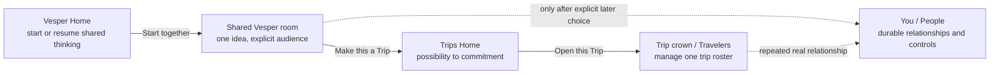

# Multiplayer entry points: Vesper Home → shared room → Trip

> **Status.** This is a working synthesis, not build authorization or settled
> surface canon. It records the August 12 product discussion and a same-day
> code investigation. Recommendations are labelled **[proposed]**; current-code
> statements are labelled **[verified]**. Any accepted surface change must be
> promoted into the relevant Vesper Home, Vesper Chat, and Trips Home operating
> contracts before implementation is considered complete.

## 1. Executive position

**[implemented 2026-08-12]** A standalone group is now a first-class
conversation: it can begin with people, an idea, both, or neither. It has
explicit invite admission, a mutable room owner distinct from immutable
creator provenance, leave/remove/handoff lifecycle operations, and a direct
client creation/opening path. It does **not** receive trip-only location,
availability, map, weather, or itinerary context until promotion.

**[implemented 2026-08-12]** The first client entry is the existing
conversation-creation scope (`group`): no new Vesper Home or Trips Home card
was added. A standalone group opens in the established chat shell with shared
room identity and focused history convergence. The remaining experience work
is the designed `Start together` affordance in Home’s composer plus a Room
Info surface that exposes people, invite, owner handoff, leave, and promote.

**[proposed]** Multiplayer should be exposed from both Vesper Home and Trips
Home, but the two entry points must not be duplicates:

- **Vesper Home owns starting and resuming shared thinking with Vesper.**
- **Trips Home owns turning a possibility into a shared commitment and bringing
  people into an emerging or existing Plan.**
- **A trip crown and Trip Info → Travelers own membership in one specific
  existing trip.**
- **You → People owns durable relationships:** Circles, companions, follows,
  and relationship/privacy controls.

The product verb should be **Start together**, **Plan with people**, or **Bring
someone in**. It should not be **Add friends**. Inviting someone to one room is
not the same as declaring friendship, following them, confirming a Circle,
making them a recurring companion, or granting future location/memory access.

The core product sequence is deliberately non-prescriptive:

> **Start with people, an idea, or both; let the room earn its Trip.**

An idea-first invitation is valuable, but it is not a validity gate. A blank
room is a legitimate social starting state, and people may supply the reason
to gather together.

## 2. The user problem

Today the app has strong multiplayer machinery after a Trip exists, but the
first natural multiplayer gesture often happens earlier:

- “My girlfriend sent me some places for Amalfi.”
- “A few of us are talking about Nice.”
- “Should we do something Friday?”
- “I found this place and immediately thought of Maya.”
- “Can I invite people into this Vesper conversation before it becomes a
  formal trip?”

The user is not necessarily ready to:

- create a trip object;
- choose dates;
- define a complete roster;
- manage a durable social graph;
- write an invitation note;
- decide whether this is a local Plan, travel Trip, pair ritual, or one-off
  possibility.

They only need a room around a possibility, with Vesper present and enough
context for the room to be useful.

The current product prematurely collapses that state into one of two choices:

1. keep talking privately to Vesper; or
2. create/select a Trip, then invite people through Travelers.

The missing state is a **pre-trip shared Vesper session**: a scoped room with a
real idea, explicit participants, zero-install invitation, clear audience, and
a later path to become a Trip without losing its history or people.

## 3. This is not generic group chat

The strategic goal is not to replace iMessage, WhatsApp, or an existing friend
group’s conversation. The native room exists for work ordinary messaging
cannot represent reliably:

- Vesper’s grounded synthesis and plan-shaping;
- explicit private-versus-group audience boundaries;
- structured place, route, availability, weather, and itinerary context;
- private caucus followed by group-safe resolution;
- shared proposals, decisions, receipts, and outcomes;
- one living Plan rather than divergent private chatbot answers;
- continuity when a shared possibility becomes a Trip.

Human-to-human messaging table stakes—reactions, replies, typing indicators,
and maximizing chat volume—are not the wedge. The invitation should travel
through the user’s existing social graph, usually as a share link in an
existing group chat. The richer Vesper room is the shared work surface after
the link is opened.

This follows the multiplayer strategy’s existing boundary: send Vesper’s
judgment into the social graph rather than requiring users to reconstruct the
social graph inside Vesper. See
[`multiplayer-strategy-2026-08-07.md`](../../travel-agent/docs/working/multiplayer-strategy-2026-08-07.md).

## 4. Product ontology: do not collapse the people models

The codebase already has several legitimate but different social concepts.
The entry-point design must preserve them.

| Concept | Meaning | How it begins | What it authorizes |
|---|---|---|---|
| Conversation participant | A person admitted to one Vesper room | Explicit participant addition or accepted room invite | Participation in that conversation only |
| Trip traveler/member | A person on one Trip roster | Accepted trip invite, promotion, or organizer action | Trip-scoped access according to role |
| Companion/co-traveler | A presentation of prior shared-trip history | Derived from actual co-travel records | No new sharing authority by itself |
| Circle | An explicit relationship carried across occasions | Explicit creation plus member acceptance | Only the Circle-scoped capabilities separately granted |
| Follow | One-way social/discovery relationship | Explicit follow | Discovery visibility; not private-context access |
| Visibility grant | Directional, revocable permission | Explicit privacy action | The named observation only, under its freshness/scope rules |
| Relationship-memory claim | A governed claim at personal/Circle/roster scope | Explicit or policy-governed write | Only the stored visibility and source scope |

**[proposed invariant]** `Start together` initially creates or resumes only a
conversation-participant relationship. It must not automatically:

- follow anyone;
- create or confirm a Circle;
- label anyone a friend or companion;
- create a persistent location grant;
- share personal memory;
- infer future invitation authority;
- carry an ephemeral party’s group preference into another occasion.

Durable relationship conversion may be offered later, after repeated real
outcomes and an explicit action. It is a separate user decision.

## 5. Surface ownership

### 5.1 Vesper Home

**Job:** start and resume sessions, including group sessions.

The Vesper Home operating contract says Vesper owns sessions while Trips owns
objects and Deck. It already permits group-session rows and authorized
participant facepiles. That makes Vesper Home the correct global entry point
for a pre-trip shared room, provided the entry remains a session action rather
than turning Home into a social feed or card stack.

Recommended affordance:

- a compact, visible **Together** audience control near the composer; or
- as the smallest first slice, **Start together** as the first surface-specific
  action in the composer’s existing `+` menu;
- a contextual **Bring someone in** action inside a substantive private
  conversation;
- existing group sessions continue to appear in the Workbench with a facepile.

The composer is the preferred primary home because `Together` changes the
audience of the work the user is starting. It is not a utility like Search or
History.

### 5.2 Vesper Home header capsule

The current trailing capsule contains Search, History, and You. The shared
`HeaderActionCapsule` deliberately accepts only two or three actions and throws
when given four.

**[proposed] Do not append a fourth “add friends” icon.** Reasons:

1. It violates the current component contract.
2. A person-add icon beside the existing person icon makes “invite” and “your
   account/people” difficult to distinguish.
3. The icon would describe a social-graph mutation, while the intended action
   is starting shared work.
4. A fourth unlabeled icon is a weak way to teach a strategic new behavior.
5. The header cluster is explicitly utility chrome; audience belongs closer
   to the composer.

If evidence later justifies a global header shortcut, the header must be
redesigned as a three-action system rather than stretched to four. Possible
experiments include a labelled `Start` control with private/together choices,
or a `More` consolidation. Neither should precede proving the composer entry.

### 5.3 Trips Home

**Job:** help a possibility become a shared Plan or Trip.

Trips Home already has a standing `CONNECT` card. A new card should not be
added. The existing card should be made honest and differentiated from the
crowned trip’s empty chair.

Current behavior:

- with no eligible connect trip, the card routes to Trip creation;
- with an eligible trip, it routes to Trip Info → Travelers;
- the crowned trip’s empty chair also routes to Trip Info → Travelers.

Therefore, in the common trip-present state, `CONNECT` and the crown mostly
duplicate one another. The card CTA also says `Share link`, but the press does
not mint or share a link; it opens Travelers first.

**[proposed] Evolve `CONNECT` by state:**

| Trips state | Card promise | Primary action | Result |
|---|---|---|---|
| No trip, no shared session | “Start something together.” | Start together | Seed a pre-trip shared Vesper room |
| Private idea has substance | “Bring someone into this.” | Share the idea | Mint a conversation invite |
| Shared room exists | “This is taking shape.” | Open the room | Resume the shared session |
| One relevant existing Trip | “Bring someone into this trip—or start something new.” | Choose destination | Existing Trip invite or new shared room |
| Crowned Trip | Crown owns the direct empty-chair action | Open Travelers | Manage that Trip’s roster |
| Viewer lacks invite authority | Show people truth without invitation promise | View travelers | Read-only roster or authorized actions only |

The exact card copy should state the consequence of the next tap. `Share link`
must either open the share handoff directly or be renamed `Choose who to
invite`/`Open Travelers`.

### 5.4 Trip crown and Travelers

**Job:** invite and manage people for one known Trip.

The current crown’s empty chair follows the correct authority pattern:

- it appears only after people-management authority resolves;
- it is a route-only handoff;
- the Travelers surface owns minting, sharing, pending invites, revocation,
  roles, and organizer transitions.

This should remain the contextual, trip-specific door. It should not become a
global friend-management shortcut.

### 5.5 You → People

**Job:** explain and manage durable relationship state.

This is where users should understand:

- whom they have traveled with;
- whom they follow;
- which Circles they explicitly confirmed;
- what relationship-scoped memory or visibility they authorized;
- how to retract, leave, archive, or change those relationships.

The user should not have to visit this surface before sharing one idea or
inviting someone to one Trip. Existing companions and confirmed Circles can
later become convenience targets in the invitation flow.

## 6. Recommended end-to-end journey

### 6.1 Start

1. The user taps **Start together** from Vesper Home or Trips `CONNECT`.
2. Any draft text, pasted link, selected place, save, event, city, trip shape,
   or Vesper session context is retained.
3. The interface states the audience clearly: private until people join, then
   group-visible in the shared room.
4. The user provides the smallest useful seed if no context exists.

The initial question is about the possibility, not the contact list:

- “What are you thinking about?”
- “Bring a place, a date, or the beginning of an idea.”
- “Amalfi in August.”
- “Something easy Friday night.”

### 6.2 Create something worth joining

5. Vesper produces a grounded opening artifact: a concise framing, two
   plausible directions, an important timing/route constraint, or one useful
   question.
6. The room becomes invite-eligible only when it has a destination or anchor.
7. Vesper never manufactures filler merely to pass the gate.

The backend already enforces this discipline with
`conversation_has_substance`. A direct blank-room share should therefore not
be the default flow.

### 6.3 Bring people in

8. The organizer taps **Bring someone in**.
9. MVP delivery uses an expiring/revocable share link and the OS share sheet.
10. A person can receive the link in iMessage, WhatsApp, email, or another
    existing social channel without address-book import.
11. Existing Vesper companions/Circles may be offered as shortcuts later, but
    no social graph is required.
12. The landing page explains the shared idea with a safe projection and may
    capture a bounded pre-auth signal.
13. After authentication/acceptance, the person joins the conversation.

### 6.4 Work together

14. The transcript is unmistakably group-visible.
15. Participants see who is in the room and which actions are shared.
16. Each person retains a private Vesper path for constraints or thoughts they
    do not want attributed in the room.
17. Vesper composes group-safe resolutions without revealing private sources.
18. The room produces shared objects and receipts rather than maximizing
    conversational activity.

### 6.5 Become a Trip

19. When the possibility has enough commitment, the organizer chooses **Make
    this a Trip**.
20. Promotion preserves the shared group conversation as the Trip’s primary
    room.
21. Conversation participants become Trip members with explicit roles.
22. Open invitation links remain recoverable across the promotion race.
23. The group lands in the same living Plan rather than restarting in a new
    generic chat.
24. Later roster changes belong to Travelers.

### 6.6 Continue after the occasion

25. Participation in one room or Trip does not automatically become a durable
    Circle.
26. Per-person outcomes are learned separately; roster membership is not
    treated as unanimous enjoyment.
27. A repeated relationship may later earn an explicit Circle or pair
    invitation.
28. Each participant should leave with something useful even if they never
    become the organizer: a place, plan, memory, or improved personal judgment.

## 7. Copy and interaction language

### Preferred

| Moment | Copy |
|---|---|
| Global doorway | `Start together` |
| Existing idea | `Bring someone in` |
| Composer audience | `Private` / `Together` |
| Share action | `Share invite` |
| Existing Trip | `Invite to this trip` |
| Promotion | `Make this a Trip` |
| Resume | `Open the room` |

### Avoid

- `Add friends` — falsely implies a durable social-graph mutation.
- `Create group` — administrative and context-free.
- `New group chat` — positions Vesper as another messenger.
- `Collaborate` — abstract enterprise language for a consumer relationship.
- `Invite members` before a Trip exists — implies an object and governance
  model the user has not created.
- `Share link` when the next tap merely navigates to another management page.

## 8. Verified implementation substrate

### 8.1 Backend: standalone group conversations exist

**[verified]** The conversation create API accepts `group` or `personal`, an
optional `trip_id`, and explicit `participant_ids`:

- [`backend/api/routes/conversations.py`](../../travel-agent/backend/api/routes/conversations.py)
  (`CreateConversationRequest`, `create_conversation`).

This means a group conversation is not inherently Trip-bound in the backend.

### 8.2 Backend: pre-trip conversation invites exist

**[verified]** The backend has conversation-scoped invite mint/list/revoke
routes:

- `POST /api/conversations/{conversation_id}/invites`
- `GET /api/conversations/{conversation_id}/invites`
- `DELETE /api/conversations/{conversation_id}/invites/{token}`

They are implemented in
[`backend/api/routes/invites.py`](../../travel-agent/backend/api/routes/invites.py).
Minting is creator-owned, idempotent, quota-aware, expiring, and gated on a
substantive destination/anchor so an invitee sees something real.

### 8.3 Backend: invitation acceptance is atomic

**[verified]** Conversation-invite acceptance atomically consumes a bounded
invite slot and adds the authenticated user to `conversation_participants`.
Retries avoid burning another slot. If promotion already occurred, acceptance
repairs both Trip membership and the destination group-room participant row:

- [`backend/core/db/trip_invites.py`](../../travel-agent/backend/core/db/trip_invites.py)
  (`consume_and_add_conversation_participant`).

### 8.4 Backend: promotion preserves the group

**[verified]** Promotion treats a group source as already share-safe and keeps
it as the Trip’s primary conversation. It copies conversation participants into
Trip members. A personal source remains private and produces a clean canonical
group room instead:

- [`backend/core/db/promotion.py`](../../travel-agent/backend/core/db/promotion.py).

This is the correct privacy distinction for the proposed flow.

### 8.5 Vesper Workbench can project standalone group sessions

**[verified]** The backend Workbench session projection already emits:

- `conversation_type: group | personal`;
- optional `trip_id`;
- `Group chat` kicker for a non-Trip group conversation;
- up to five authorized participant display summaries.

See
[`backend/home/vesper_workbench/sessions.py`](../../travel-agent/backend/home/vesper_workbench/sessions.py)
and
[`backend/home/vesper_workbench/models.py`](../../travel-agent/backend/home/vesper_workbench/models.py).

The mobile Workbench already renders group facepiles. Therefore, resume and
continuity are closer to complete than creation and admission.

### 8.6 Mobile conversation-invite transport exists

**[verified]** The app has a typed, tested hook that mints a pre-trip
conversation invite, handles the substance gate, and hands the URL to the OS
share sheet:

- [`hooks/useCreateConversationInvite.ts`](../../travel-app/hooks/useCreateConversationInvite.ts).

It currently has no production callsite.

### 8.7 Trips already has invitation surfaces

**[verified]** Existing surfaces include:

- the standing `CONNECT` card in
  [`components/trips/TripsHomeTrail.tsx`](../../travel-app/components/trips/TripsHomeTrail.tsx);
- the authority-gated crown empty chair in
  [`components/trips/TripsStackCrown.tsx`](../../travel-app/components/trips/TripsStackCrown.tsx);
- organizer-owned invite target selection, share handoff, pending invites,
  revocation, and roster administration in
  [`app/trip-info/index.tsx`](../../travel-app/app/trip-info/index.tsx);
- `Invite someone` in eligible Trip chat add menus.

The missing product is not “trip invitations.” It is the before-Trip doorway
and a coherent distinction between starting together and managing an existing
Trip.

## 9. Verified experienced-product gaps

### 9.1 Group create requires a Trip on mobile

**[verified]** The mobile create-intent resolver downgrades `group` without a
`tripId` to `private`:

- [`utils/conversationCreateIntent.ts`](../../travel-app/utils/conversationCreateIntent.ts).

The create screen routes Trip group scope to the Trip’s canonical group room,
but its new-conversation mutation creates only `conversation_type: personal`:

- [`app/conversations/create.tsx`](../../travel-app/app/conversations/create.tsx).

No people picker, participant bootstrap, or share-first pre-trip group path is
present.

### 9.2 Standalone group sessions open through private chat

**[verified]** Vesper Home routes a group session to Trip chat only when the
session also has a `trip_id`. A standalone group session falls through to the
private Concierge chat route:

- [`app/(tabs)/concierge/index.tsx`](../../travel-app/app/%28tabs%29/concierge/index.tsx).

The private scope hook redirects a loaded group conversation only when it can
also resolve a Trip:

- [`hooks/useConciergeConversationScope.ts`](../../travel-app/hooks/useConciergeConversationScope.ts).

The private header model labels every standalone conversation `private`:

- [`utils/chat/conciergeHeaderModel.ts`](../../travel-app/utils/chat/conciergeHeaderModel.ts).

Therefore, the substrate can produce a standalone group row that the current
app opens with misleading private chrome. This is a blocking audience-trust
defect, not cosmetic polish.

### 9.3 The invite callsite was removed

**[verified history]** Frontend commit `071d0220` (2026-07-31,
`feat(vesper): add voice asks and conversation invites`) added:

- the conversation-invite hook;
- a substantive-chat invitation nudge;
- its Concierge chat callsite.

Commit `b95a0138` (2026-08-01,
`feat(app): consolidate navigation and surface polish`) deleted the visible
`ConversationInviteNudge` and its chat mounting while retaining the hook and
tests. The current state is therefore not a backend blank slate; it is an
orphaned, previously exposed capability with no present doorway.

This does not mean the deleted banner should be restored unchanged. The banner
competed with transcript hierarchy and was gated by a client proxy rather than
an eligibility read. It does show that the missing seam has already been
recognized and partially implemented.

### 9.4 Trips `CONNECT` duplicates the crown

**[verified]** The `CONNECT` action resolves to either Trip creation or
Trip Info → Travelers:

- [`components/trips/useTripsHomeActions.ts`](../../travel-app/components/trips/useTripsHomeActions.ts).

For the crowned Trip, the empty chair also routes to Trip Info → Travelers.
Both are honest individually, but they do not yet express different stages of
the multiplayer journey.

### 9.5 The operating contracts do not yet specify pre-trip shared rooms

**[verified]** The contracts support:

- group rows on Vesper Home;
- Trip-bound group-visible creation;
- organizer invite actions in Trip chat;
- the Trips crown empty chair and standing Connect section.

They do not fully specify:

- creating a group session without a Trip;
- standalone group-chat routing and chrome;
- the composer’s private/together audience transition;
- when a private session may invite people;
- how conversation promotion should appear to every participant;
- how `CONNECT` differs from the crown after this change.

## 10. Readiness assessment

This is a qualitative product assessment, not a delivery estimate:

| Layer | Readiness | Evidence |
|---|---:|---|
| Conversation and participant data model | High | Backend supports standalone group creation and participant lists |
| Conversation invite lifecycle | High | Mint/list/revoke, public projection, accept, retry, promotion-race repair |
| Promotion into Trip | High | Group source remains primary; participants copy to Trip membership |
| Vesper Home resume projection | Medium-high | Group rows and facepiles exist |
| Mobile standalone group routing/chrome | Low | Falls through to private surface and label |
| Mobile pre-trip group creation | Low | Missing Trip downgrades group to private |
| User-facing invitation doorway | Low | Tested hook has zero production consumers |
| Trips/Vesper information architecture | Medium | Owners exist, but Connect and crown duplicate and pre-trip stage is absent |
| Device-certified end-to-end experience | Unproved | No complete two-person pre-trip shared-room receipt identified |

Working shorthand: **roughly 75% substrate, 25% experienced product.** This is
intended to describe where the risk sits, not to imply 75% of implementation
hours are complete. The remaining 25% includes the highest-trust surface:
audience clarity, admission, routing, and first-use comprehension.

## 11. Proposed implementation sequence

### Phase 0 — settle the product contract

Before exposing a new door:

1. Decide whether the standalone room is a dedicated group-chat route keyed by
   `conversationId` or a generalized chat surface with explicit audience.
2. Define the pre-join state: private draft, shared object awaiting people, or
   immediately group-visible room with one participant.
3. Define organizer capabilities before and after Trip promotion.
4. Define whether the initial invite requires one Vesper response or only the
   backend’s existing intent-state substance.
5. Promote accepted decisions into the three operating contracts.

### Phase 1 — repair standalone group truth

1. Route `conversation_type=group, trip_id=null` to a real group transcript.
2. Display unambiguous group-visible header/composer language.
3. Load and display authorized participants.
4. Ensure private chat and group chat never share an ambiguous audience model.
5. Add route, deep-link, history, and Workbench tests for standalone groups.

This phase is prerequisite. A visible start button must not lead to a room
labelled private.

### Phase 2 — restore admission inside an existing idea

1. Mount `Bring someone in` in an eligible standalone/private conversation.
2. Reuse the existing conversation-invite hook and backend substance gate.
3. Use a contextual action or composer add-menu action rather than a persistent
   transcript banner.
4. Make the gate’s next step useful: keep the user in the idea and explain what
   anchor is missing.
5. Verify invite landing, authentication, acceptance, and room re-entry.

This is the smallest product proof because it begins with a conversation that
already has meaning.

### Phase 3 — expose `Start together` on Vesper Home

1. Add a composer-adjacent audience/action control.
2. Preserve typed/pasted/attached context while changing start intent.
3. Create a standalone group conversation rather than downgrading to personal.
4. Seed the room before inviting if substance is absent.
5. Show the resulting room in the Workbench with its facepile and correct edge.
6. Keep header capsule actions at three unless the entire capsule is
   deliberately redesigned.

### Phase 4 — evolve Trips `CONNECT`

1. Stop adding a second card; reuse `TripsHomeTrail`’s existing module.
2. Distinguish new shared possibility from invite-to-current-Trip.
3. Align CTA copy with the immediate next action.
4. Avoid duplicating the crown’s contextual empty chair.
5. Preserve fail-closed organizer authority.
6. Keep People and Atlas in their dedicated destinations.

### Phase 5 — promotion and continuity proof

1. Promote a real standalone group conversation to a Trip.
2. Verify all current participants become Trip members with correct roles.
3. Verify the original room is the Trip’s primary group conversation.
4. Verify outstanding invite links accept into the promoted destination.
5. Verify Workbench, Trips Home, Trip chat, notifications, and unread state
   converge without duplicate rooms.
6. Verify each participant’s private Vesper context remains private.

### Phase 6 — convenience and relationship continuity

Only after the zero-install link flow works:

1. Offer existing companions and confirmed Circles as invitation shortcuts.
2. Preserve explicit choice of one person versus a group-share link.
3. Never import or sync the address book to Vesper merely for selection.
4. Explore explicit post-outcome Circle/pair confirmation.
5. Connect participant exit artifacts to each person’s own place relationship.

## 12. Instrumentation and evidence

The funnel should measure useful shared action, not chat volume.

### Entry and creation

- `start_together_opened`
- source surface: `vesper_home`, `trips_connect`, `conversation`, `place`, or
  `saved_item`
- context kind present/absent
- draft preserved across audience change
- room created or abandoned

### Invitation

- substance gate shown and later cleared
- invite minted
- OS share opened
- invite landing viewed
- bounded pre-auth signal submitted
- authentication started/completed
- invite accepted/recovered/rejected/expired/revoked

### Shared value

- first non-organizer contribution
- first Vesper group-safe response
- first shared place/Plan/proposal object
- first private-caucus → group-safe resolution
- first accepted/declined shared action
- time from first idea to first executable move

### Promotion and retention

- standalone room promoted to Trip
- participant/role continuity errors
- duplicate-room creation
- participant returns to their own solo Vesper/Places loop
- participant later initiates a Plan or Trip
- per-person outcome captured without treating attendance as unanimous approval

### Required proof

At minimum, certify:

1. organizer on device/account A;
2. invitee on device/account B;
3. signed-out landing and sign-in continuation;
4. invitation acceptance before and after promotion;
5. both participants observing the same room and Plan state;
6. private input remaining absent from the group transcript;
7. revocation and expired-link failure;
8. process death/relaunch and deep-link recovery;
9. Workbench and Trips Home convergence after mutations.

Automated tests and mock screenshots are not substitutes for this two-principal
device evidence.

## 13. Product risks and guardrails

### Audience ambiguity

The largest immediate risk is not a failed API call. It is a user believing a
message is private when it is group-visible, or believing a group room is
private because the current header says so. Audience must be structural and
persistent, not a transient toast.

### Empty-room awkwardness

A blank room plus contact picker produces social risk before value. Seed the
idea first and give the invitee something concrete to react to.

### Organizer burden

Do not turn “start together” into a form requiring title, dates, roster,
visibility mode, roles, notes, and permissions. The initial act should be one
idea plus one share. Vesper and progressive disclosure carry the rest.

### Social-graph overreach

Conversation participation is not friendship. No inferred friend graph,
automatic Circle, ambient permission, or relationship-memory sharing follows
from one invite.

### Messenger imitation

Do not judge success by messages sent or time in chat. Judge whether the group
reaches one grounded, feasible move with less coordination labor.

### Premature democracy

Do not default to polls, swipe matching, or availability grids. One rich owner
and many thin participants is a valid and often lower-friction shape. Vesper
should resolve and explain wherever authority allows, while preserving vetoes
and private constraints.

### Duplicate invitation doors

Vesper Home, Trips Connect, the Trip crown, Trip chat, and Travelers may all
surface invitations, but each must have one stage-specific job. Two doors may
route to the same canonical owner; they must not make identical promises from
the same page or create parallel invite stores.

### False urgency and growth pressure

Do not use friend counts, popularity, streaks, or synthetic FOMO to drive
invites. A genuine place, deadline, weather window, route improvement, or
relationship-relevant possibility may create urgency. The invitation itself
must remain pressure-free.

## 14. Non-goals

This proposal does not authorize:

- a general-purpose friend graph;
- public people discovery;
- contact-book ingestion;
- a social feed of friends’ activity;
- generic group messaging table stakes;
- inferred group preferences from room membership;
- automatic Circle creation;
- live location sharing;
- voting/polls as the default coordination model;
- a second Trips social card;
- a fourth header-capsule icon without a deliberate header redesign;
- a parallel Trip invite or Plan mutation backend.

## 15. Open product decisions

1. Should `Together` be visible directly on the Vesper composer or begin in its
   `+` menu for the first experiment?
2. Does a new room exist before the first invite, or is it created atomically
   when a substantive invite is shared?
3. Can an existing private conversation become group-visible, or must Vesper
   create a new group room with a safe summarized handoff? The privacy-safe
   default is a new room unless the entire existing transcript was explicitly
   authored for sharing.
4. What does an invitee see before authentication: one Vesper framing, selected
   places, proposed dates, or a bounded combination?
5. Which participant may promote the room into a Trip?
6. Does promotion require an explicit group receipt before changing the room’s
   Trip identity?
7. How should a pair room differ, if at all, from an ephemeral group room?
8. When should an existing confirmed Circle be offered as a target?
9. Should Trips `CONNECT` open a chooser (`This trip` / `Something new`) or
   resolve one action from the current posture?
10. What is the smallest honest eligibility read for surfacing `Bring someone
    in`, so the client does not infer substance from transcript shape?

## 16. Acceptance criteria for a coherent first release

A first release is coherent only when all of the following are true:

- A user can start a shared Vesper session without first creating a Trip.
- The first action is about an idea, not social-graph administration.
- The room’s audience is always unmistakable.
- A share link works through an existing social channel with no address-book
  import and a useful zero-install landing.
- An accepted invite lands in the same room, including after promotion races.
- Vesper Home can resume the room with correct group chrome and participant
  summary.
- The group can create one useful shared artifact or decision.
- Promotion creates one canonical Trip, preserves people and room continuity,
  and does not leak prior private conversation content.
- Trips `CONNECT`, the crown, and Travelers each have distinct, truthful jobs.
- No ephemeral invite silently mutates durable friendship, Circle, follow,
  memory, or location permissions.
- The flow has two-account/two-device evidence, including revocation, recovery,
  and private/group boundary checks.

## 17. Related documents

- [`multiplayer-strategy-2026-08-07.md`](../../travel-agent/docs/working/multiplayer-strategy-2026-08-07.md)
- [`multiplayer-activation-and-social-psychology-2026-08-09.md`](../../travel-agent/docs/working/multiplayer-activation-and-social-psychology-2026-08-09.md)
- [`multiplayer-implementation-sequence.md`](multiplayer-implementation-sequence.md)
- [`multiplayer-guest-participation-audit-2026-08-08.md`](multiplayer-guest-participation-audit-2026-08-08.md)
- [`vesper-home/contract.md`](../../travel-app/docs/surfaces/vesper-home/contract.md)
- [`vesper-chat/contract.md`](../../travel-app/docs/surfaces/vesper-chat/contract.md)
- [`trips-home/contract.md`](../../travel-app/docs/surfaces/trips-home/contract.md)

## 18. Decision record to promote if accepted

If the founder accepts this direction, promote these five statements into
canon:

1. **Vesper Home owns starting shared sessions; Trips Home owns conversion into
   shared Plans/Trips.**
2. **The primary verb is Start together, not Add friends.**
3. **Conversation participation never implies a durable relationship or
   privacy grant.**
4. **Trips reuses and evolves its existing Connect module; the crown remains
   the direct invite door for one known Trip.**
5. **No visible entry point ships until standalone group routing and audience
   truth are repaired.**

## 19. Design-experiment readiness

This document is now concrete enough to seed a Claude Design exploration, but
it is not a request for unconstrained visual invention. The experiment should
answer one bounded product question:

> **How can Vesper make starting together feel as immediate as starting alone,
> while making the audience unmistakable and preserving the calm character of
> Vesper Home?**

The exploration should compare entry treatments and resolve the seam from
Vesper Home into a shared room. It should not redesign the app, invent a social
network, or make a new visual system.

### 19.1 Locked product boundaries

Treat these as constraints, not design variables:

- The primary concept is **Start together**, not Add friends.
- Vesper Home owns pre-Trip shared thinking; Trips owns commitment around an
  emerging or existing Trip.
- A shared session starts around an idea. It does not start with a contact
  picker, roster form, or trip-setup questionnaire.
- A private conversation is never silently exposed or converted into a group
  transcript.
- The audience must remain visible in room chrome and at the composer.
- One invitation does not create friendship, follow, Circle, companion,
  location, memory, or future visibility permissions.
- Vesper is not a participant avatar and never appears in a people facepile.
- Vesper Home remains a workbench, not an inbox, social feed, or dashboard.
- Trips Home retains one ranked crown. The existing `CONNECT` module may
  evolve, but no second social hero may be added.
- The root header action capsule remains a maximum of three actions. Search,
  History, and You cannot gain a fourth peer action without a separately
  approved header redesign.
- The global navigation remains Trips → Vesper → Discover → Atlas. Multiplayer
  does not get a fifth tab.

### 19.2 Questions the experiment must answer

1. Is a visible composer-adjacent `Together` affordance understood faster than
   the same action inside the composer `+` menu?
2. Can the control be visible without making the quiet Vesper Home feel like a
   collaboration tool or social-growth surface?
3. At every step, can a user correctly answer “who will see what I type next?”
4. Can an organizer start with one idea and share it without supplying title,
   dates, roster, roles, visibility, or a note?
5. Does an invitee understand the useful thing they are joining before being
   asked to authenticate?
6. Does promotion into a Trip feel like continuity of one shared object rather
   than migration into a different product?
7. Are Vesper Home `Start together`, Trips `CONNECT`, the Trip crown, and
   Travelers visibly related but semantically distinct?

### 19.3 Variables Claude may explore

Keep variants limited to these decisions:

**Variable A — Vesper Home entry**

- **A1: composer-visible.** A compact `Together` action is directly available
  at the writing surface.
- **A2: composer menu.** The existing `+` opens a short contextual menu whose
  first social action is `Start together`.

Do not test a header icon: the capsule is already full, and the action belongs
to composing an idea rather than global account navigation.

**Variable B — when the room is created**

- **B1: idea first.** The user writes or selects one substantive idea; Vesper
  creates the shared room when the user chooses Share.
- **B2: room first.** Choosing Start together opens a clearly shared draft
  room, but no participant is added until a substantive invitation is shared.

The board should recommend one. B1 is the working preference because it avoids
an empty-room object and makes the invitation content-specific.

**Variable C — invitation handoff**

- **C1: direct system share.** After a concise preview, the OS share sheet
  handles delivery.
- **C2: copy link plus system share.** The preview offers one primary share
  action and one quiet copy-link escape hatch.

Do not introduce address-book access, friend search, a platform friend graph,
or required invitation-note composition.

### 19.4 Required experiment frames

Every frame must have a stable root `data-screen-id`. Use deterministic fixture
data and show real content rather than empty gray scaffolding.

| Priority | `data-screen-id` | Frame | Required evidence |
|---|---|---|---|
| P0 | `multiplayer-vesper-home-resume` | Vesper Home at rest | One personal session, one shared session with a 22-point facepile, normal composer, three-action header capsule |
| P0 | `multiplayer-entry-direct` | Entry variant A1 | Composer-visible Together treatment, no new header action, no explanatory wall of text |
| P0 | `multiplayer-entry-menu` | Entry variant A2 | Existing `+` opens a 2–5 item contextual menu with Start together as a concrete action |
| P0 | `multiplayer-idea-first` | A possibility worth sharing | One Amalfi idea with place/timing judgment; primary Share with people action; no setup form |
| P0 | `multiplayer-shared-room` | Shared room after admission | Group title, compact member facepile, explicit audience copy, System Sans transcript, group composer |
| P0 | `multiplayer-invite-preview` | Zero-install invitation preview | Sender, purpose, selected place/context, Vesper framing, clear Join action, no generic “invited you to Vesper” copy |
| P0 | `multiplayer-trips-connect` | Trips continuity | Existing Connect module evolves according to trip posture; crown remains the only direct invite door for a known Trip |
| P0 | `multiplayer-promoted-receipt` | Room becomes a Trip | One quiet receipt showing continuity of people, room, and shared artifact; no celebratory modal |
| P1 | `multiplayer-private-boundary` | Unsafe conversion guard | Existing private transcript stays private; a summarized handoff creates a new shared room |
| P1 | `multiplayer-invite-revoked` | Revoked/expired invitation | Honest inline recovery; no dead-end authentication loop |
| P1 | `multiplayer-entry-narrow` | Narrow phone | 320-point class width with no action collision or card clipping |
| P1 | `multiplayer-shared-large-text` | Accessibility size | Large text, wrapping header/title, reachable 44-point targets, composer still operable |

The P0 set is the minimum useful board. P1 frames are required before an
implementation handoff can be considered complete.

### 19.5 Deterministic fixture

Use one fixture across every frame so reviewers judge hierarchy rather than
different content:

- Organizer: **You / Fei**
- Invitee: **Maya Chen**
- Optional third participant: **Jon Bell**
- Possibility: **Amalfi in late August**
- Grounded Vesper judgment: **“The sea is calmest before lunch. I’d keep the
  boat day loose and choose the cove that morning.”**
- Shared place: **Marina del Cantone**
- Supporting intent: **Maya saved a quiet swim; Fei cares about proposal-light
  timing.** This private provenance must affect the recommendation without
  naming whose constraint it was.
- Existing session rows: **Amalfi, before the crowds** and **Dinner near home
  Friday**
- Promotion artifact: **Boat morning · Wed, Aug 26 · weather-flexible**

The board may tighten wording to meet surface copy budgets, but it must not
replace this with lorem ipsum, generic “Plan a trip” language, or tourism
marketing copy.

### 19.6 Interaction prototype

At least one clickable path should demonstrate:

1. Vesper Home at rest.
2. Start together.
3. Express one idea or select an existing substantive session.
4. Review what will be shared.
5. Invoke the operating-system share handoff.
6. Join through a zero-install invitation preview.
7. Enter the same shared room with explicit audience truth.
8. Produce or revise one shared place/plan artifact.
9. Promote into a Trip.
10. Return through Trips and re-enter the same room.

The prototype may stub network and authentication behavior. It must not fake
the audience transition: the private and shared states need visibly different
chrome, attribution, and composer context.

## 20. Design-language investigation

### 20.1 Sources and precedence

The current product language is distributed across canon, surface contracts,
decision records, tokens, and production components. For this experiment, use
the following precedence when two sources disagree:

1. Production safety and accessibility requirements.
2. Current surface operating contracts.
3. [`Design Language.md`](../../travel-app/docs/Design%20Language.md) and the
   current type/material and interaction-surface doctrines.
4. Shared production tokens and primitives.
5. [`Brand Identity.md`](../../travel-app/docs/Brand%20Identity.md).
6. Historical screenshots and design specimens.

This matters because two older brand statements no longer describe the current
product surface:

- An older Brand Identity line associates agent presence with purple. Current
  Design Language, semantic color tokens, and shipped surfaces use **ochre/gold
  for Vesper**. Violet is restricted to privacy handoff and Discover.
- Older letterpress language can imply raised treatment on every card. Current
  material doctrine says **Paper is the room; cards earn containment**. Quiet
  Paper is the normal card, while perceptible lift is exceptional.

Similarly, do not manually reconstruct header geometry from prose when the
shared production primitive differs. Use `HeaderActionCapsule` and
`headerChrome` as the current implementation authority.

### 20.2 Desired character

The target is a **knowledgeable local friend with taste opening a well-kept
notebook**, not a SaaS collaboration dashboard. Multiplayer should add visible
care, not visual busyness.

The surface should feel:

- warm, durable, and quietly specific;
- opinionated enough to recommend one move;
- socially aware without displaying social metrics;
- private by construction rather than covered in warning UI;
- useful before every participant contributes;
- tactile without decorative nostalgia;
- contemporary enough that audience and action remain instantly legible.

It should not feel:

- like Slack, Discord, a project board, or a travel-planning spreadsheet;
- like a contact-growth funnel;
- like a generic AI chat product with an avatar bubble;
- like luxury-hotel branding;
- playful, gamified, bubbly, glassy, or heavily shadowed;
- like a poll, questionnaire, or preference-intersection machine.

### 20.3 Product doctrine expressed visually

| Product doctrine | Design consequence |
|---|---|
| Opinionated over options | Present one recommended next move and at most one quiet alternative; no comparison matrix |
| Effortless over collaborative labor | Begin from partial intent; avoid blank canvases, roster setup, fields, roles, and group configuration |
| Invisible privacy, visible care | Show room audience and accommodated outcome; never reveal who supplied a private need |
| Show, do not ask | Render a concrete Amalfi possibility before asking the user to share it |
| Silence is valid | Do not add unread pressure, typing theater, streaks, or contribution prompts merely to animate the room |
| Organizer as protagonist | Make the initiating gesture effortless; thin participation remains useful and dignified |
| Vesper as host, not member | Use gold attribution and prose; never add Vesper to participant avatars |
| Content-specific first contact | Invitation preview leads with the actual possibility/place, not product acquisition copy |

### 20.4 Typography

Typography separates authored judgment from productive coordination:

- **EB Garamond** is allowed for bounded authored Vesper prose, editorial
  reads, and artifact-like moments on Vesper Home.
- **System Sans** owns shared-room transcripts, participant labels, audience
  state, controls, invitations, permissions, forms, and operational copy.
- **JetBrains Mono** is reserved for compact dates, times, receipts, and quiet
  metadata—not paragraphs or navigation.
- New UI must use semantic text roles from
  [`textVariants.ts`](../../travel-app/constants/textVariants.ts), not local
  font-size recipes.
- The shared transcript follows the Vesper Chat geometry: System Sans 16/26.
  The composer input follows its 17-point contract.
- Compact operational page titles use the 16/20 header role. Card titles use
  the shared card-stack role rather than an invented display face.
- Use Roman-first typography. Do not introduce synthetic italics as a shortcut
  for intimacy or authored voice.

The key distinction is not “AI text is serif.” It is **authored read versus
productive surface**. A Vesper recommendation may open in serif on Home and
become System Sans when it enters active group coordination.

### 20.5 Color semantics

Use the semantic values in
[`colors.ts`](../../travel-app/constants/colors.ts); do not sample approximate
hex values from screenshots.

- Warm parchment/paper is the room.
- Ink and ink-soft carry normal text hierarchy.
- Ochre/gold signals Vesper authorship, recommendation, and restrained brand
  presence. `signatureGold` is the contrast-safe small-text gold on paper.
- Warm umber `action.primary` (`#4A3428`) owns ordinary primary action.
- Sage/olive communicates accommodation, success, and grounded feasibility.
- Oxblood is destructive or severe, not a fashionable accent.
- Violet appears only for privacy handoff and Discover semantics. It is not a
  generic AI color or selected state.
- Avoid broad gray systems, rainbow participant decoration, neon social
  accents, and gold used as a generic active-tab color.

People monograms use the deterministic earth palette specified in
[`people-monogram-colors.md`](../../travel-app/docs/design-decisions/people-monogram-colors.md).
The same person must keep the same color across Home, shared room, invitation,
Trips, and Travelers.

### 20.6 Material and containment

The normal material is **Quiet Paper**:

- warm fill;
- fine hairline when containment helps;
- shared tactile radius;
- no perceptible lift;
- no stacked nested cards without a real information-boundary reason.

Use a flat row or section when the only purpose is vertical organization. Use
the shared overlay material for menus and sheets; an overlay is not another
card recipe. Raised treatment is reserved for a truly foregrounded object, not
for every multiplayer element.

For this exploration:

- Vesper Home’s authored read remains unboxed above the composer.
- Session rows should feel like entries in a workbench, not feed posts.
- Trips Connect should reuse the existing `groupOutlined` card surface unless
  the board documents a material-contract reason to change it.
- Invitation preview may use one bounded paper object because provenance,
  purpose, and action travel together.
- Promotion uses a quiet inline receipt, not a floating success card or
  celebration overlay.

No experiment may create a new local card family. Reuse recipes from
[`cardSurface.ts`](../../travel-app/constants/cardSurface.ts).

### 20.7 Layout, rhythm, and geometry

- Root content inset is 22 points; normal page inset is 16; sheet content inset
  is 20.
- Minimum interactive target is 44 × 44 points.
- Use the shared spacing scale: 2, 4, 6, 8, 10, 12, 14, 16, 20, 24, 32.
- The card-stack rhythm is mono eyebrow → sans title → body → actions, with
  6 points between identity/title and title/body, then 12 points before normal
  actions. Use the 16-point emphasized gap only for a genuinely invitation-led
  card.
- Standard button geometry uses a 14-point radius; in-card buttons use the
  shared card geometry, with a 36-point visible body and 44-point hit target.
  Full capsules are for selection chips, not every action.
- Passive status is dot plus metadata or plain typography. Do not turn
  `Shared`, `Private`, `Joined`, or `2 people` into decorative pills.
- Root header actions use the production capsule: two or three 44-point targets,
  standard glyphs, soft-square/capsule geometry. Do not add arbitrary circles.

At narrow widths or large text, action rows should stack rather than shrink
labels or violate hit targets.

### 20.8 People, Vesper, and iconography

- Use 22-point overlapped monograms/avatars for compact facepiles on Home and
  in group-room chrome; 28 for ordinary participant rows; 40 for sheets.
- Facepiles use a paper cutout plate between overlaps, not visible outline rings
  around every avatar.
- Seed monogram color from user ID, falling back to normalized name. `You` uses
  the canonical ink treatment.
- Do not infer presence from avatar decoration. Availability, invitation state,
  and privacy require explicit semantic copy when they matter.
- Vesper is represented through gold attribution such as `+ VESPER · FOR THE
  GROUP`, authored prose, and approved semantic wrappers—not a bot avatar.
- The Organic Pair is the Vesper identity mark, not a generic multiplayer icon.
  Do not place it in a facepile, Start together control, or ordinary functional
  header action.
- Use familiar people/add/share glyphs through the existing icon system. Do not
  draw a new relationship logo or duplicate the Organic Pair SVG.

### 20.9 One-to-one and group substrate

The channel geometry should make scope recognizable before copy is read:

- **Private one-to-one is an envelope.** Vesper prose sits directly on paper;
  only the user’s outgoing message needs a conventional bubble.
- **Group is an open table.** Human contributions share one left-aligned
  conversational grammar; Vesper speaks with explicit ochre group attribution
  rather than a participant avatar.

The experiment must not create a private-looking room and rely on a small
`Shared` label to repair it. Group title, participant summary, attribution, and
composer context should reinforce the same audience truth.

### 20.10 Interaction surfaces

Use the interaction-surface doctrine rather than platform alerts or improvised
bottom sheets:

- `ContextActionMenu` for 2–5 short, object-local actions such as the composer
  `+` variant.
- `ActionListSheet` when options need descriptions—for example `This trip` and
  `Something new` if Trips Connect genuinely needs that comparison.
- `ConfirmDialog` only for a consequential binary decision.
- Toasts only for reversible, non-blocking feedback.
- Inline states for loading, permission, revocation, expiry, and recovery.

The main job must remain directly tappable. A context menu cannot hide the
screen’s only primary action. Do not stack a menu, sheet, and dialog. The OS
share sheet is an acceptable delivery handoff after Vesper has shown the
content-specific invitation preview.

The Decision Seal is prohibited for send, save, scope change, invite, or room
creation. It is reserved for genuine booking, settlement, or consensus moments.

### 20.11 Motion

Motion should communicate state change, not excitement:

- brief fade/translate for a room-scope transition;
- restrained shared-element continuity for the idea becoming a Trip artifact;
- standard menu/sheet motion from shared primitives;
- no bounce, confetti, parallax, count-up, celebratory burst, avatar explosion,
  or perpetual ambient animation;
- honor reduced-motion settings.

Promotion should feel inevitable and calm: the room keeps its identity, a Trip
reference appears, and one receipt confirms what changed.

### 20.12 Copy and voice

Vesper sounds like a specific, knowledgeable local friend with judgment. Copy
should name the place, timing, tradeoff, or social reason that makes the action
worth taking.

Prefer:

- `Start together`
- `Bring Maya into this idea`
- `Share Amalfi, before the crowds`
- `For you and Maya`
- `The sea is calmer before lunch. Keep Wednesday loose.`
- `Continue in Amalfi · Aug 24–29`

Avoid:

- `Collaborate now`
- `Create group`
- `Manage members`
- `Invite contacts`
- `3 users active`
- `AI-generated recommendation`
- `Optimize group preferences`
- `Your friend has joined the platform`

Do not attribute private inputs. Say `I kept the morning quiet and
weather-flexible`, not `Maya asked for a quiet swim` unless Maya explicitly
made that statement group-visible.

### 20.13 Accessibility and resilience

Every selected direction must show or annotate:

- 44-point targets and visible focus state;
- text and icon contrast on each paper/material combination;
- large-text wrapping without clipped actions or hidden audience state;
- 320-point width behavior;
- screen-reader labels that include action and scope;
- non-color cues for private/shared, invite state, and errors;
- reduced-motion behavior;
- keyboard-safe composer behavior;
- loading, offline, revoked, expired, and permission-denied recovery;
- no audience-changing optimistic state before server confirmation.

The board should treat incorrect audience or room identity as a safety failure,
not a polish defect.

## 21. Reuse map for design and implementation

The board should annotate intended reuse rather than inventing lookalike
components.

| Need | Existing authority | Direction |
|---|---|---|
| Root action chrome | [`VesperRootHeaderActions.tsx`](../../travel-app/components/vesper-workbench/VesperRootHeaderActions.tsx), [`HeaderActionCapsule.tsx`](../../travel-app/components/ui/HeaderActionCapsule.tsx) | Preserve Search / History / You; do not add a fourth action |
| Trips social module | [`TripsHomeTrail.tsx`](../../travel-app/components/trips/TripsHomeTrail.tsx) | Evolve copy/behavior by trip posture; preserve the one-crown hierarchy |
| Card material | [`cardSurface.ts`](../../travel-app/constants/cardSurface.ts) | Reuse Quiet Paper / `groupOutlined`; no local card recipe |
| Text roles | [`textVariants.ts`](../../travel-app/constants/textVariants.ts) | Reuse semantic roles; document any proposed addition before styling it |
| Semantic color | [`colors.ts`](../../travel-app/constants/colors.ts) | Use named values; gold for Vesper, umber for primary action |
| Header geometry | [`headerChrome.ts`](../../travel-app/constants/headerChrome.ts) | Use current component values, not screenshot measurements |
| Composer add actions | [`composerAddCapabilities.ts`](../../travel-app/components/chat/composerAddCapabilities.ts) | Extend the canonical capability registry if A2 wins |
| Short local actions | [`ContextActionMenu.tsx`](../../travel-app/components/ui/ContextActionMenu.tsx) | Use only for a compact composer menu |
| Described choices | [`ActionListSheet.tsx`](../../travel-app/components/ui/ActionListSheet.tsx) | Use for posture/target choice when descriptions materially help |
| Consequential binary choice | [`ConfirmDialog.tsx`](../../travel-app/components/ui/ConfirmDialog.tsx) | Reserve for destructive or privacy-significant confirmation |
| Feedback | [`ToastContext.tsx`](../../travel-app/context/ToastContext.tsx) | Reversible background feedback only; use inline recovery otherwise |
| People marks | [`peopleCollaboration.ts`](../../travel-app/constants/peopleCollaboration.ts) | Reuse deterministic palette and privacy-safe participant semantics |

If Claude proposes a new visual primitive, it must name the missing semantic
job and explain why these authorities cannot represent it. Visual novelty is
not sufficient justification.

## 22. Claude Design delivery contract

Follow the repository capture convention in
[`_claude-design-capture-contract.md`](../../travel-app/docs/surfaces/_claude-design-capture-contract.md):

- Give every required frame a stable `data-screen-id`.
- Support direct rendering through `?screen=<id>&mode=capture&capture=1`.
- In capture mode, hide board chrome and render only the selected frame.
- Keep fixture content deterministic across exports.
- Include both entry variants on one comparison board before selecting a
  recommendation.
- Label components intended for reuse and any deliberate deviation.
- Add one type/material compliance annotation covering authored versus
  productive type, semantic colors, containment, imagery, contrast, and new
  token requests.
- Export the selected P0 frames through the repository design QA workflow.

The board itself should include:

1. a one-paragraph thesis and the locked boundaries;
2. A1/A2 comparison at the same device size and fixture state;
3. the complete selected journey;
4. a private-versus-group substrate comparison;
5. narrow-width and large-text evidence;
6. component/token annotations;
7. rejected directions with one-sentence reasons;
8. a final recommendation and remaining product decisions.

## 23. Review rubric

Score each selected direction from 1–5 on the following. Audience truth and
privacy are gates: a direction scoring below 4 on either cannot proceed even
if its visual score is high.

| Criterion | Review question |
|---|---|
| Audience truth | Can every participant tell who sees the next message before sending it? |
| Activation | Can a user begin with one idea and one share, without setup labor? |
| Content specificity | Does the invitation communicate an actual place/possibility worth joining? |
| Continuity | Does shared room → Trip feel like one object becoming more committed? |
| Surface distinction | Are Vesper Home, Trips Connect, crown invite, and Travelers clearly different jobs? |
| Vesper character | Does the experience feel like grounded judgment from a good host rather than an AI tool? |
| Calmness | Does multiplayer preserve the workbench’s restraint and hierarchy? |
| System fidelity | Does the design reuse current type, material, color, geometry, and interaction primitives? |
| Thin-participant dignity | Is the experience useful when some people only read, react, or veto? |
| Accessibility | Does the design survive narrow width, large text, non-color use, and reduced motion? |

### Recommended experiment success signal

In moderated testing, give participants the Vesper Home frame and ask them to
start thinking about Amalfi with a partner. The direction is promising when
participants can, without coaching:

- find the together action;
- predict whether their existing private transcript will be exposed;
- create/share a substantive invitation in under one minute;
- identify who can see the shared-room composer;
- explain the difference between bringing someone into the room and adding a
  Traveler to a Trip;
- find the same room again after it becomes a Trip.

Measure comprehension and successful continuity, not clicks, invite volume,
message volume, or time spent in chat.

## 24. From experiment to canon

Claude output is evidence, not implementation authority. After the experiment:

1. Record the selected entry treatment and room-creation moment.
2. Resolve the open decisions in Section 15.
3. Promote accepted behavior into the Vesper Home, Vesper Chat, and Trips Home
   operating contracts.
4. Add any genuinely missing shared token or primitive to its canonical owner;
   do not ship local style forks.
5. Convert selected frames into implementation acceptance evidence.
6. Validate private/group boundaries and room continuity with two accounts on
   two devices before exposing the entry point broadly.

Until those steps happen, this section is a design-research brief—not approval
to implement the visually preferred variant.

## 25. Verification pass — 2026-08-12 (same day, after authoring)

A follow-up session checked this document's claims against the canonical design
project and against source. Everything below is **[verified]** unless marked
otherwise. Code was read on **local `main`, which was 9 commits ahead of
`origin/main`** at the time — so these findings describe the working tree, not
what is pushed.

### 25.1 The Trips entry point, confirmed and re-scoped

Section 5.3's premise holds: `CONNECT` is real, it ships, and it is the module
to evolve rather than duplicate. Both specific criticisms are confirmed in
source:

- The CTA reads `Share link` and mints nothing.
  `useTripsHomeActions.openConnect` pushes
  `tripInfo(id, {focus: "people"})` when a connect trip exists and
  `tripBegin()` when none does.
- In the trip-present state it therefore lands on the same Travelers screen the
  crown's empty chair already opens. Two doors, one destination.

Two refinements this document did not have:

1. **`CONNECT` already varies by state.** `connectAvailable` switches title,
   promise and label together — `Bring someone with you.` / `Share link` with an
   eligible trip, `Start a trip together.` / `Start a trip` without one. The
   cold state already *says* the thing section 5.3 wants and routes to trip
   creation anyway. The promise is written; only the destination is wrong.
2. **`TripsGroupSection` now ships.** Section 9 should not be read as implying
   the group card is missing. It is built, uncarded (step 0), 46pt facepile,
   faces from `trip.travelers`, routing `group_room → routes.tripChat`. It is
   structurally trip-bound and cannot render a room without a trip.

### 25.2 The design canon was the stale layer, not this document

`Trips - The Page.dc.html` drew the `CONNECT` card as
*"Connect / Trips are better with the people in them / Invite whoever is coming
— no account needed / Invite someone"*. **None of those strings exist in
`TripsHomeTrail.tsx`.** The frame claimed to be lifted verbatim from
`Trips - As Built §9`, so the same drift should be assumed there.

The frame was corrected in `Trips - The Page` on 2026-08-12 (copy, the two
`connectAvailable` states, and the label/destination mismatch recorded in its
note). **`Trips - As Built §9` was left uncorrected and is a known-stale
follow-up.**

Also relevant to sequencing: the `Build Manifest` re-verification of 08-11
declares the Trips section plan **closed and exhaustive at twenty-four
entries**, order declared in `tripsHomePageSectionPlan.ts` and gates in
`tripsHomePageComposition.ts`. Any new Trips-side surface is a twenty-fifth
declared entry, not a copy change. Section 11's Phase 4 should be read with
that cost attached.

### 25.3 New finding: there is no add-to-existing-conversation route

This is the most consequential thing the pass turned up, and this document
assumed otherwise by omission.

- `CreateConversationRequest` accepts `participant_ids: list[UUID]` with
  `trip_id: UUID | None = None`. A multi-person trip-less group conversation is
  legal, and section 8.1 is correct.
- **But no `POST /api/conversations/{id}/participants` exists.** Every route on
  the conversations router was enumerated; add-participant is not among them.
- Only three code paths insert into `conversation_participants`:
  `promotion.py:745`, and `trip_invites.py:1344` / `:1389` (invite acceptance).

So a person enters a room exactly three ways: **named at creation**, **accepting
an invite link**, or **promotion**. There is no "start the chat, then add
people."

The `participant_ids` path is additionally **unreachable from the client**: it
takes internal user UUIDs, and the app has no people picker, no user search, no
contacts permission and no address-book dependency. Every invitation surface in
the app is link-based, including trip-info's `onOpenInviteTarget`, which selects
an invite *type* and mints a link either way.

**[proposed] Consequence.** For a trip-less room, the invite link is not the
preferred door — it is the only door. Section 6.3's "MVP delivery uses an
expiring/revocable share link" is stronger than an MVP choice; it is the
mechanism.

### 25.4 Open decision 15.2 is resolved by mechanism

Section 15's second open question — *does a new room exist before the first
invite, or is it created when a substantive invite is shared?* — and section
19.3's Variable B are answered by code that already exists.

`mint_conversation_invite` is gated on `conversation_has_substance`, whose own
docstring names the rejected case exactly:

> The gate is only for the pre-intent case (organizer opened a fresh chat and
> immediately tried to invite friends before saying anything).

A room-first flow that offers Share on an empty room returns
`409 conversation_needs_substance` with `next_step: "concierge_turn"`. **B1 is
not a preference; it is what the backend enforces.** Section 19.3's working
preference should be recorded as settled.

The gate is **deliberately lax** — it passes on any one of a destination, an
anchor, or a `narrative_note` in `intent_state`. One line clears it. So the
real shape is *tap → one sentence → share*, which is materially cheaper than
section 6.2 implies. A room may still be made to *appear* immediately provided
the share affordance stays inert until substance lands.

This also answers section 15's tenth question. The honest eligibility read is
the server's own `conversation_has_substance`, not a client inference from
transcript shape.

### 25.5 Considered and rejected: a "start a group chat" card with a people picker

Raised in session: a Trips Home card that opens a modal, takes some users, and
starts a group chat immediately.

Rejected, on three grounds in descending order of hardness:

1. **Nothing populates the picker.** No user search, no contacts, no friend
   graph. The only computable roster is the travelers union (`Your people`),
   which is unbuilt and gated on the 08-07 per-pair relationship grant. A new
   user has an empty list by definition.
2. **There is no add-participant route** (25.3), so the modal's implied
   mechanic does not exist.
3. **It inverts the wedge.** A picker only reaches people who are already
   users; a link reaches someone who has never heard of Vesper. Picking
   optimizes for the graph we do not have.

The instinct underneath it — that the first tap should feel immediate rather
than procedural — is legitimate and is carried into 25.4's *tap → one sentence
→ share*.

### 25.6 What this pass did not settle

- `Trips - As Built §9` copy drift is unfixed.
- Section 9.3's commit history (`071d0220`, `b95a0138`) was not re-verified.
- Section 9.2's private-chrome defect was not re-read in source; it remains
  this document's claim, and it remains Phase 1's justification.
- Nothing here was verified on a device, and the `Build Manifest` records
  thirty blank fixture/backend/device evidence cells across the ten integrated
  families, the invite seat among them. Section 12's two-principal requirement
  is unmet and is not closer to met.
