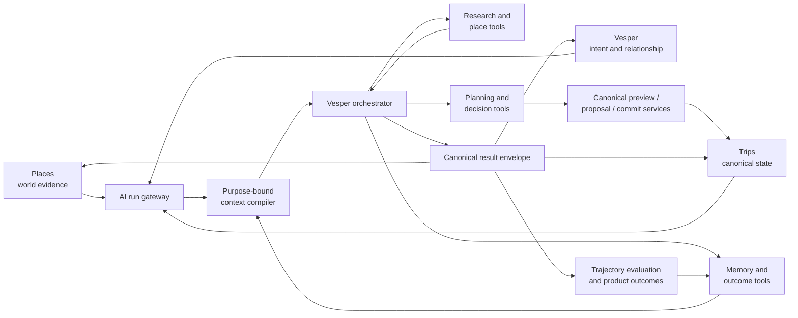

# Vesper AI System Improvement Plan

> **Working plan, not product canon.** This document translates the product
> thesis and the 2026-08-01 codebase investigation into an implementation
> program. Existing canonical product, privacy, mutation, journey, and surface
> contracts continue to win where they are more specific. A phase is not
> “done,” “shipped,” or “certified” until the evidence layer named in that
> phase's exit gate has actually been completed.

## Executive decision

Improve the existing AI system through consolidation, evidence, and controlled
cutover. Do not replace the agent runtime, introduce a second planner, create a
new memory product surface, or add a general autonomous agent.

The target product loop is:

```text
Places supplies evidence
    → Vesper understands intent, researches, and proposes or acts
    → Trips holds canonical commitments and visible receipts
    → trip outcomes become correctable evidence for future Vesper decisions
```

The product has three active root surfaces:

| Surface | Canonical role |
| --- | --- |
| **Trips** | Travel over time, canonical trip state, decisions, commitments, receipts, history, and post-trip reflection |
| **Vesper** | Relationship, intent development, conversation, research, orchestration, and appropriately scoped action |
| **Places** | The external world, spatial evidence, place relationships, search, browse, saves, and contextual handoff |

Founder clarification on 2026-08-01: **Atlas and Discover are deprecated as
active product surfaces.** Existing route names, API names, component folders,
telemetry values, or data concepts may remain temporarily for backward
compatibility. They are not authorization to design new product behavior around
Atlas or Discover. Memory, correction, readings, and personal controls must be
re-owned contextually by Trips, Vesper, Places, or the private You/settings area
without recreating a competing root surface.

The program's central outcome is not “a better chatbot.” It is:

> Given this traveler, these relationships, this trip, this place, and this
> moment, Vesper reliably chooses the smallest useful next step, grounds it in
> permitted evidence, changes canonical state only through the correct domain
> path, makes the result visible, and learns only from evidence the traveler can
> inspect or correct.

## 1. Why this program exists

The current system is more capable than the product consistently feels.

The backend already contains:

- a centralized model-role registry;
- a shared LLM wrapper with retry, prompt caching, tracing, and token tracking;
- a declarative AI surface registry and kill-switch path;
- a shared agent loop and bounded tool providers;
- specialized concierge, planning, research, preference, booking, lookup, and
  notification systems;
- a purpose-bound context compiler with privacy-aware projections and evidence
  fingerprints;
- canonical itinerary preview, proposal, commit, receipt, correction, and undo
  paths;
- privacy-safe group composition;
- layered place retrieval with corpus-first and live-provider paths;
- an extensive fixture, replay, seeded-database, and LLM evaluation harness;
- content-free product-outcome reporting.

The mobile app already contains:

- optimistic conversation turns with persistent identifiers;
- queued sends, cancellation, reconnection, and SSE handling;
- typed context attachments and cross-surface conversation seeds;
- canonical Trips surfaces and mutation receipts;
- the Vesper Workbench and durable session edges;
- the consolidated Places workspace;
- device-oriented visual QA infrastructure.

The product gap is therefore not missing raw capability. It is the lack of one
observable and measurable relationship loop joining those capabilities.

### 1.1 Current-state assessment

| Capability | Existing strength | Current gap |
| --- | --- | --- |
| Conversation runtime | Sophisticated transport, persistence, and recovery logic | Release-profile and cross-device proof remains the trust gate |
| Streaming | Fast incremental presentation and terminal reconciliation | Preliminary prose may be deleted and replaced by materially different canonical prose |
| First-turn research | Named-place routing patch and regression coverage exist | Tests can prove tool eligibility without proving a useful, durable outcome |
| Context and memory | Strong purpose/audience/evidence compiler foundation | Fragmented turn loaders still serve much of the product; planner cutover evidence remains open |
| Planning actions | Canonical workflow, revisions, receipts, and reversibility exist | Conversational promises and visible Trips state are not graded together consistently |
| Group intelligence | Private evidence, shared memory, synthesis, and group-safe compose exist | Value is not consistently perceptible without risking explanation laundering |
| Places intelligence | Curated corpus, live operational facts, scope, ranking, and honest unknowns | Context transfer into Vesper needs end-to-end outcome measurement |
| Product learning | Direct outcomes and behavioral proxies are modeled | The post-trip collection and confirmation loop is not consistently present in the consolidated product |
| Proactive systems | Delivery, quiet-hours, attention, and trigger infrastructure exist | Interruption value and earned authority are not yet proven through a narrow canary |
| AI evaluation | Broad scenario and replay harness exists | Most checks focus on reply/tool behavior rather than complete trajectory and final product state |
| AI governance | Model and surface registries exist | Some policy fields remain declarative; specialized/bypass paths require equivalent control-plane coverage |

### 1.2 Investigation evidence snapshot

The 2026-08-01 investigation found:

- targeted Vesper Home/chat suites passed 58 tests across four suites;
- seven targeted backend tests covering the named-place/Tokyo routing repair
  passed;
- those tests do not establish that the resulting Tokyo response researches,
  advances, persists, and communicates the trip successfully;
- the journey status still distinguishes automated/persona evidence from
  required live-device certification;
- the context compiler plan describes the compiler foundation and the first
  outcome-learning loop as implemented while keeping planner production
  cutover and mobile confirmation as separate release gates;
- the current eval framework has broad concierge coverage and deterministic
  replay, but its strongest future extension is final-state and cross-surface
  grading;
- the mobile client deliberately accepts terminal `replacement_text`, which
  explains the observed “streamed answer disappeared and was swapped” effect;
- active and working documentation still contains stale Atlas and Discover
  vocabulary even though the visible shell and product direction have
  consolidated around Trips, Vesper, and Places.

This evidence justifies the program. It does not certify the user experience.

## 2. Governing principles and invariants

### 2.1 One intelligence, three product owners

The AI system is headless. The surfaces do not own separate brains.

- Places contributes world and place context.
- Vesper owns the relationship and orchestration.
- Trips owns operational truth.

No surface may create a competing plan, memory identity, or action history.

### 2.2 State matters more than prose

A conversational response is successful only when its promise agrees with
durable state. “I added it” is false unless the canonical itinerary contains the
change and the user can see its receipt. “Nothing changed” is false if the
server committed an action before a disconnect.

### 2.3 Evidence is not identity

An accepted suggestion, a saved place, or one visited venue is evidence. It is
not automatically a durable preference or statement about who the traveler is.
Durable personal claims require explicit confirmation or repeated,
well-attributed evidence.

### 2.4 Privacy is enforced structurally

Private member evidence must never reach group-visible text, notifications,
booking briefs, shared read models, or exports. All group-bound composition must
use `travel-agent/backend/concierge/group_compose.py` or an equivalently explicit
policy and redaction boundary.

An explanation is also an egress path. A group-safe result must not make the
private source inferable through attribution, unique detail, or contrast.

### 2.5 One writer per mutation type

LLMs do not write plan, proposal, booking, or expense tables directly. They
produce structured intent for the existing canonical domain service.

Every consequential mutation must be:

- idempotent;
- append-only ledgered;
- represented by a visible receipt;
- reversible when the product claims it is reversible;
- coherent on every surface that presents the state;
- honest when a concurrent action or newer revision wins.

### 2.6 Autonomy is task-specific and earned

There is no global “autonomous Vesper” setting. Researching a venue, proposing
an itinerary change, posting to a group, and confirming a paid booking have
different stakes and require different permissions.

### 2.7 Honest absence beats fabricated usefulness

Unknown opening hours remain unknown. An unavailable provider does not become
“closed.” Missing group evidence does not become a personalized group read. A
surface with no supported action omits the action rather than rendering a fake
door.

### 2.8 Device evidence is part of system correctness

Validation has four layers:

1. static trace;
2. mock walk;
3. backend canary;
4. live dogfood on a supported device and real providers.

Automated or backend evidence must never be described as device certification.

## 3. Target system architecture



The architecture stays modular. The Vesper orchestrator decides how to advance
a task within a bounded capability set. Deterministic code continues to own:

- authorization and membership;
- private/group audience policy;
- mutation authority and approval;
- canonical writers;
- idempotency and concurrency;
- ledger and receipt creation;
- memory write gates;
- fallback and fail-dark rules.

## 4. The AI Run Envelope

Introduce one logical contract that joins the currently fragmented turn,
context, tool, mutation, delivery, and outcome traces. The first implementation
may be an event/schema contract rather than a new table.

### 4.1 Identity and scope

Every meaningful AI invocation carries:

```text
run_id
actor_id
origin_surface: vesper | trips | places | notification | background
conversation_id?
user_message_id?
assistant_message_id?
trip_id?
place_id?
object_reference?
audience: private | trip_internal | group_visible
idempotency_key
request_id
trace_id
```

Legacy `atlas` and `discover` origin values may remain readable for historical
data and old clients. New producers emit canonical semantic origins.

### 4.2 Intent and authority

```text
task_class
risk_class
desired_outcome
allowed_capabilities
approval_requirement
expected_result_kind
```

The internal result kinds are:

```text
answer
draft
proposal
mutation
memory_candidate
no_action
failed
```

### 4.3 Context and evidence

```text
context_bundle_id
context_dependency_fingerprint
context_policy_version
evidence_categories_included
evidence_categories_omitted
freshness_requirements
missing_or_uncertain_context
```

Operational telemetry remains content-free by default. Evidence references are
identifiers and versions, not replicated private prose.

### 4.4 Execution

```text
ai_surface_key
model_role
provider
model_id
tool_calls
recovery_attempts
token_budget
latency_budget
cancellation_state
```

### 4.5 Result and state consequence

```text
result_kind
canonical_display_text
artifact_references
state_revision_before
state_revision_after
receipt_reference
undo_or_correction_reference
no_write_reason
```

### 4.6 Delivery and evaluation

```text
time_to_ack
time_to_first_event
time_to_first_semantic_feedback
time_to_canonical_content
time_to_terminal_result
stream_reconciliation_reason
replacement_edit_ratio
automated_graders
human_or_device_evidence
user_acceptance_or_correction
post_trip_outcome_reference
```

## 5. Workstream A — AI governance control plane

### Goal

Make the existing AI surface and model registries the executable control plane
for every production AI call.

### A1. Reconcile the active product vocabulary

- Inventory all `vesper.atlas.*` and `vesper.discover.*` surface keys.
- Inventory old mobile origins, route helpers, telemetry event names, and
  generated API enums.
- Classify each as:
  - active capability re-owned by Trips, Vesper, Places, or You/settings;
  - legacy compatibility path;
  - unreachable/deletable implementation.
- Stop adding new behavior under deprecated product owners.
- Preserve backwards-compatible reads until route, notification, and analytics
  producers have migrated.

### A2. Govern specialized and bypass calls

Some multimodal, tool-loop, reflection, synthesis, and classifier paths cannot
use the ordinary single-shot LLM wrapper. They still need equivalent:

- kill-switch enforcement;
- resolved model assignment;
- surface trace tag;
- timeout and token budget;
- failure counting;
- fallback behavior.

Add a lightweight `surface_guard`-style boundary rather than forcing
incompatible calls through `call_llm()`.

### A3. Activate the valuable registry fields first

Runtime-enforce:

- model role;
- surface status and kill switch;
- latency budget;
- fallback policy;
- privacy/risk class;
- evaluation-suite association.

Keep generalized event-driven cache invalidation, speculative prefetch, and
multi-tier artifact serving deferred until measured product use justifies them.

### Exit gate

Every reachable production AI call has one registered owner, model policy,
kill switch, trace identity, fallback posture, and applicable evaluation suite.
The live inventory, not an old documentation count, is the evidence.

## 6. Workstream B — Trustworthy conversation and delivery

### Goal

An accepted Vesper turn produces exactly one durable user message and no more
than one canonical assistant outcome, regardless of disconnect, retry,
backgrounding, or app termination.

### B1. Separate progress from canonical prose

Adopt three delivery classes:

1. `progress` — accepted, checking the trip, researching, shaping options;
2. `canonical_content` — stable prose intended for the user;
3. `result` — answer, artifact, proposal, mutation receipt, memory candidate,
   no-write result, or failure.

Progress communicates activity without exposing hidden chain-of-thought.

Turns likely to pass through strict composition, privacy filtering, receipt
reconciliation, or output regeneration should stabilize user-facing prose
before emitting it as canonical content.

### B2. Preserve safety replacements

Immediate replacement remains required when preliminary text could violate
privacy, safety, or state truth. For ordinary stylistic reconciliation, prefer
stabilization before display.

Record:

- replacement reason;
- streamed and canonical character counts;
- edit-distance ratio;
- time the preliminary text remained visible;
- whether facts, actions, or only presentation changed.

### B3. Exactly-once matrix

Test at minimum:

- blank Vesper Home composer send;
- rapid duplicate tap;
- background immediately after send;
- network loss before the first event;
- network loss after a tool call;
- network loss after a mutation commits;
- explicit Stop/cancel;
- app termination and reopen;
- reconnect while a newer turn is active;
- server completion after the client disconnects;
- history reload after terminal reconciliation.

### B4. Device matrix

- iOS release profile;
- Android release profile;
- two signed-in devices for group/privacy and cross-device reconciliation;
- real backend and real provider lane where the journey requires them.

### Initial reliability targets

| Metric | Initial target |
| --- | --- |
| Accepted-but-lost sends | 0 in the defined release canary |
| Duplicate canonical actions | 0 |
| Terminal message/state agreement | 100% in the canary |
| First semantic feedback | p95 ≤ 4 seconds |
| Large ordinary stream replacement | < 1% of ordinary turns |
| Private-data group leakage | 0 |
| Mutation receipt agreement | 100% |

These are internal launch targets, not claimed external industry standards.

## 7. Workstream C — Context compiler serving cutover

### Goal

Make the purpose-bound context compiler the common context lifecycle without
creating a single oversized prompt or conducting a big-bang migration.

### C1. Planner dual-run

For the same planning request, compile both:

- the current broad planner context;
- the new compiler bundle.

Compare:

- hard-constraint preservation;
- current-trip override behavior;
- member differentiation;
- private/group projection;
- open questions and uncertainty;
- itinerary quality and edit distance;
- prompt size;
- compiler latency and total planning latency;
- evidence lineage usefulness.

### C2. Planner cutover gates

- unauthorized evidence inclusion: 0;
- hard-constraint regressions: 0 in the gate corpus;
- group projection privacy violations: 0;
- itinerary quality: no material regression;
- latency: within the registered planning budget;
- rollback: exercised against a representative trip;
- dogfood evidence: sufficient content-free events for the canonical readout.

### C3. Expand by purpose

After planner cutover, migrate consumers in this order:

1. trip-scoped private Vesper;
2. group-safe Vesper composition;
3. Places-to-Vesper handoffs;
4. Trips Home reads;
5. Vesper Home session grounding;
6. proactive decisioning.

Each consumer requests only the task, audience, scope, evidence types,
freshness, and token budget it needs.

### C4. Dual-read migration rule

For each fragmented context loader:

1. dual-read;
2. compare fingerprints and policy output;
3. cut over one consumer;
4. observe in dogfood;
5. remove the redundant loader.

## 8. Workstream D — Capability and tool policy

### Goal

Replace accumulating intent-specific patches with a deterministic preflight and
bounded capability selection, while leaving nuanced tool choice to the agent.

### D1. Deterministic preflight

Resolve before the model chooses tools:

- actor and membership;
- private versus group audience;
- origin surface;
- typed attachments;
- trip scope;
- place and location provenance;
- current lifecycle and time;
- mutation authority;
- whether live operational evidence is required.

Obvious scope resolution must not require another LLM call.

### D2. Capability families

- place research;
- live place verification;
- trip inspection;
- plan shaping;
- plan revision;
- group proposal;
- memory and correction;
- booking research;
- transactional booking.

The preflight authorizes capability families. The model selects tools only
inside the bounded set.

### D3. Clarification policy

Vesper resolves researchable uncertainty itself and asks the user only for
consequential preference or intent.

The Tokyo prompt becomes the reference case:

- named places are resolved or researched;
- the system advances toward a useful sketch;
- it does not ask for information already implied by the request;
- it asks only a consequential preference question when necessary;
- any durable state change is explicit and visible.

## 9. Workstream E — Canonical action grammar

### Goal

Make every consequential Vesper action legible and consistent across the three
surfaces.

The user-facing grammar is:

```text
Understand → Draft → Review → Apply → Receipt → Undo or Correct
```

### E1. Internal authority tiers

| Tier | Capability | Example |
| --- | --- | --- |
| Read | Inspect or research | Check current opening hours |
| Draft | Produce private working material | Sketch an evening around two places |
| Propose | Prepare a reviewable shared change | Suggest moving dinner |
| Apply reversible | Execute an approved canonical operation | Add a venue to Tuesday |
| Transact | Require explicit consequential approval | Confirm a paid booking |

### E2. Surface boundaries

- Places researches, saves, and hands off. It does not write the itinerary.
- Vesper understands, drafts, proposes, and invokes canonical operations.
- Trips owns commitment, receipts, history, correction, and undo.
- Vesper Home owns sessions, not decision cards.
- Trips Home owns attention to trip objects and decisions, not freeform chat.

### E3. Mutation requirements

Every plan, proposal, booking, or expense mutation must:

- use the existing canonical builder/service;
- include an idempotency key;
- check the current revision and actor authority;
- emit a ledger event;
- produce a visible pending/success/rejection/error consequence;
- reconcile Plan and Map;
- provide a truthful correction or undo path where supported.

### E4. Group payoff without privacy leakage

The first visible group-intelligence payoff should be non-invertible and
outcome-oriented, for example:

- where the group overlaps;
- what the plan is protecting;
- why the proposal fits the group.

It must not identify which member supplied a constraint, disclose raw votes or
private evidence, expose an internal tension model, or imply certainty the
evidence does not support.

## 10. Workstream F — Memory and outcome learning

### Goal

Create a closed, correctable learning loop without reviving Atlas as a product
surface or collapsing evidence into one universal memory table.

### F1. Four memory layers

| Layer | Lifetime | Contents |
| --- | --- | --- |
| Working context | Current session | Active goal, attachments, unresolved questions |
| Trip context | One trip | Intent, agreements, itinerary, live state, trip-specific facets |
| Durable personal memory | Cross-trip | Confirmed or strongly evidenced preferences and constraints |
| Outcome evidence | Append-only | Accepted, rejected, changed, corrected, visited, or experienced outcomes |

### F2. Write policy

- Explicit “remember this” → durable confirmed memory or confirmation flow.
- Current-trip preference → trip-scoped by default.
- One click, save, acceptance, or visit → evidence, not identity.
- Consistent evidence across multiple trips → durable memory candidate.
- Group agreement → shared trip memory.
- Private constraint → private evidence only.
- Correction → superseding evidence plus dependency invalidation.
- Ambiguous or poorly attributed outcome → abstain.

### F3. Consolidated product experience

Memory confirmation appears:

- contextually in Vesper after a consequential learning moment;
- in a completed Trip reflection;
- in the private You/settings area for full inspection, correction, and
  forgetting.

Do not add another primary memory destination.

### F4. First closed learning loop

```text
Completed Trip
  → short debrief
  → proposed learning
  → confirm / correct / forget
  → compiler consumes confirmed evidence
  → next trip visibly benefits
```

The debrief should collect the existing direct outcomes:

- made the trip better;
- felt represented;
- organizer relief;
- privacy trust;
- would use again;
- optional best and low moments.

## 11. Workstream G — Trajectory evaluation

### Goal

Evaluate the complete AI trajectory and final product state, not only reply text
or tool eligibility.

### G1. Trial record

Each evaluation captures:

1. initial database and surface state;
2. context and evidence supplied;
3. model/tool trajectory;
4. conversation output;
5. final database state;
6. receipt and destination;
7. reloaded mobile state;
8. interaction quality;
9. latency and cost.

### G2. Grader stack

- deterministic policy/schema checks;
- state before/after assertions;
- required and forbidden tool assertions;
- privacy and hard-constraint checks;
- groundedness and freshness checks;
- pointwise interaction-quality rubric;
- pairwise challenger-versus-baseline judge;
- human calibration;
- device evidence.

### G3. Initial golden journey suite

| # | Journey | Required proof |
| --- | --- | --- |
| 1 | Tokyo named-place first turn | Researches/grounds, advances, avoids redundant clarification |
| 2 | Places attachment → Vesper | Exact place context survives handoff and reload |
| 3 | Personal Vesper sketch → Trip | Explicit promotion; no hidden trip creation |
| 4 | Existing trip revision | Proposal/preview, commit, receipt, Plan/Map coherence |
| 5 | Private dietary constraint → group suggestion | Useful group result; zero private leakage or attribution |
| 6 | Group rejection | Original state remains and is visibly confirmed |
| 7 | Disconnect after commit | No false failure; committed result is recovered |
| 8 | Cancel before commit | No mutation; cancellation is terminal and honest |
| 9 | Live place provider unavailable | Honest unknown; no fabricated hours or closure |
| 10 | Mid-trip disruption | Coherent bounded replan and consequences |
| 11 | Completed Trip → learning | Debrief, candidate, confirmation/correction |
| 12 | Corrected memory → next trip | Correction wins over stale inference |

### G4. Incident-to-eval rule

Every material production or dogfood incident creates:

- a named failure mode;
- a minimized reproducible scenario;
- a deterministic assertion where possible;
- a human rubric where necessary;
- a promoted baseline after correction;
- a named device layer if the failure is transport, navigation, visual, or
  cross-device.

## 12. Workstream H — Model quality, latency, and cost

### Goal

Route models by task and risk only after the trajectory evaluation foundation
can prove that a change is better.

### H1. Task-based routing hypotheses

| Task | Candidate posture |
| --- | --- |
| Bounded factual lookup | Fast model plus deterministic verification |
| Entity extraction/classification | Fast structured model |
| Nuanced personal planning | High-quality reasoning model |
| Group synthesis | Privacy-qualified model and strict compose path |
| Major replanning | High-quality reasoning model |
| Background post-trip reflection | Asynchronous quality model |
| Missing/failed optional voice | Deterministic or silent fallback |

### H2. Promotion criteria

Compare challenger and incumbent on:

- successful trajectory rate;
- privacy and constraint failures;
- tool-selection accuracy;
- unnecessary clarification;
- time to useful result;
- total cost per retained action;
- human-rated Vesper quality.

Do not optimize tokens or cost per turn without the outcome denominator.

### H3. Fine-tuning deferral

Do not fine-tune until there is a sufficiently clean dataset of accepted
actions, corrections, rejected proposals, privacy-safe trajectories, and
human-reviewed exemplars with stable rubrics.

## 13. Workstream I — Earned proactive assistance

### Goal

Prove one high-value proactive intervention before enabling broad autonomous or
interruptive behavior.

### I1. Deterministic attention gate

Consider:

- consequence;
- time sensitivity;
- confidence;
- user permission;
- availability of a concrete action;
- recent interruption history;
- quiet hours;
- current trip state.

The LLM may phrase the message. It does not override permission, urgency, or
audience policy.

### I2. First canary

- one dogfood cohort;
- one verified trigger: closure, disruption, deadline, or leave-by risk;
- ambient Vesper Home notice first;
- push only when delay materially reduces usefulness;
- one-tap act, snooze, dismiss, quiet, and correct controls.

### I3. Canary metrics

- intervention accepted;
- dismissed or snoozed;
- corrected;
- downstream trip action;
- undo or repair;
- repeat acceptance;
- direct “was this useful?” signal where sample size permits.

Notification open rate alone is not proof of value.

## 14. Delivery roadmap

The timeline below assumes one small cross-functional product/engineering team.
The dependency order matters more than the exact calendar.

### Phase 0 — Canon and measurement, week 1

Work:

- lock the Trips/Vesper/Places AI ownership model;
- inventory deprecated Atlas/Discover runtime and telemetry vocabulary;
- define the AI Run Envelope;
- propagate trace identity across mobile, backend, model, tools, mutations, and
  receipts;
- define the stateful eval extension;
- instrument streaming reconciliation and the three root funnels.

Exit gate:

- static trace of the three-surface system;
- schema and telemetry tests;
- no claim of device completion.

#### Execution update — 2026-08-01

Phase 0 is in progress. The first backend slice establishes the narrow,
content-free identity portion of the envelope for every streamed chat turn:

- `backend/core/ai_runs.py` owns immutable `ai_run.v1` identity, active
  surface, audience, and operation classifications;
- `run_stream_turn` creates that identity before any concierge work and passes
  it to the terminal SSE envelope;
- terminal `metadata` now provides `ai_run_id` plus safe classification fields
  to the initiating client; and
- the local `Trace` schema records the same ID, including nested traces
  created inside the run scope; and
- control-plane action envelopes and synthesized execution receipts inherit the
  same optional UUID and expose it only in content-free trace projections. It
  is observation metadata, not action authority, mutation identity, or a new
  persisted writer path.

The next streaming-measurement slice is also in place: any terminal
reconciliation now emits a content-free `stream_reconciliation` quality event
and terminal metadata with a deterministic reason, character counts, common
prefix length, and replacement-edit ratio. Raw streamed and canonical text are
never copied into that measurement.

The stateful-evaluation foundation is also available in `tools/eval/core`.
It grades an observed trial's outcome, before/after canonical revisions, tool
effects, private-to-group evidence separation, receipt, reloaded projections,
and Plan/Map coherence. The concierge final-check adapter refuses to treat the
normal mocked fixture replay as final-state evidence; a seeded-DB canary must
supply an observed trajectory record. This adds a gate, not a claim that any
of the twelve journeys has device evidence yet.

J06 now constructs the first such record from its real proposal-resolution
canary: canonical Plan and Map responses are captured before and after apply,
then joined to the canonical history receipt. On 2026-08-01, the canary passed
against the local Postgres database. The earlier skip was the filesystem sandbox
denying the test process localhost database access, not an outdated
`itinerary_blocks` schema; a read-only schema comparison found no missing
columns. The database does reference Alembic revision `placefeed05`, which is
present in a separate local worktree but absent from this checkout, so no
migration was applied or copied. That lineage mismatch should still be repaired
before using Alembic from this checkout, but it does not invalidate the observed
J06 backend-canary result. This remains backend/state evidence only, not device
evidence.

The stream-delivery boundary now also distinguishes ordinary response turns
from turns that may still need canonicalization. Proposal and unknown-agency
turns retain all provider prose until parsing, receipt reconciliation, and
output guards have produced the durable terminal reply; that reply is emitted
once, rather than appearing in an optimistic bubble and then being replaced.
Commit-turn receipt gating and strict group composition remain independent
paths. Direct response turns continue to stream so this safety boundary does
not turn ordinary Vesper conversation into an unnecessarily delayed answer.
The terminal SSE frame and the mobile turn-performance event now classify the
delivery as `streaming` or `canonical_terminal`, allowing latency and
replacement cohorts to be compared without exposing content. Focused unit
coverage proves the server behavior; it has not yet been observed on a device
or measured against production latency targets.

Reconnect coverage now also protects presentation ownership: after an accepted
group turn loses its socket and retries with the same idempotency key, a late
text or metadata frame from the abandoned connection is ignored. Only the
retry's terminal canonical text may settle the optimistic bubble and its
performance spans. The focused private/group recovery suite has mock-level
coverage for this behavior; it is not evidence of an iOS/Android release-profile
or two-device run.

The first physical interaction check exposed and fixed a separate delivery
failure: while the iOS keyboard was open, the absolute chat composer stayed at
the screen bottom, so its send target could sit beneath the keyboard. Both
private and group chat now use a keyboard-synchronous sticky footer for the
composer, while the existing keyboard-aware transcript container continues to
manage readable message space. The group stability Maestro flow was corrected
to perform one send tap rather than a second tap that would cancel the now-
in-flight turn. On 2026-08-01, it and the existing private-chat send flow
passed on a local iPhone 17 Pro iOS 26.5 simulator, showing each composer
above the keyboard; the group flow also showed the resulting visible user
bubble, while the private flow showed its mock Vesper response. Their fixtures
explicitly use mock data, so this is narrow simulator interaction evidence
only: it does not establish backend, stream, release-profile, credentialed,
Android, or two-device behavior.

On 2026-08-02, the active AI Run now reaches the provider-observability
boundary as well: both the Langfuse parent agent span and every nested
generation span inherit the same `ai_run_id` from request context. This applies
to the shared non-streaming and streaming LLM wrappers and direct agent-loop
generation calls because they all use the common Langfuse wrapper. The provider
metadata contains only the run UUID already present in the terminal envelope;
it does not add conversation IDs, actor IDs, prompts, replies, or tool payloads
to that external service. Focused regression tests exercise both parent and
generation paths.

The same date's durable-accounting slice adds that UUID to every
`llm_call_records` row created under an active run, with a partial lookup index
for a run's chronological provider-cost records. The UUID is nullable for
background and legacy calls, has no foreign key because an AI Run is not a
durable domain entity, and is cleared at worker-job entry so a reused worker
cannot attribute a background cost to a prior foreground traveler turn.
Structured per-call token logs now carry the same key explicitly. The database
migration is authored and offline-chain tested, but has not been applied to the
locally divergent database.

The next tool-to-state boundary is now represented in the same local trace:
each tool span records the provider tool-call ID, latency, cache status, and a
structural result class (`succeeded`, `failed`, or `rejected`). At turn
finalization, content-free per-tool evidence uses that ID to join the declared
tool capability with its control-plane action effect/execution class and any
receipt status, verification verdict, failure category, and changed-object
count. Since the enclosing trace and Langfuse parent span already carry
`ai_run_id`, this yields a single read-only diagnostic chain from model cost to
tool result to durable consequence. It does not alter tool dispatch, authority,
canonical writers, receipts, or group-visible text. Focused backend tests prove
the local/trace contract only; this is not device or live-provider evidence.

The canonical durable-receipt writer (`create_action_receipt`) now also inherits
the active `ai_run_id` for AI-originated receipts. Its raw internal row model
stores that UUID and its new partial index supports a chronological run-to-
receipt lookup; the serialized viewer model deliberately omits it, so it cannot
appear in private or group receipt responses. Manual and worker-originated
receipts continue to have no active run and omit the column on write, preserving
safe behavior for local databases that have not yet applied this additive
migration. The migration and SQL render are offline-verified but not applied to
the divergent local database.

This is still intentionally not a claim that the full envelope is propagated
through every mutation writer or release-profile/device journeys. Those remain
the next P0 items.

The existing dogfood coverage ledger was also corrected to call its output
*declared rail coverage*. A registered `logic_qa` scenario plus a registered
`maestro` scenario is a necessary coverage prerequisite; it is not evidence
that either test was executed, and it never substitutes for a device run. The
ledger currently maps all twelve MVP journeys to both declared rails, while
the individual run records remain the source of execution evidence.

### Phase 1 — Trustworthy turn, weeks 2–3

Work:

- canonical progress/content/result delivery;
- pre-canonical prose suppression where required;
- exactly-once reconnect and cancellation proof;
- first twelve golden journeys;
- release-profile device matrix.

Exit gate:

- layers 1–3 green for the relevant journeys;
- live iOS and Android evidence for transport claims;
- two-device evidence for group/cross-device claims.

### Phase 2 — Context serving spine, weeks 4–5

Work:

- planner context compiler dual-run;
- dogfood comparison readout;
- planner cutover and rollback exercise;
- trip-private Vesper migration;
- group-safe projection proof.

Exit gate:

- privacy, constraint, quality, latency, and rollback gates satisfied;
- planner cutover is not described as full product certification without its
  device journey.

### Phase 3 — Cross-surface action, weeks 6–7

Work:

- standard result envelope;
- Places → Vesper context preservation;
- Vesper → Trips review/apply/receipt path;
- privacy-safe group payoff;
- Plan/Map apply/undo coherence.

Exit gate:

- stateful trajectory evals;
- backend canary;
- supported-device proof for the complete cross-surface journeys.

### Phase 4 — Learning loop, weeks 8–9

Work:

- completed-Trip debrief;
- contextual memory candidate confirmation;
- correction and forgetting;
- confirmed outcome evidence into compiler;
- memory-on versus memory-off next-trip replay.

Exit gate:

- correction wins over stale inference;
- no group/private scope regression;
- a real dogfood trip demonstrates the loop;
- direct outcome collection is reachable on a device.

### Phase 5 — Optimization and earned agency, week 10+

Work:

- task-based model routing experiment;
- justified cache/SWR activation;
- one proactive canary;
- broader model/provider experiments;
- later voice and booking expansion behind their own gates.

Exit gate:

- challenger beats incumbent on trajectory and product outcomes, not merely
  model rubric;
- proactive value exceeds interruption cost in the canary;
- rollback and kill switches are exercised.

## 15. Immediate P0 backlog

Execute in this order:

1. Canonical Trips/Vesper/Places AI ownership map.
2. Legacy Atlas/Discover AI-key, route, and telemetry inventory.
3. AI Run Envelope schema and event mapping.
4. End-to-end trace-id propagation.
5. Vesper Home, Places handoff, and Trips receipt funnel telemetry.
6. Stream-reconciliation reason and replacement-shock metrics.
7. Pre-canonical prose suppression for post-processed turns.
8. Stateful before/after graders in the existing eval harness.
9. Twelve relationship golden scenarios.
10. Release-profile chat and cross-device certification matrix.
11. Planner context-compiler dual-run readout.
12. Planner cutover/rollback decision.

Items 1–10 precede memory expansion, proactive autonomy, fine-tuning, or broad
model-routing work.

## 16. Product and system scorecard

### 16.1 North-star product metric

> **Vesper-assisted trip success:** the share of Vesper-assisted trips with at
> least one retained Vesper action, no action-related repair within 24 hours,
> and a positive post-trip “made the trip better” response.

### 16.2 Trust

- accepted-but-lost sends;
- duplicate actions;
- stream replacement shock;
- private/group privacy violations;
- hard-constraint violations;
- correction and undo rate;
- receipt/state disagreement.

### 16.3 Intelligence

- correct capability and tool selection;
- retrieval groundedness and source freshness;
- known-context retention;
- unnecessary clarification;
- proposal acceptance and retention;
- compiler parity and bundle usefulness.

### 16.4 Experience

- time to first semantic feedback;
- time to useful artifact;
- turns to successful outcome;
- seeded handoff context retention;
- ability to locate the result outside chat;
- cross-surface continuation success.

### 16.5 Relationship

- made the trip better;
- felt represented;
- quiet-member representation;
- organizer relief;
- privacy trust;
- would use again;
- confirmed learning;
- next-trip memory benefit.

### 16.6 Economics

- cost per successful trajectory;
- cost per retained Vesper action;
- tokens per outcome;
- provider/tool cost per useful recommendation;
- cache effectiveness;
- background artifacts generated but never viewed.

## 17. Release and change-management policy

### 17.1 Prompt or model change

Before promotion:

1. relevant deterministic checks;
2. relevant stateful trajectory suite;
3. pointwise quality rubric;
4. pairwise challenger/baseline comparison with order swapping and ties;
5. human review of yellow-band and high-risk outputs;
6. dogfood canary;
7. rollback/kill-switch verification.

### 17.2 Context-policy change

Requires:

- private/group projection fixtures;
- membership-revision tests;
- hard-constraint matrix;
- dependency fingerprint invalidation;
- group-compose trace;
- dogfood shadow evidence before serving cutover.

### 17.3 Mutation change

Requires:

- canonical-writer trace;
- idempotency and concurrency tests;
- ledger and receipt assertion;
- Plan/Map coherence assertion;
- undo/correction proof;
- device journey.

### 17.4 Proactive change

Requires:

- deterministic attention and permission gate;
- quiet-hours proof;
- audience/privacy proof;
- opt-out and correction;
- narrow cohort canary;
- explicit interruption-value readout.

## 18. Ownership model

One accountable owner is required for each contract even if the same person
holds multiple roles.

| Contract | Accountable owner |
| --- | --- |
| AI Run Envelope and traces | AI runtime / platform |
| Context compiler and privacy projection | Context and memory |
| Tool capability policy | Concierge/orchestration |
| Canonical itinerary mutation | Trips domain |
| Group compose and egress | Privacy/group systems |
| Places evidence and freshness | Places/research |
| Mobile delivery and reconciliation | Travel App/chat |
| Stateful evaluation and promotion | AI quality |
| Product outcomes and debrief | Product/data |
| Device certification | Mobile/product owner for the journey |

## 19. Risks and mitigations

| Risk | Consequence | Mitigation |
| --- | --- | --- |
| Context compiler and legacy loaders diverge | Different surfaces know different things | Dual-read, fingerprints, one-consumer cutovers |
| New Vesper actions bypass canonical writers | State drift and irreversibility | Structured intent plus existing preview/commit services only |
| Group explanation reveals private evidence | Unrecoverable trust failure | Group compose, non-invertible explanations, privacy evals |
| Streaming optimizes speed over truth | Readable text disappears or changes meaning | Separate progress from canonical prose; replacement metrics |
| Memory overlearns from behavior | Creepy or wrong personalization | Evidence-first write gates and confirmation |
| Model judge becomes the definition of quality | False-green releases | Deterministic state, human calibration, device evidence, outcomes |
| Deprecated vocabulary persists in code and docs | Future work rebuilds retired product ideas | Owner migration inventory and compatibility classification |
| More agents increase orchestration complexity | Latency and failure surface grow | No new agent until a bounded capability cannot fit existing runtime |
| Premature proactive behavior | Interruption without value | One trigger, one cohort, deterministic gate |
| Cost optimization degrades relationship quality | Cheaper but less useful Vesper | Cost per retained action, not cost per turn |

## 20. Explicit deferrals

Do not build during the critical path:

- a new top-level AI or memory surface;
- a replacement agent framework;
- a second itinerary writer;
- a universal memory table;
- a knowledge graph without an earned consumer;
- fine-tuning before clean outcome data and stable rubrics;
- a universal autonomy slider;
- broad daily digests or proactive pushes;
- numeric group-fairness claims presented as truth;
- recurring group identity before repeated-trip confirmation;
- visible chain-of-thought;
- broad booking autonomy;
- voice expansion without its own live-device and lifecycle proof;
- generalized SWR, speculative prefetch, or batch infrastructure without
  measured demand.

## 21. Definition of program complete

The program is complete only when all of the following are true:

- active AI behavior is owned by Trips, Vesper, Places, or a clearly private
  You/settings capability;
- deprecated Atlas/Discover product origins no longer create new active flows;
- every production AI call has executable governance and evaluation coverage;
- one trace joins user intent, permitted context, model/tool execution,
  canonical state consequence, receipt, delivery, and outcome;
- accepted turns reconcile exactly once across disconnect and reload;
- preliminary streaming does not routinely expose materially non-canonical
  prose;
- planner and priority Vesper consumers use purpose-bound compiler context;
- private evidence cannot reach or be reconstructed from group output;
- every consequential mutation uses the canonical ledgered writer and produces
  a visible receipt and truthful correction/undo posture;
- the initial golden journeys grade both trajectory and final state;
- supported-device evidence exists for the high-risk conversation,
  cross-surface, group, mutation, and learning journeys;
- completed-trip feedback and confirmed learning reach the next-trip context;
- model and proactive changes promote through measurable canaries and rollback;
- direct traveler outcomes are collected and reported alongside behavioral
  proxies;
- the product demonstrates that Vesper made at least one real dogfood trip
  better, with evidence stronger than backend tests alone.

If the final condition is not yet demonstrated, the system may be
implementation-complete at several layers, but the relationship loop is not
product-certified.

## 22. Local references

- `travel-agent/docs/product/Product Thesis.md`
- `travel-agent/docs/product/Product Architecture Principles.md`
- `travel-agent/docs/architecture/Architecture.md`
- `travel-agent/docs/architecture/Vesper Unified Context and Memory Plan.md`
- `travel-agent/docs/architecture/vesper-consolidation/STATUS.md`
- `travel-agent/backend/core/context_compiler/`
- `travel-agent/backend/core/surfaces/`
- `travel-agent/backend/concierge/`
- `travel-agent/backend/core/db/product_outcomes.py`
- `travel-agent/tools/eval/README.md`
- `docs/journeys/README.md`
- `docs/journeys/STATUS.md`
- `docs/systems/concierge-vesper.md`
- `docs/working/global-navigation-ia-proposal-2026-07-25.md`
- `docs/working/home-surfaces-program-2026-07-28.md`
- `travel-app/docs/surfaces/vesper-home/contract.md`
- `travel-app/docs/surfaces/vesper-chat/contract.md`
- `travel-app/docs/surfaces/trips-home/contract.md`
- `travel-app/docs/surfaces/places-workspace/contract.md`

## 23. External research references

- Anthropic, “Trustworthy agents in practice”:
  <https://www.anthropic.com/research/trustworthy-agents>
- Anthropic, “Demystifying evals for AI agents”:
  <https://www.anthropic.com/engineering/demystifying-evals-for-ai-agents>
- OpenAI, “Evaluate agent workflows”:
  <https://developers.openai.com/api/docs/guides/agent-evals>
- Microsoft, “Guidelines for Human-AI Interaction”:
  <https://www.microsoft.com/en-us/research/publication/guidelines-for-human-ai-interaction/>
- Google PAIR, “Feedback and controls”:
  <https://pair.withgoogle.com/guidebook-v2/chapter/feedback-controls/>
- Google, “Rules of Machine Learning”:
  <https://developers.google.com/machine-learning/guides/rules-of-ml/>
- Google, “Measuring success”:
  <https://developers.google.com/machine-learning/managing-ml-projects/success>

## 24. Open founder decisions before implementation

1. Confirm that private memory inspection belongs in You/settings plus
   contextual Vesper/Trip moments, with no active Atlas-branded product page.
2. Approve the internal result taxonomy: answer, draft, proposal, mutation,
   memory candidate, no action, failed.
3. Approve the first twelve golden journeys as the protected relationship
   suite.
4. Approve the initial reliability targets, especially the large replacement
   threshold and physical-device canary size.
5. Choose the first completed-Trip debrief placement.
6. Choose the first proactive trigger and dogfood cohort only after Phases 0–4
   pass their gates.
